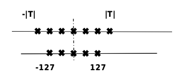

### 9.3.1 Quantization

    Model quantization is the process of approximating floating-point weights of continuous values (typically FP32 or a large number of possible discrete values) or data fixed points through individual operators to a finite number of discrete values (typically INT8) with a lower loss of inference accuracy, as shown in :numref:`ch08-fig-quant_minmax`, where T is the range of data before quantization. By representing floating-point data in fewer bits, model quantization can reduce model size and thus memory consumption during inference, and can increase inference speed on some processors with faster low-precision operations.

:width:`300px`
:label:`ch08-fig-quant_minmax`

    The number of occupied bits and the range of data they represent varies among different data types in computers. Generally, the model of deep neural network is represented by single-precision floating-point numbers, and if the parameters of the original model can be approximated by signed integers, then the storage size of the quantized weight parameters can be reduced to one-fourth of the original size. The fewer the number of bits used for quantization, the higher the compression ratio of the quantized model. The most common quantization bits used in industry today are 8 bits, and quantization below 8 bits is called low-bit quantization. 1 bit is the limit of model compression, and the model can be compressed to 1/32, and efficient XNOR and BitCount bit operations can be used to improve the inference speed during inference.

    In addition, quantization methods can be classified into linear and nonlinear quantization based on whether the range of the original data represented by the quantized data is uniform. The weights and activation values of actual deep neural networks are usually uneven, so theoretically higher accuracy can be achieved by using nonlinear quantization, but the computational complexity of nonlinear quantization is higher in practical inference, and linear quantization is usually used. The principles of linear quantization are highlighted below.

    Assuming that r denotes the floating point number before quantization, the quantized integer q can be expressed as:

$$
q=clip(round(\frac{r}{s}+z),q_{min},q_{max})
$$

$round(\cdot)$ and $clip(\cdot)$ denote rounding and truncation operations respectively, $q_{min}$ and $q_{max}$ are the minimum and maximum values after quantization. $s$ is the interval of data quantization and $z$ is the bias that indicates the data offset. A quantization where $z$ is 0 is called Symmetric quantization and a quantization where it is not 0 is called Asymmetric quantization. Symmetric quantization can avoid the quantization operator to calculate the $z$-related part in inference and reduce the computational complexity in inference; asymmetric quantization can determine the minimum and minimum values according to the distribution of the actual data, which can make fuller use of the quantized data information and make the calculation more accurate.

    According to the shared range of quantization parameters $s$ and $z$, quantization methods can be divided into layer-by-layer quantization and channel-by-channel quantization. Layer-by-layer quantization takes a layer of network as the quantization unit, with a set of quantization parameters for each layer; channel-by-channel quantization takes each quantization channel of a layer of network as the unit, with a separate set of quantization parameters for each channel. Channel-by-channel quantization can achieve higher quantization accuracy due to finer quantization granularity, but the calculation is also more complicated.

    According to whether training is required in the quantization process, model quantization can be divided into Quantization Aware Training (QAT) and Post Training Quantization (PTQ). Quantization Aware Training refers to adding pseudo-quantization operators to the model training process, which can improve the accuracy of the quantized model by counting the range of input and output data during training, and is suitable for scenarios requiring high model accuracy; Post Training Quantization refers to the direct quantization of the trained model, which requires only a small amount of calibration data, and is suitable for scenarios pursuing high ease of use and lack of training resources.

#### Quantization Aware Training

    Quantization aware training is to simulate quantization in the training process and use pseudo-quantization nodes to account for the accuracy changes brought by quantization into the training error, so that the optimizer can minimize the quantization error in the training process and get higher model accuracy. The specific process of quantization aware training is as follows:

- Initialization: setting the initial values of the ranges $q_{min}$ and $q_{max}$ for the weights and activation values.
- Construction of a simulated quantization network: insertion of pseudo quantization nodes after the weights and activation values to be quantized.
- Quantization training: repeat the following steps until the network converges, calculate the ranges $q_{min}$ and $q_{max}$ for the weights and activation values of the quantization network layers, and back-propagate the forward calculation to update the network weight parameters.
- Export quantization network: obtain $q_{min}$ and $q_{max}$ and calculate quantization parameters $s$ and $z$; calculate quantization integer values of weights according to the formula and replace parameters and data types of corresponding network layers; delete pseudo quantization nodes and insert quantization and anti-quantization operators before and after quantization network layers respectively.

#### Post Training Quantization

Post training quantization can also be divided into two types, weight quantization and full quantization. Weight quantization only quantifies the weights of the model to compress the size of the model. The weights are inverse quantized to the original FP32 data during inference, and the subsequent inference process is consistent with the ordinary FP32 model. The advantage of weight quantization is that there is no need to calibrate the dataset, no need to implement the quantization operator, and the accuracy error of the model is smaller. Since the actual inference is still using the FP32 operator, the inference performance will not be improved. Full quantization not only quantifies the weights of the model, but also quantifies the activation values of the model, and performs quantization operators to speed up the inference of the model during model inference. In order to quantify the activation values, the user needs to provide a certain number of calibration datasets to count the distribution of activation values at each level and to calibrate the quantized operators. The calibration dataset can come from the training dataset or from the input data of real scenarios, and the number needed is usually very small. When doing post training quantization, the calibration dataset is used as input to perform the inference process. Then the data distribution of activation values for each layer is counted and the corresponding quantization parameters are obtained, as follows:

- The statistical distribution of the original FP32 data was obtained using the histogram statistics $P_f$;
- A number of $q_{max}$ and $q_{min}$ are selected in the given search space to quantify the activation values respectively, and the quantized data $Q_q$ is obtained.
- Use histogram statistics to obtain the statistical distribution of $Q_q$;
- The statistical distribution difference between each $Q_q$ and $P_f$ is calculated, and the corresponding $q_{min}$ and $q_{max}$ of the lowest difference is found to calculate the corresponding quantization parameter. Common metrics used to measure the distribution difference include KL scatter (Kullback-Leibler Divergence), Symmetric KL scatter (Symmetric Kullback-Leibler Divergence) and JS scatter (Jenson-Shannon Divergence).

    In addition to this, there is a need to correct for quantization errors due to the inherent errors in quantization. Take matrix multiplication as an example, $a=\sum_{i=1}^Nw_ix_i+b$ , w denotes the weight, x denotes the activation value, and b denotes the bias. First, the quantized mean needs to be corrected by averaging each channel of the fp32 operator and the output of the quantized operator. Suppose the mean value of the output of the fp32 operator for a channel i is $a_i$ and the mean value of the output of the inverse quantization of the quantization operator is $a_q$. The difference between the two means of this channel $a_i-a_q$ is added to the corresponding channel to make the final output mean consistent with fp32. It is also necessary to ensure that the distribution after quantization is consistent with that before quantization. Let the mean and variance of a channel weight data be $E(w_c)$、$||w_c-E(w_c)||$, the quantified means and variances are $E(\hat{w_c})$、$||\hat{w_c}-E(\hat{w_c})||$, and the following corrections are made to the weights:

$$
\hat{w_c}\leftarrow\zeta_c(\hat{w_c}+u_c)
$$

$$
u_c=E(w_c)-E(\hat{w_c})
$$

$$
\zeta_c=\frac{||w_c-E(w_c)||}{||\hat{w_c}-E(\hat{w_c})||}
$$

    The quantization method has achieved wide application as a general model compression method that can significantly improve the efficiency of neural network storage and compression.

### 9.3.2 Model sparsity
