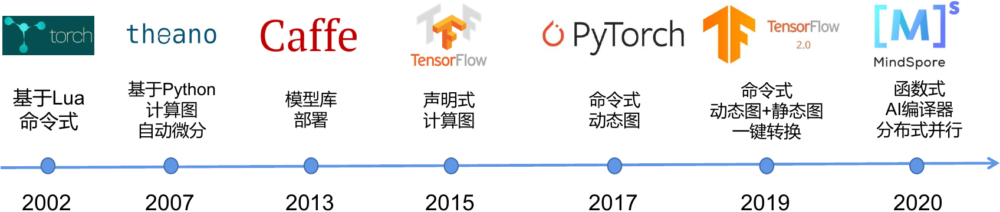
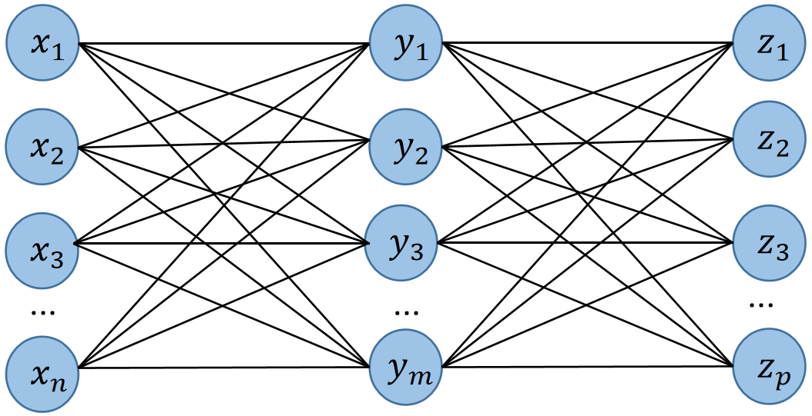
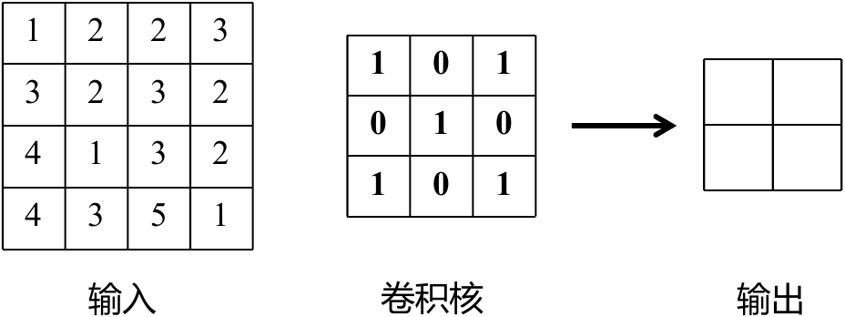
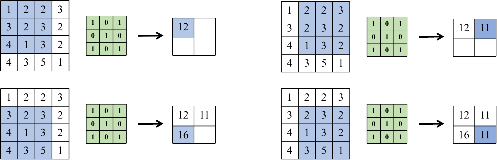
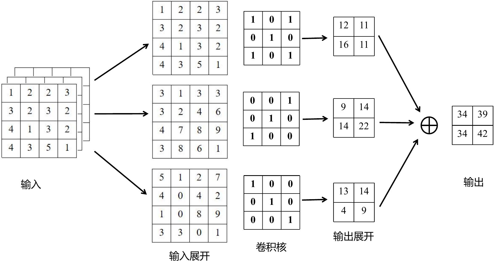
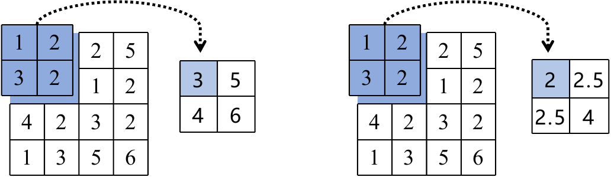
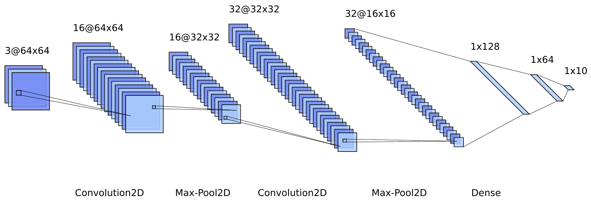
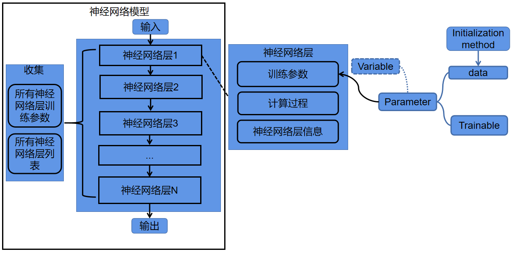
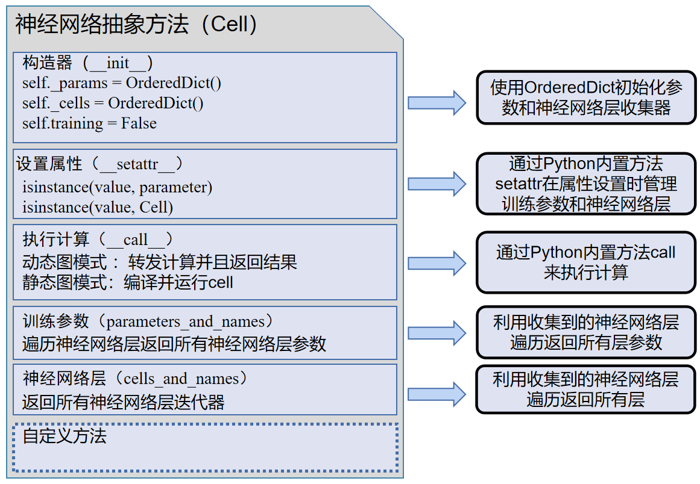

# 编程接口

现代机器学习框架包含大量的组件。这些组件使得用户得以高效开发机器学习算法，处理数据，部署模型，性能调优和使用硬件加速器。在设计这些组件的编程接口时，一个核心的诉求是：如何平衡框架性能和易用性？为了达到最优的性能，开发者需要利用硬件亲和的编程语言如：C和C++来进行开发。这是因为：C和C++的使用使得机器学习框架可以高效硬件的底层API，从而最大限度发挥硬件。同时，现代操作系统（如Linux和Windows）提供丰富的基于C和C++的编程接口（如文件系统，网络编程，多线程管理等），通过直接调用操作系统API，可以降低框架运行的开销。

从易用性的角度分析，机器学习框架的使用者往往具有丰富的行业背景（如数据科学家，生物学家，化学家，物理学家等）。他们的常用的编程语言是高层次脚本语言：Python，Matlab，R和Julia。相比于C和C++，这些语言在提供编程的易用性的同时，丧失了C和C++对底层硬件和操作系统进行深度优化的能力。因此，机器学习框架的核心设计目标是：其要具有易用编程接口来支持用户用高层次语言如Python来实现机器学习算法，同时其也要具备以C和C++为核心的低层次编程接口，使得框架开发者可以用C和C++实现大量高性能组件，从而在硬件上高效执行。在本章中，我们将会讲述如何达到这个设计目标。

本章的学习目标包括：

-   理解机器学习系统的工作流和以Python为核心的编程接口设计。

-   理解机器学习系统以神经网络模块为核心的接口设计原理和实现。

-   理解机器学习系统的底层C/C++执行算子的实现和与上层Python接口的调用实现。

-   了解机器学习系统编程接口的演进方向。

## 机器学习系统编程模型的演进


:width:`400px`
:label:`img_framedh`

随着机器学习通的诞生，如何设计易用且高性能的编程接口就一直成为了框架设计者首要解决的问题。在早期的机器学习框架中（如图:numref:`img_framedh`所示），人们选择用Lua（Torch）和Python（Theano）等高层次编程语言来编写机器学习程序。这些早期的机器学习框架提供了机器学习必须的模型定义，自动微分等功能，其适用于编写小型和科研为导向的机器学习应用。

在2011年，深度神经网络快速崛起，并很快在各个AI应用领域（计算机视觉，语音识别，自然语言处理等）取得了最先进的性能。训练深度神经网络需要消耗大量的算力，而这些算力无法被以Lua和Python所主导开发的Torch和Theano所满足。与此同时，计算加速卡（如英伟达GPU）的通用编程接口（例如CUDA
C）日趋成熟，而构建于CPU多核技术之上的多线程库（POSIX
Threads）也被广大开发者所接受。因此，许多的机器学习用户希望基于C和C++来开发高性能的深度学习应用。这一类需求被Caffe等一系列以C和C++作为核心编程接口的框架所满足。

然而，机器学习模型往往需要针对部署场景，数据类型，识别任务等需求进行深度定制，而这类定制任务需要被广大的AI应用领域的开发者所实现。这类开发者的背景多样，其往往不具有熟练使用C和C++的背景，因此Caffe这一类库与C和C++深度绑定的编程模型快速成为了制约这一类框架快速推广的巨大瓶颈。

在2016年，谷歌率先推出了TensorFlow。相比于传统的Caffe，Torch和Theano，TensorFlow提出利用高层次编程语言：Python作为面向用户的主要前端语言，而利用C和C++实现高性能后端。大量基于Python的前端API确保了TensorFlow可以被大量的数据科学家和机器学习科学家接受，同时帮助TensorFlow能够快速融入Python为主导的大数据生态（大量的大数据开发库如Numpy，Pandas，Scrapy,
Matplotlib和PySpark）。同时，Python具有出色的和C语言的互操作性，这种互操作性已经在多个Python库中得到验证。因此，TensorFlow兼有Python的灵活性和生态，同时也通过C/C++后端得以实现高性能。这种设计在日后崛起的PyTorch，MXNet和CNTK的机器学习框架得到传承。

随着多个机器学习框架的出现，Keras和TensorLayer等高层次机器学习开发库提供了更高层次的Python
API从而可以快速导入已有的模型，
这些高层次API进一步屏蔽了底层框架的实现细节，因此Keras和TensorLayer可以运行在不同的机器学习框架之上。

随着深度神经网络的进一步发展，对于机器学习框架编程接口的挑战也日益增长。因此在2020年前后，新型的机器学习框架如MindSpore和JAX进一步出现。其中，MindSpore在继承了TensorFlow，PyTorch的Python和C/C++的混合接口的基础上，进一步拓展了机器学习编程模型从而可以高效支持多种AI后端芯片（如华为Ascend，英伟达GPU和ARM芯片），实现了机器学习应用在海量异构设备上的快速部署。

同时，超大型数据集和超大型深度神经网络崛起让分布式执行成为了机器学习框架编程模型的核心设计需求。为了实现分布式执行，TensorFlow和PyTorch的使用者需要进行大量编程来将数据集和神经网络分配到分布式节点上，而大量的AI开发人员并不具有分布式编程的能力。因此MindSpore进一步完善了机器学习框架的分布式编程模型的能力，从而让单节点的MindSpore程序可以无缝地运行在海量节点上。

在本小节中，我们将以MindSpore作为例子讲解一个现代机器学习框架的Python前端API和C/C++后端API的设计原则。这些设计原则和PyTorch，TensorFlow相似。

## 机器学习工作流

机器学习系统编程模型的首要设计目标是：对开发者的整个工作流进行完整的编程支持。一个常见的机器学习任务一般包含如图:numref:`img_workflow`所示的流程。这个工作流完成了训练数据集的读取，模型的训练，测试和调试。通过归纳，我们可以将这一工作流中用户所需要自定义的部分通过定义以下API来支持（我们这里假设用户的高层次API以Python函数的形式提供）：

-   **数据处理：**
    首先，用户需要数据处理API来支持将数据集从磁盘读入。进一步，用户需要对读取数据进行数据预处理，从而可以将数据输入后续的机器学习模型中。

-   **模型定义：**
    完成数据的读取后，用户需要模型定义API来定义机器学习模型。这些模型带有模型参数，可以对给定的数据进行推理。

-   **损失函数和优化算法：**
    模型的输出需要和用户的标记进行对比，这个对比差异一般通过损失函数（Loss
    function）来进行评估。因此，优化器定义API允许用户定义自己的损失函数，并且根据损失来引入（Import）和定义各种优化算法（Optimisation
    algorithms）来计算梯度（Gradient），完成对模型参数的更新。

-   **训练过程：**
    给定一个数据集，模型，损失函数和优化器，用户需要训练API来定一个循环（Loop）从而将数据集中的数据按照小批量（mini-batch）的方式读取出来，反复计算梯度来更新模型。这个反复的过程称为训练。

-   **测试和调优：**
    训练过程中，用户需要测试API来对当前模型的精度进行评估。当精度达到目标后，训练结束。这一过程中，用户往往需要调试API来完成对模型的性能和正确性进行验证。


:width:`400px`
:label:`img_workflow`

### 环境配置

在构建机器学习工作流程前，MindSpore需要通过context.set_context来配置运行需要的信息，如运行模式、后端信息、硬件等信息。
导入context模块，配置运行需要的信息。

```python
import os
import argparse
from mindspore import context
parser = argparse.ArgumentParser(description='MindSpore MLPNet Example')
parser.add_argument('--device_target', type=str, default="CPU", choices=['Ascend', 'GPU', 'CPU'])
args = parser.parse_known_args()[0]
context.set_context(mode=context.GRAPH_MODE, device_target=args.device_target)
```
上述配置样例运行使用图模式。根据实际情况配置硬件信息，譬如代码运行在Ascend
AI处理器上，则--device_target选择Ascend，代码运行在CPU、GPU同理。

### 数据处理
配置好运行信息后，首先讨论数据处理API的设计。这些API提供了大量Python函数支持用户用一行命令即可读入常见的训练数据集（如MNIST，CIFAR，COCO等）。
在加载之前需要下载数据集存放在./datasets/MNIST_Data路径中；MindSpore提供了用于数据处理的API模块
mindspore.dataset，用于存储样本和标签。在加载数据集前，通常会对数据集进行一些处理，mindspore.dataset也集成了常见的数据处理方法。
以下代码读取了MNIST的数据是大小为$28 \times 28$的图片，返回DataSet对象。

```python
import mindspore.dataset as ds
DATA_DIR = './datasets/MNIST_Data/train'
mnist_dataset = ds.MnistDataset(DATA_DIR)
```

有了DataSet对象后，通常需要对数据进行增强，常用的数据增强包括翻转、旋转、剪裁、缩放等；在MindSpore中是使用map将数据增强的操作映射到数据集中的，之后进行打乱（Shuffle）和批处理（Batch）。
```python
# 导入需要用到的模块
import mindspore.dataset as ds
import mindspore.dataset.transforms.c_transforms as C
import mindspore.dataset.vision.c_transforms as CV
from mindspore.dataset.vision import Inter
from mindspore import dtype as mstype
# 数据处理过程
def create_dataset(data_path, batch_size=32, repeat_size=1,
                   num_parallel_workers=1):
    # 定义数据集
    mnist_ds = ds.MnistDataset(data_path)
    resize_height, resize_width = 32, 32
    rescale = 1.0 / 255.0
    rescale_nml = 1 / 0.3081
    shift_nml = -1 * 0.1307 / 0.3081

    # 定义所需要操作的map映射
    resize_op = CV.Resize((resize_height, resize_width), interpolation=Inter.LINEAR)
    rescale_nml_op = CV.Rescale(rescale_nml * rescale, shift_nml)
    hwc2chw_op = CV.HWC2CHW()
    type_cast_op = C.TypeCast(mstype.int32)
    # 使用map映射函数，将数据操作应用到数据集
    mnist_ds = mnist_ds.map(operations=type_cast_op, input_columns="label", num_parallel_workers=num_parallel_workers)
    mnist_ds = mnist_ds.map(operations=[resize_op, rescale_nml_op,hwc2chw_op], input_columns="image",num_parallel_workers=num_parallel_workers)

    # 进行shuffle、batch操作
    buffer_size = 10000
    mnist_ds = mnist_ds.shuffle(buffer_size=buffer_size)
    mnist_ds = mnist_ds.batch(batch_size, drop_remainder=True)
    return mnist_ds 
```

### 模型定义

使用MindSpore定义神经网络需要继承mindspore.nn.Cell，神经网络的各层需要预先在\_\_init\_\_方法中定义，然后重载\_\_construct\_\_方法实现神经网络的前向传播过程。
因为输入大小被处理成$32 \times 32$的图片，需要用Flatten将数据压平为一维向量后给全连接层，全连接层输入大小为$32 \times 32$，预测$0 \sim 9$中的哪个数字所以最后输出大小为10，下面定义了一个三层的全连接层。
```python
# 导入需要用到的模块
import mindspore.nn as nn
# 定义线性模型
class MLPNet(nn.Module):
    def __init__(self):
        super(MLPNet, self).__init__()
        self.flatten = nn.Flatten()
        self.dense1 = nn.Dense(32*32, 128)
        self.dense2 = nn.Dense(128, 64)
        self.dense3 = nn.Dense(64, 10)

    def construct(self, inputs):
        x = self.flatten(inputs)
        x = self.dense1(x)
        x = self.dense2(x)
        logits = self.dense3(x)
        return logits
# 实例化网络
net = MLPNet()
```

### 损失函数和优化器

有了神经网络组件构建的模型我们还需要定义**损失函数**来计算训练过程中输出和真实值的误差。**均方误差**(Mean Squared Error，MSE)是线性回归中常用的，是计算估算值与真实值差值的平方和的平均数。
**平均绝对误差**（Mean Absolute Error，MAE）是计算估算值与真实值差值的绝对值求和再求平均。
**交叉熵**（Cross Entropy，CE）是分类问题中常用的，衡量已知数据分布情况下，计算输出分布和已知分布的差值，

有了损失函数，我们就可以通过损失值利用**优化器**对参数进行训练更新。对于优化的目标函数$f(x)$；先求解其梯度$\nabla$$f(x)$，然后将训练参数$W$沿着梯度的负方向更新，更新公式为：$W_t = W_{t-1} - \alpha\nabla(W_{t-1})$，其中$\alpha$是学习率，$W$是训练参数，$\alpha\nabla(W_{t-1})$是方向。
神经网络的优化器种类很多，一类是学习率不受梯度影响的随机梯度下降（Stochastic Gradient Descent）及SGD的一些改进方法，如带有Momentum的SGD；另一类是自适应学习率如AdaGrad、RMSProp、Adam等。

**SGD**的更新是对每个样本进行梯度下降，因此计算速度很快，但是单样本更新频繁，会造成震荡；为了解决震荡问题，提出了带有Momentum的SGD，该方法的参数更新不仅仅由梯度决定，也和累计的梯度下降方向有关，使得增加更新梯度下降方向不变的维度，减少更新梯度下降方向改变的维度，从而速度更快也减少震荡。

自适应学习率**AdaGrad**是通过以往的梯度自适应更新学习率不同的参数$W_i$具有不同的学习率。AdaGrad对频繁变化的参数以更小的步长更新，而稀疏的参数以更大的步长更新。因此对稀疏的数据表现比较好。**Adadelta**是对AdaGrad的改进，解决了AdaGrad优化过程中学习率$\alpha$单调减少问题；Adadelta不对过去的梯度平方进行累加，用指数平均的方法计算二阶动量，避免了二阶动量持续累积，导致训练提前结束。**Adam**可以理解为Adadelta和Momentum的结合，对一阶二阶动量均采用指数平均的方法计算。

MindSpore提供了丰富的API来让用户导入损失函数和优化器。在下面的例子中，计算了输入和真实值之间的softmax交叉熵损失，导入Momentum优化器。
```python
# 定义损失函数
net_loss = nn.SoftmaxCrossEntropyWithLogits(sparse=True, reduction='mean')
# 定义优化器
net_opt = nn.Momentum(net.trainable_params(), learning_rate=0.01, momentum=0.9)
```

### 训练及保存模型

MindSpore提供了回调Callback机制，可以在训练过程中执行自定义逻辑，使用框架提供的ModelCheckpoint为例。ModelCheckpoint可以保存网络模型和参数，以便进行后续的Fine-tuning（微调）操作。
```python
# 导入模型保存模块
from mindspore.train.callback import ModelCheckpoint, CheckpointConfig
# 设置模型保存参数
config_ck = CheckpointConfig(save_checkpoint_steps=1875, keep_checkpoint_max=10)
# 应用模型保存参数
ckpoint = ModelCheckpoint(prefix="checkpoint_lenet", config=config_ck)
```

通过MindSpore提供的model.train接口可以方便地进行网络的训练，LossMonitor可以监控训练过程中loss值的变化。
```python
# 导入模型训练需要的库
from mindspore.nn import Accuracy
from mindspore.train.callback import LossMonitor
from mindspore import Model

def train_net(args, model, epoch_size, data_path, repeat_size, ckpoint_cb, sink_mode):
    """定义训练的方法"""
    # 加载训练数据集
    ds_train = create_dataset(os.path.join(data_path, "train"), 32, repeat_size)
    model.train(epoch_size, ds_train, callbacks=[ckpoint_cb, LossMonitor(125)], dataset_sink_mode=sink_mode)
```

其中，dataset_sink_mode用于控制数据是否下沉，数据下沉是指数据通过通道直接传送到Device上，可以加快训练速度，dataset_sink_mode为True表示数据下沉，否则为非下沉。

有了数据集、模型、损失函数、优化器后就可以进行训练了，这里把train_epoch设置为1，对数据集进行1个迭代的训练。在train_net和
test_net方法中，我们加载了之前下载的训练数据集，mnist_path是MNIST数据集路径。
```python
train_epoch = 1
mnist_path = "./datasets/MNIST_Data"
dataset_size = 1
model = Model(net, net_loss, net_opt, metrics={"Accuracy": Accuracy()})
train_net(args, model, train_epoch, mnist_path, dataset_size, ckpoint, False)
```

### 测试和验证

测试是模型运行测试数据集得到的结果，通常在训练过程中，每训练一定的数据量后就会测试一次，以验证模型的泛化能力。MindSpore使用model.eval接口读入测试数据集。
```python
def test_net(network, model, data_path):
    """定义验证的方法"""
    ds_eval = create_dataset(os.path.join(data_path, "test"))
    acc = model.eval(ds_eval, dataset_sink_mode=False)
    print("{}".format(acc))
```

在训练完毕后，参数保存在checkpoint中，可以将训练好的参数加载到模型中进行验证。
```python
from mindspore import load_checkpoint, load_param_into_net
# 加载已经保存的用于测试的模型
param_dict = load_checkpoint("checkpoint_lenet-1_1875.ckpt")
# 加载参数到网络中
load_param_into_net(net, param_dict)
# 使用函数model.predict预测image对应分类
output = model.predict(Tensor(data['image']))
```


## 定义深度神经网络

在上一节我们使用MindSpore构建了一个多层感知机的网络结构，随着深度神经网络的飞速发展，各种深度神经网络结构层出不穷，但是不管结构如何复杂，神经网络层数量如何增加，构建深度神经网络结构始终遵循最基本的规则：1.承载计算的节点；2.可变化的节点权重（节点权重可训练）；3.允许数据流动的节点连接。因此在机器学习编程库中神经网络是以层为核心，它提供了各类神经网络层基本组件；将神经网络层组件按照网络结构进行堆叠、连接就能构造出神经网络模型。

### 以层为核心定义神经网络

神经网络层包含构建机器学习网络结构的基本组件，如计算机视觉领域常用到卷积(Convolution)、池化(Pooling)、全连接(Fully Connected)；自然语言处理常用到循环神经网络(Recurrent Neural Network，RNN)；为了加速训练，防止过拟合通常用到批标准化（BatchNorm）、Dropout等。

**全连接**是将当前层每个节点都和上一层节点一一连接，本质上是特征空间的线性变换；可以将数据从高维映射到低维，也能从低维映射到高维度。
图:numref:`fc_layer`展示了全连接的过程，对输入的n个数据变换到另一个大小为m的特征空间，再从大小为m的特征空间变换到大小为p的特征空间；可见全连接层的参数量巨大，两次变换所需的参数大小为$n \times m$和$m \times p$。


:width:`400px`
:label:`fc_layer`

**卷积**操作是卷积神经网络中常用的操作之一，卷积相当于对输入进行滑动滤波。根据卷积核（Kernel）、卷积步长（Stride）、填充（Padding）对输入数据从左到右，从上到下进行滑动，每一次滑动操作是矩阵的乘加运算得到的加权值。
如图:numref:`conv_comp`卷积操作主要由输入、卷积核、输出组成输出又被称为特征图（Feature Map）。


:width:`400px`
:label:`conv_comp`

卷积的具体运算过程我们通过图:numref:`single_conv`进行演示。该图输入为$4 \times 4$的矩阵，卷积核大小为$3 \times 3$，卷积步长为1，不填充，最终得到的$2 \times 2$的输出矩阵。
计算过程为将$3 \times 3$的卷积核作用到左上角$3 \times 3$大小的输入图上；输出为$1 \times 1 + 2 \times 0 + 2 \times 1 + 3 \times 0 + 2 \times 1 + 3 \times 0 + 4 \times 1 + 1 \times 0 + 3 \ times 1 = 12$,
同理对卷积核移动1个步长再次执行相同的计算步骤得到第二个输出为11；当再次移动将出界时结束从左往右，执行从上往下移动1步，再进行从左往右移动；依次操作直到从上往下再移动也出界时，结束整个卷积过程，得到输出结果。我们不难发现相比于全连接，卷积的优势是参数共享（同一个卷积核遍历整个输入图）和参数量小（卷积核大小即是参数量）。


:width:`400px`
:label:`single_conv`

在卷积过程中，如果我们需要对输出矩阵大小进行控制，那么就需要对步长和填充进行设置。还是上面的输入图，如需要得到和输入矩阵大小一样的输出矩阵，步长为1时就需要对上下左右均填充一圈全为0的数。

在上述例子中我们介绍了一个输入一个卷积核的卷积操作。通常情况下我们输入的是彩色图片，有三个输入，这三个输入称为通道（Channel），分别代表红、绿、蓝（RGB）。此时我们执行卷积则为多通道卷积，需要三个卷积核分别对RGB三个通道进行上述卷积过程，之后将结果加起来。
具体如图:numref:`channels_conv`描述了一个输入通道为3，输出通道为1，卷积核大小为$3 \times 3$，卷积步长为1的多通道卷积过程；需要注意的是，每个通道都有各自的卷积核，同一个通道的卷积核参数共享。如果输出通道为$out_c$，输入通道为$in_c$，那么需要$out_c$$\times$$in_c$个卷积核。


:width:`400px`
:label:`channels_conv`

**池化**是常见的降维操作，有最大池化和平均池化。池化操作和卷积的执行类似，通过池化核、步长、填充决定输出；最大池化是在池化核区域范围内取最大值，平均池化则是在池化核范围内做平均。与卷积不同的是池化核没有训练参数；池化层的填充方式也有所不同，平均池化填充的是0，最大池化填充的是$-inf$。
图:numref:`pooling`是对$4 \times 4$的输入进行$2 \times 2$区域池化，步长为2，不填充；图左边是最大池化的结果，右边是平均池化的结果。


:width:`400px`
:label:`pooling`

有了卷积、池化、全连接组件就可以构建一个非常简单的卷积神经网络了，图:numref:`nn_network`展示了一个卷积神经网络的模型结构。
给定输入$3 \times 64 \times 64$的彩色图片，使用16个$3 \times 3$大小的卷积核做卷积，得到大小为$16 \times 64 \times 64$；
再进行池化操作降维，得到大小为$16 \times 32 \times 32$的特征图；
对特征图再卷积得到大小为$32 \times 32 \times 32$特征图，再进行池化操作得到$3 \times 16 \times 16$大小的特征图；
我们需要对特征图做全连接，此时需要把特征图平铺成一维向量这部操作称为Flatten，压平后输入特征大小为$3\times 16 \times 16 = 768$；
之后做一次全连接对大小为768特征变换到大小为128的特征，再依次做两次全连接分别得到64，10。
这里最后的输出结果是依据自己的实际问题而定，假设我们的输入是包含$0 \sim 9$的数字图片，做分类那输出对应是10个概率值，分别对应$0 \sim 9$的概率大小。


:width:`400px`
:label:`nn_network`

有了上述基础知识，我们对卷积神经网络所需组件接口和模型构建使用伪代码描述如下：
```python
# 构建卷积神经网络的组件接口定义：
全连接层接口：fully_connected(input, weights)
卷积层的接口：convolution(input, filters, stride, padding)
最大池化接口：pooling(input, pool_size, stride, padding, mode='max')
平均池化接口：pooling(input, pool_size, stride, padding, mode='mean')

# 构建卷积神经网络描述：
input:(3,64,64)大小的图片
# 创建卷积模型的训练变量,使用随机数初始化变量值
conv1_filters = variable(random(size=(3, 3, 3, 16)))
conv2_filters = variable(random(size=(3, 3, 16, 32)))
fc1_weights = variable(random(size=(768, 128)))
fc2_weights = variable(random(size=(128, 64)))
fc3_weights = variable(random(size=(64, 10)))
# 将所有需要训练的参数收集起来
all_weights = [conv1_filters, conv2_filters, fc1_weights, fc2_weights, fc3_weights]

# 构建卷积模型的连接过程
output = convolution(input, conv1_filters, stride=1, padding=0)
output = pooling(output, kernel_size=3, stride=1, padding=0, mode='max')
output = convolution(output, conv2_filters, stride=1, padding=0)
output = pooling(output, kernel_size=3, stride=1, padding=0, mode='max')
output=flatten(output)
output = fully_connected(output, fc1_weights)
output = fully_connected(output, fc2_weights)
output = fully_connected(output, fc3_weights)
```

随着深度神经网络应用领域的扩大，诞生出了丰富的模型构建组件。在卷积神经网络的计算过程中，前后的输入是没有联系的，然而在很多任务中往往需要处理序列信息，如语句、语音、视频等，为了解决此类问题诞生出循环神经网络（Recurrent Neural Network，RNN）；
循环神经网络很好的解决了序列数据的问题，但是随着序列的增加，长序列又导致了训练过程中梯度消失和梯度爆炸的问题，因此有了长短期记忆（Long Short-term Memory，LSTM）；
在语言任务中还有Seq2Seq它将RNN当成编解码（Encoder-Decoder）结构的编码器（Encoder）和解码器（Decode）；
在解码器中又常常使用注意力机制（Attention）;基于编解码器和注意力机制又有Transformer；
Transformer又是BERT模型架构的重要组成。随着深度神经网络的发展，未来也会诞生各类模型架构，架构的创新可以通过各类神经网络基本组件的组合来实现。

### 神经网络层的实现原理

2.3.1中使用伪代码定义了一些卷积神经网络接口和模型构建过程，整个构建过程，需要创建训练变量和构建连接过程；
随着网络层数的增加，手动管理训练变量是一个繁琐的过程，因此2.3.1中描述的接口在机器学习库中属于低级API。
机器学习编程库大都提供了更高级用户友好的API，它将神经网络层抽象成一个基类，所有的神经网络层实现都继承基类调用低级API。
如MindSpore提供的mindspore.nn.Cell、mindspore.nn.Conv2d、mindspore.dataset；
PyTorch提供的torch.nn.Module、torch.nn.Conv2d、torch.utils.data.Datset。

图:numref:`model_build`描述了神经网络构建过程中的基本细节。
神经网络层需要的功能有该层的训练参数（变量，包括初始化方法和训练状态）以及计算过程；
神经网络模型需要的功能是对神经网络层管理和神经网络层参数的管理。
在机器学习编程库中，承担此功能有MindSpore的Cell、PyTorch的Module。
Cell和Module是模型抽象方法也是所有网络的基类。
现有模型抽象方案有两种。
一种是抽象出两个方法分别为Layer（负责单个神经网络层的参数构建和前向计算），Model（负责对神经网络层进行连接组合和神经网络层参数管理）；
另一种是将Layer和Modle抽象成一个方法，该方法既能表示单层神经网络层也能表示包含多个神经网络层堆叠的模型，Cell和Module就是这样实现的。


:width:`400px`
:label:`model_build`

图:numref:`cell_abs`展示了设计神经网络层抽象方法的通用表示。通常在构造器会选择使用Python中collections模块的OrderedDict来初始化神经网络层和神经网络层参数的存储；它的输出是一个有序的，相比与Dict更适合深度学习这种模型堆叠的模式。参数和神经网络层的管理是在\_\_setattr\_\_中实现的，当检测到属性是属于神经网络层及神经网络层参数时就记录起来。神经网络模型比较重要的是计算连接过程，可以在\_\_call\_\_里重载，实现神经网络层时在这里定义计算过程。训练参数的返回接口是为了给优化器传所有训练参数。神经网络层返回为了遍历各层神经网络得到各个神经网络层的参数。这里只列出了一些重要的方法，在自定义方法中，通常需要实现参数插入删除方法、神经网络层插入删除、神经网络模型信息等。


:width:`400px`
:label:`cell_abs`

神经网络接口层基类实现，仅做了简化的描述，在实际实现时，执行计算的\_\_call\_\_方法并不会让用户直接重载，它往往在\_\_call\_\_之外定义一个执行操作的方法（对于神经网络模型该方法是实现网络结构的连接，对于神经网络层则是实现计算过程）后然后在\_\_call\_\_调用；如MindSpore的Cell因为动态图和静态图的执行是不一样的，因此在\_\_call\_\_里定义动态图和计算图的计算执行，在construct方法里定义层或者模型的操作过程。

### 自定义神经网络层

2.3.1中使用伪代码定义机器学习库中低级API，有了实现的神经网络基类抽象方法，那么就可以设计更高层次的接口解决手动管理参数的繁琐。假设已经有了神经网络模型抽象方法Cell，构建Conv2D将继承Cell，并重构\_\_init\_\_和\_\_call\_\_方法，在\_\_init\_\_里初始化训练参数和输入参数，在\_\_call\_\_里调用低级API实现计算逻辑。同样使用伪代码接口描述自定义卷积层的过程。

```python
# 接口定义：
全连接层接口：convolution(input, filters, stride, padding)
变量：Variable(value, trainable=True)
高斯分布初始化方法：random_normal(shape)
神经网络模型抽象方法：Cell

# 定义卷积层
class Conv2D(Cell):
    def __init__(self, in_channels, out_channels, ksize, stride, padding):
        # 卷积核大小为 ksize x ksize x inchannels x out_channels
        filters_shape = (out_channels, in_channels, ksize, ksize)
        self.stride = stride
        self.padding = padding
        self.filters = Variable(random_normal(filters_shape))

    def __call__(self, inputs):
        outputs = convolution(inputs, self.filters, self.stride, self.padding)
```

有了上述定义在使用卷积层时，就不需要创建训练变量了。
如我们需要对$30 \times 30$大小10个通道的输入使用$3 \times 3$的卷积核做卷积，卷积后输出通道为20调用方式如下：
```python
conv = Conv2D(in_channel=10, out_channel=20, filter_size=3, stride=2, padding=0)
output = conv(input)
```

其执行过程为，在初始化Conv2D时，\_\_setattr\_\_会判断属性，属于Cell把神经网络层Conv2D记录到self.\_cells，filters属于parameter把参数记录到self.\_params。查看神经网络层参数使用conv.parameters_and_names；查看神经网络层列表使用conv.cells_and_names；执行操作使用conv(input)。

### 自定义神经网络模型

神经网络层是Cell的子类（SubClass）实现，同样的神经网络模型也可以采用SubClass的方法自定义神经网络模型；构建时需要在\_\_init\_\_里将要使用的神经网络组件实例化，在\_\_call\_\_里定义神经网络的计算逻辑。同样的以2.3.1的卷积神经网络模型为例，定义接口和伪代码描述如下：
```python
# 使用Cell子类构建的神经网络层接口定义：
# 构建卷积神经网络的组件接口定义：
全连接层接口：Dense(in_channel, out_channel)
卷积层的接口：Conv2D(in_channel, out_channel, filter_size, stride, padding)
最大池化接口：MaxPool2D(pool_size, stride, padding)
张量平铺：Flatten()

# 使用SubClass方式构建卷积模型
class CNN(Cell):
    def __init__(self):
        self.conv1 = Conv2D(in_channel=3, out_channel=16, filter_size=3, stride=1, padding=0)
        self.maxpool1 = MaxPool2D(pool_size=3, stride=1, padding=0)
        self.conv2 = Conv2D(in_channel=16, out_channel=32, filter_size=3, stride=1, padding=0)
        self.maxpool2 = MaxPool2D(pool_size=3, stride=1, padding=0)
        self.flatten = Flatten()
        self.dense1 = Dense(in_channels=768, out_channel=128)
        self.dense2 = Dense(in_channels=128, out_channel=64)
        self.dense3 = Dense(in_channels=64, out_channel=10)

    def __call__(self, inputs):
        z = self.conv1(inputs)
        z = self.maxpool1(z)
        z = self.conv2(z)
        z = self.maxpool2(z)
        z = self.flatten(z)
        z = self.dense1(z)
        z = self.dense2(z)
        z = self.dense3(z)
        return z
```
    
上述卷积模型进行实例化，其执行将从\_\_init\_\_开始，第一个是Conv2D，Conv2D也是Cell的子类，会进入到Conv2D的\_\_init\_\_，此时会将第一个Conv2D的卷积参数收集到self.\_params，之后回到Conv2D，将第一个Conv2D收集到self.\_cells；第二个的组件是MaxPool2D，因为其没有训练参数，因此将MaxPool2D收集到self.\_cells；依次类推，分别收集第二个卷积参数和卷积层，三个全连接层的参数和全连接层。实例化之后可以调用.parameters_and_names来返回训练参数；调用用conv.cells_and_names查看神经网络层列表。

## C/C++编程接口

在上述小节中，我们讨论了开发者如何利用Python来定义机器学习的整个工作流，以及如何定义复杂的深度神经网络。然而，在很多时候，用户也需要添加自定义的算子来帮助实现新的模型，优化器，数据处理函数等。这些自定义算子需要通过C和C++实现，从而获得最优性能。但是为了帮助这些算子被用户使用，他们也需要暴露为Python函数，从而方便用户整合入已有的Python为核心编写的工作流和模型。在这一小节中，我们讨论这一过程是如何实现的。

### 在Python中调用C/C++函数的原理

由于Python的解释器是由C实现的，因此在Python中可以实现对于C和C++函数的调用。现代机器学习框架（包括TensorFlow，PyTorch和MindSpore）主要依赖Pybind11来将底层的大量C和C++函数自动生成对应的Python函数，这一过程一般被称为Python绑定（
Binding）。在Pybind11出现以前，将C和C++函数进行Python绑定的手段主要包括：

- Python的C-API。这种方式要求在一个C++程序中包含Python.h，并使用Python的C-API对Python语言进行操作。使用这套API需要对Python的底层实现有一定了解，比如如何管理引用计数等，具有较高的使用门槛。

- 简单包装界面产生器（Simplified Wrapper and Interface Generator，SWIG)。SWIG可以将C和C++代码暴露给Python。SWIG是TensorFlow早期使用的方式。这种方式需要用户便携一个复杂的SWIG接口声明文件，并使用SWIG自动生成使用Python
    C-API的C代码。自动生成的代码可读性很低，因此具有很大代码维护开销。

-  Python的ctypes模块，提供了C语言中的类型，以及直接调用动态链接库的能力。缺点是依赖于C的原生的类型，对自定义类型支持不好。

- CPython是结合了Python和C语言的一种语言，可以简单的认为就是给Python加上了静态类型后的语法，使用者可以维持大部分的Python语法。CPython编写的函数会被自动转译为C和C++代码，因此在CPython中可以插入对于C/C++函数的调用。

- Boost::Python是一个C++库。它可以将C++函数暴露为Python函数。其原理和Python C-API类似，但是使用方法更简单。然而，由于引入了Boost库，因此有沉重的第三方依赖。

相对于上述的提供Python绑定的手段，Pybind11提供了类似于Boost::Python的简洁性和易用性，但是其通过专注支持C++
11，并且去除Boost依赖，因此成为了轻量级的Python库，从而特别适合在一个复杂的C++项目（例如本书讨论的机器学习系统）中暴露大量的Python函数。

### 添加C++编写的自定义算子

算子是构建神经网络的基础，在前面也称为低级API；通过算子的封装可以实现各类神经网络层，当开发神经网络层遇到内置算子无法满足时，可以通过自定义算子来实现。以MindSpore为例，实现一个GPU算子需要如下步骤：

1.  Primitive注册：算子原语是构建网络模型的基础单元，用户可以直接或者间接调用算子原语搭建一个神经网络模型。

2.  GPU Kernel实现：GPU Kernel用于调用GPU实现加速计算。

3.  GPU Kernel注册：算子注册用于将GPU
    Kernel及必要信息注册给框架，由框架完成对GPU Kernel的调用。

**1.注册算子原语**
算子原语通常包括算子名、算子输入、算子属性（初始化时需要填的参数，如卷积的stride、padding）、输入数据合法性校验、输出数据类型推导和维度推导。假设需要编写加法算子，主要内容如下：

-   算子名：TensorAdd

-   算子属性：构造函数\_\_init\_\_中初始化属性，因加法没有属性，因此\_\_init\_\_不需要额外输入。

-   算子输入输出及合法性校验：infer_shape方法中约束两个输入维度必须相同，输出的维度和输入维度相同。infer_dtype方法中约束两个输入数据必须是float32类型，输出的数据类型和输入数据类型相同。
    算子输出

MindSpore中实现注册TensorAdd代码如下：
```python
# mindspore/ops/operations/math_ops.py
class TensorAdd(PrimitiveWithInfer):
    """
    Adds two input tensors element-wise.
    """
    @prim_attr_register
    def __init__(self):
        self.init_prim_io_names(inputs=['x1', 'x2'], outputs=['y'])

    def infer_shape(self, x1_shape, x2_shape):
        validator.check_integer('input dims', len(x1_shape), len(x2_shape), Rel.EQ, self.name)
        for i in range(len(x1_shape)):
            validator.check_integer('input_shape', x1_shape[i], x2_shape[i], Rel.EQ, self.name)
        return x1_shape

    def infer_dtype(self, x1_dtype, x2_type):
        validator.check_tensor_type_same({'x1_dtype': x1_dtype}, [mstype.float32], self.name)
        validator.check_tensor_type_same({'x2_dtype': x2_dtype}, [mstype.float32], self.name)
        return x1_dtype
```
    
在mindspore/ops/operations/math_ops.py文件内注册加法算子原语后，需要在mindspore/ops/operations/\_\_init\_\_中导出，方便python导入模块时候调用。
```python
# mindspore/ops/operations/__init__.py
from .math_ops import (Abs, ACos, ..., TensorAdd)
__all__ = [
  'ReverseSequence',
  'CropAndResize',
  ...,
  'TensorAdd'
]
```

**2.GPU算子开发**继承GPUKernel，实现加法使用类模板定义TensorAddGpuKernel，需要实现以下方法：

- Init(): 用于完成GPU Kernel的初始化，通常包括记录算子输入/输出维度，完成Launch前的准备工作；因此在此记录Tensor元素个数。

- GetInputSizeList():向框架反馈输入Tensor需要占用的显存字节数；返回了输入Tensor需要占用的字节数，TensorAdd有两个Input，每个Input占用字节数为element_num$\ast$sizeof(T)。

- GetOutputSizeList():向框架反馈输出Tensor需要占用的显存字节数；返回了输出Tensor需要占用的字节数，TensorAdd有一个output，占用element_num$\ast$sizeof(T)字节。

- GetWorkspaceSizeList():向框架反馈Workspace字节数，Workspace是用于计算过程中存放临时数据的空间；由于TensorAdd不需要Workspace，因此GetWorkspaceSizeList()返回空的std::vector\<size_t\>。

- Launch(): 通常调用CUDA kernel(CUDA kernel是基于Nvidia GPU的并行计算架构开发的核函数)，或者cuDNN接口等方式，完成算子在GPU上加速；Launch()接收input、output在显存的地址，接着调用TensorAdd完成加速。
```python
// mindspore/ccsrc/backend/kernel_compiler/gpu/math/tensor_add_v2_gpu_kernel.h

template <typename T>
class TensorAddGpuKernel : public GpuKernel {
 public:
  TensorAddGpuKernel() : element_num_(1) {}
  ~TensorAddGpuKernel() override = default;

  bool Init(const CNodePtr &kernel_node) override {
    auto shape = AnfAlgo::GetPrevNodeOutputInferShape(kernel_node, 0);
    for (size_t i = 0; i < shape.size(); i++) {
      element_num_ *= shape[i];
    }
    InitSizeLists();
    return true;
  }

  const std::vector<size_t> &GetInputSizeList() const override { return input_size_list_; }
  const std::vector<size_t> &GetOutputSizeList() const override { return output_size_list_; }
  const std::vector<size_t> &GetWorkspaceSizeList() const override { return workspace_size_list_; }

  bool Launch(const std::vector<AddressPtr> &inputs, const std::vector<AddressPtr> &,
              const std::vector<AddressPtr> &outputs, void *stream_ptr) override {
    T *x1 = GetDeviceAddress<T>(inputs, 0);
    T *x2 = GetDeviceAddress<T>(inputs, 1);
    T *y = GetDeviceAddress<T>(outputs, 0);

    TensorAdd(element_num_, x1, x2, y, reinterpret_cast<cudaStream_t>(stream_ptr));
    return true;
  }

 protected:
  void InitSizeLists() override {
    input_size_list_.push_back(element_num_ * sizeof(T));
    input_size_list_.push_back(element_num_ * sizeof(T));
    output_size_list_.push_back(element_num_ * sizeof(T));
  }

 private:
  size_t element_num_;
  std::vector<size_t> input_size_list_;
  std::vector<size_t> output_size_list_;
  std::vector<size_t> workspace_size_list_;
};
```

TensorAdd中调用了CUDA
kernelTensorAddKernel来实现element_num个元素的并行相加:
```python
// mindspore/ccsrc/backend/kernel_compiler/gpu/math/tensor_add_v2_gpu_kernel.h

 template <typename T>
 __global__ void TensorAddKernel(const size_t element_num, const T* x1, const T* x2, T* y) {
  for (size_t i = blockIdx.x * blockDim.x + threadIdx.x; i < element_num; i += blockDim.x * gridDim.x) {
    y[i] = x1[i] + x2[i];
  }
 }

 template <typename T>
 void TensorAdd(const size_t &element_num, const T* x1, const T* x2, T* y, cudaStream_t stream){
    size_t thread_per_block = 256;
    size_t block_per_grid = (element_num + thread_per_block - 1 ) / thread_per_block;
    TensorAddKernel<<<block_per_grid, thread_per_block, 0, stream>>>(element_num, x1, x2, y);
   return;
 }

 template void TensorAdd(const size_t &element_num, const float* x1, const float* x2, float* y, cudaStream_t stream);
```

**3.GPU算子注册**算子信息包含1.Primive；2.Input dtype, output dtype；3.GPU Kernel class；
4.CUDA内置数据类型。框架会根据Primive和Input dtype, output dtype，调用以CUDA内置数据类型实例化GPU Kernel class模板类。如下代码中分别注册了支持float和int的TensorAdd算子。
```python
// mindspore/ccsrc/backend/kernel_compiler/gpu/math/tensor_add_v2_gpu_kernel.cc

MS_REG_GPU_KERNEL_ONE(TensorAddV2, KernelAttr()
                                    .AddInputAttr(kNumberTypeFloat32)
                                    .AddInputAttr(kNumberTypeFloat32)
                                    .AddOutputAttr(kNumberTypeFloat32),
                      TensorAddV2GpuKernel, float)

MS_REG_GPU_KERNEL_ONE(TensorAddV2, KernelAttr()
                                    .AddInputAttr(kNumberTypeInt32)
                                    .AddInputAttr(kNumberTypeInt32)
                                    .AddOutputAttr(kNumberTypeInt32),
                      TensorAddV2GpuKernel, int)
```
    
完成上述三步工作后，需要把MindSpore重新编译，在源码的根目录执行bash
build.sh -e gpu，最后使用算子进行验证。

## 总结

- 现代机器学习系统需要兼有易用性和高性能，因此其一般选择Python作为前端编程语言，而使用C和C++作为后端编程语言。

- 一个机器学习框架需要对一个完整的机器学习应用工作流进行编程支持。这些编程支持一般通过提供高层次Python API来实现。

- 数据处理编程接口允许用户下载，导入和预处理数据集。

- 模型定义编程接口允许用户定义和导入机器学习模型。

- 损失函数接口允许用户定义损失函数来评估当前模型性能。同时，优化器接口允许用户定义和导入优化算法来基于损失函数计算梯度。

- 机器学习框架同时兼有高层次Python API来对训练过程，模型测试和调试进行支持。

- 复杂的深度神经网络可以通过叠加神经网络层来完成。

- 用户可以通过Python API定义神经网络层，并指定神经网络层之间的拓扑来定义深度神经网络。

- Python和C之间的互操作性一般通过CType等技术实现。

- 机器学习框架一般具有多种C和C++接口允许用户定义和注册C++实现的算子。这些算子使得用户可以开发高性能模型，数据处理函数，优化器等一系列框架拓展。
