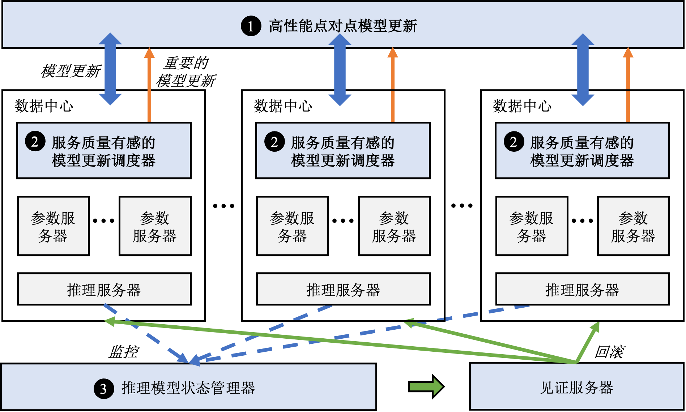

## 案例分析：支持在线模型更新的大型推荐系统
下面我们分析一个新型的支持低延迟模型更新的推荐系统Ekko\citeu{280902}，从而引入实际部署推荐系统所需要考虑的系统设计知识。Ekko的核心思想是将训练服务器产生的梯度或模型更新立刻发送至所有参数服务器，绕过费时长达数分钟乃至数小时的保存模型检查点、验证模型检查点、广播模型检查点到所有推理数据中心的过程。如此一来，推理服务器每次都能从同一数据中心的参数服务器上读到最新的模型参数。我们将这样的模型更新方式称为在线更新，以区别于上一小节介绍的离线更新，如图 :numref:`online-update`所示。

<!-- \begin{figure}[H]
    \centering
    \includegraphics{figs/ch_recommender/online_update.png}
    \caption{在线更新}
    \label{fig:online update}
\end{figure} -->

:width:`800px`
:label:`online-update`

### 系统设计挑战
相比于离线更新，在线更新避免了费时的存储和验证模型检查点的步骤，然而也带来了新的问题和挑战：

<!-- \noindent\textbf{1. 通过广域网传输海量的模型更新} -->
#### 1. 通过广域网传输海量的模型更新
    
在训练数据中心内部，训练服务器通过局域网（LAN）向参数服务器发送模型更新的速度可达几百GB每秒，而不同数据中心之间的网络带宽往往只有数Gbps，而且所有数据中心的网络带宽需要优先满足推理服务的需求——接受用户的推理请求并返回推荐结果。因此留给模型同步的带宽更加有限。
    
如果从训练数据中心向所有其他数据中心广播参数更新，会导致训练数据中心成为影响同步速度的瓶颈。假设训练数据中心需要广播一个100GB的模型至5个推理数据中心，训练数据中心可用的带宽为5Gbps，则需要花费800秒时间，这离秒级模型更新的需求还差了两个数量级。
    
如果使用如图 :numref:`chain-replication`所示的链式复制~\citeu{186214}，虽然可以避免在训练数据中心出现瓶颈，但是这种方式的更新延迟很大程度上取决于链上最慢的一段网络，导致在广域网的场景下延迟极高。
    
    <!-- \begin{figure}[H]
    \centering
    \includegraphics{figs/ch_recommender/chain_replication.png}
    \caption{链式复制}
    \label{fig:chain replication}
    \end{figure} -->
    
<!-- \noindent\textbf{2. 防范网络拥塞影响推荐质量} -->
#### 2. 防范网络拥塞影响推荐质量
    
模型跨地域更新的延迟很大程度上取决于网络状况，一旦网络繁忙出现拥塞，则整体更新延迟不可避免会上升，从而影响服务质量。而且采用在线更新的推荐系统更新流量也会有波峰，当模型更新流量波峰叠加网络拥塞，整体更新延迟更是雪上加霜。
    
<!-- \noindent\textbf{3. 防范有偏差的模型更新影响推荐质量} -->
#### 3. 防范有偏差的模型更新影响推荐质量
    
模型在线更新带来的一个问题是，不可能单独对每一条更新进行检查以确保其对服务质量不会产生负面影响。因此有偏差的模型更新可能被发送到推理集群中，从而直接影响在线服务质量。而且在大规模在线环境中，出现有偏差的模型更新的概率并不低。

图 :numref:`system-challenges`总结了在线更新会面临的系统挑战。

<!-- \begin{figure}[H]
    \centering
    \includegraphics{figs/ch_recommender/system_challenges.png}
    \caption{系统挑战}
    \label{fig:system challenges}
\end{figure} -->

:width:`800px`
:label:`system-challenges`

### 系统架构
针对这些挑战，Ekko提出了如图 :numref:`ekko-overview`所总结的三个核心组件。概括来讲：

<!-- \begin{figure}[H]
    \centering
    \includegraphics{figs/ch_recommender/ekko_overview.png}
    \caption{Ekko的系统概览}
    \label{fig:ekko overview}
\end{figure} -->

:width:`800px`
:label:`ekko-overview`

<!-- \begin{enumerate}[label={(\arabic*)}]
    \item Ekko设计了一套\textbf{高性能的点对点（Peer-to-Peer，P2P）模型更新传播算法}，令参数服务器根据不同的网络带宽从同伴（peer）处以自适应的速率拉取模型更新，并且结合推荐模型的特点优化了拉取效率。
    \item Ekko设计了\textbf{服务质量有感的模型更新调度器}来发现那些会对服务质量产生重大影响的模型更新并且将其在点对点传播的过程中加速。
    \item Ekko设计了\textbf{推理模型状态管理器}来监控在线服务的质量并快速回滚被有害更新损害的模型状态以避免SLO（Service-Level Objectives）受到严重影响。
\end{enumerate} -->
1. Ekko设计了一套\textbf{高性能的点对点（Peer-to-Peer，P2P）模型更新传播算法}，令参数服务器根据不同的网络带宽从同伴（peer）处以自适应的速率拉取模型更新，并且结合推荐模型的特点优化了拉取效率。
2. Ekko设计了\textbf{服务质量有感的模型更新调度器}来发现那些会对服务质量产生重大影响的模型更新并且将其在点对点传播的过程中加速。
3. Ekko设计了\textbf{推理模型状态管理器}来监控在线服务的质量并快速回滚被有害更新损害的模型状态以避免SLO（Service-Level Objectives）受到严重影响。

### 点对点模型更新传播算法
Ekko需要支持上千台分布在数个相隔上千公里的数据中心内的参数服务器之间传播模型更新。然而一个超大规模深度学习推荐系统每秒钟可以生成几百GB的模型更新，而数据中心之前的网络带宽仅有100Mbps到1Gbps不等。如果采用已有参数服务器架构，例如Project Adam~\citeu{ProjectAdam_186212}的两阶段提交协议，由训练数据中心向其他数据中心发送这些模型更新，不仅训练数据中心的带宽会成为瓶颈，而且整个系统的模型更新速度会受限于最慢的一条网络。同时Ekko的研究人员发现使用深度学习模型的推理服务器并不需要知道参数的更新过程，而仅需要知道参数的最新权重（状态）。有鉴于此，Ekko设计了基于状态的无日志同步算法，如图 :numref:`P2P-replication`所示，令参数服务器之间以自适应的速度相互拉取最新的模型更新。

<!-- \begin{figure}[H]
    \centering
    \includegraphics{figs/ch_recommender/p2p_replication.png}
    \caption{点对点模型更新}
    \label{fig:P2P replication}
\end{figure} -->

:width:`800px`
:label:`p2p-replication`

为了实现点对点无日志同步算法，Ekko首先借鉴已有的版本向量（Version Vector）算法~\citeu{ConciseVV_10.1007/11561927_25,VectorSet_10.1145/1243418.1243427}，为每个参数（即每个键值对）赋予一个版本（Version）。版本可以记录参数的更新时间和地点。此外，Ekko在每个分片内设置一条版本向量（也称之为见闻，Knowledge），用来记录该分片的所有已知版本。通过对比版本号和版本向量，参数服务器可以在不发送参数本身的前提下从同伴处拉取更新的参数状态。对版本向量算法感兴趣的读者可以参考原论文了解细节。

然而Ekko的研究人员发现，即使使用了版本向量算法，从海量的模型参数中找出被更新的参数依然是非常慢的。为了加速找出被更新的参数的过程，Ekko利用了推荐模型的两个重要的特点。
<!-- \begin{enumerate}[label={(\arabic*)}]
    \item \textbf{更新稀疏性：}虽然一个模型可以有数百GB甚至数TB的嵌入表，但是由于模型训练一般采用小批次的方式，因此每次训练服务器只会更新这一小批次中涉及到的那些嵌入项。从全局来看，一段时间内嵌入表中仅有一小部分参数的状态会被更新。
    
    \item \textbf{时间局部性：}推荐系统中的模型更新并不是均匀分布在所有参数上的，一些热门的物品和活跃用户所对应的嵌入项在一段时间内会被频繁更新，反之，冷门物品和非活跃用户所对应的嵌入项根本不会被涉及。
\end{enumerate} -->
1. **更新稀疏性：**虽然一个模型可以有数百GB甚至数TB的嵌入表，但是由于模型训练一般采用小批次的方式，因此每次训练服务器只会更新这一小批次中涉及到的那些嵌入项。从全局来看，一段时间内嵌入表中仅有一小部分参数的状态会被更新。
2. **时间局部性：**推荐系统中的模型更新并不是均匀分布在所有参数上的，一些热门的物品和活跃用户所对应的嵌入项在一段时间内会被频繁更新，反之，冷门物品和非活跃用户所对应的嵌入项根本不会被涉及。

结合这两个特点，Ekko加速比较过程的核心理念是：尽量避免浪费时间去比较那些没有被更新的参数的版本。

具体来讲，Ekko首先在每个分片内设计了一个\textbf{模型更新缓存}，其中保存的是近期刚刚被更新的参数的指针。假设参数服务器A正在试图从参数服务器B中拉取模型更新，如果参数服务器A已经知道所有不在B的缓存中的模型更新，那么A仅需要和B的缓存中的那些参数做比较，就能得到所有自己可能不知道的模型更新。

除此之外，Ekko还利用以上两个特点，为每个分片添加了一个分片版本（Shard Version），从而可以通过仅仅发送一个64比特的分片向量过滤掉那些根本没有模型更新的分片。分片版本减小的通信量带来的同步速度的提升也是非常显著的，Ekko的消融实验显示分片版本可以将更新延迟从27.4秒降低至6秒。

考虑到跨地域的网络带宽资源十分紧张，而集群内部的网络带宽相对宽裕，Ekko令每个集群内部选举一个本地领导负责从训练数据中心拉取模型更新，而集群内部的其他参数服务器从本地领导处拉取模型更新。在应用了这个简单但高效的优化之后，Ekko可以更进一步将模型更新延迟从6秒降低至2.6秒。此外，由于Ekko支持非常灵活的通讯拓扑，也可以应用已有的覆盖网络（Network Overlay）技术来进一步更加细致地优化通讯。

### 模型更新调度器
秒级模型更新的服务质量非常容易受到网络延迟的影响，而跨地域数据中心之间出现短暂的网络拥塞并不罕见。Ekko的设计者在实践中观察发现仅有一小部分关键的模型更新对服务质量具有决定性影响。为了最大程度保证在网络拥塞时的模型服务质量，Ekko会根据模型更新对服务质量的影响，赋予不同的优先级，并在点对点传播过程中优先发送这些关键更新。

具体来讲，Ekko的设计者提出了三种优先级指标来发现对服务质量具有决定性影响的模型更新：
<!-- \begin{enumerate}[label={(\arabic*)}]
    \item \textbf{更新的时新性} 正如前文提到的，如果推荐模型的嵌入表中没有新用户或新物品所对应的嵌入项，那么该用户或物品完全无法受益于推荐模型带来的高服务质量。为了避免这种情况的发生，Ekko对新加入的嵌入项赋予最高优先级，使得这些嵌入项永远以最快的速度传播至所有推理服务集群。
    \item \textbf{更新的显著性} 已有的大量研究都表明，大梯度的模型更新对模型的准确度会产生更加显著的影响，因此Ekko根据更新的幅度\footnote{根据模型的训练方式不同，更新幅度可能是梯度或梯度$\times$学习率}赋予不同模型更新不同的优先值。又因为Ekko服务于多模型场景，不同模型的数据分布不同，Ekko对每个模型在后台分别抽样统计平均更新幅度，每个更新的优先值取决于更新幅度和该模型平均更新幅度的比值。
    \item \textbf{模型的重要性} 在在线服务的多个模型中，每个模型承载的推理流量并不相同，因此在网络拥塞的情况下，Ekko优先保证那些承载着大多数流量的模型的更新。具体来讲，每个更新根据其所属模型的流量比例决定优先值。
\end{enumerate} -->
1. **更新的时新性** 正如前文提到的，如果推荐模型的嵌入表中没有新用户或新物品所对应的嵌入项，那么该用户或物品完全无法受益于推荐模型带来的高服务质量。为了避免这种情况的发生，Ekko对新加入的嵌入项赋予最高优先级，使得这些嵌入项永远以最快的速度传播至所有推理服务集群。
2. **更新的显著性** 已有的大量研究都表明，大梯度的模型更新对模型的准确度会产生更加显著的影响，因此Ekko根据更新的幅度\footnote{根据模型的训练方式不同，更新幅度可能是梯度或梯度$\times$学习率}赋予不同模型更新不同的优先值。又因为Ekko服务于多模型场景，不同模型的数据分布不同，Ekko对每个模型在后台分别抽样统计平均更新幅度，每个更新的优先值取决于更新幅度和该模型平均更新幅度的比值。
3. **模型的重要性** 在在线服务的多个模型中，每个模型承载的推理流量并不相同，因此在网络拥塞的情况下，Ekko优先保证那些承载着大多数流量的模型的更新。具体来讲，每个更新根据其所属模型的流量比例决定优先值。

除了以上三种默认的优先级指标，Ekko也允许使用者自定义函数来根据模型自身情况使用其他指标。

如图 numref:`model-update-scheduler`所示，对于每一条模型更新，Ekko根据公式\ref{equ:priority}计算其总的优先值，然后和k\%分位阈值做比较，如果大于k\%分位阈值，则视为高优先级，否则为低优先级。K值由使用者设置，而k\%分位阈值采用已有算法根据历史优先值估计。

<!-- \begin{figure}[H]
    \centering
    \includegraphics{figs/ch_recommender/update_scheduler.png}
    \caption{SLO有感的模型更新调度器}
    \label{fig:model update scheduler}
\end{figure} -->

:width:`800px`
:label:`model-update-scheduler`

<!-- \begin{equation}\label{equ:priority}
    p=(p_g+p_u) \times p_m
\end{equation} -->
$$
p=(p_g+p_u) \times p_m
$$

具有高优先级的模型更新在后续点对点传播过程中会被加速，具体的传播算法见原论文的算法2。

Ekko的线上实验结果显示，当网络拥塞时，采用服务质量有感的模型更新调度器可以避免超过2\%的服务质量下滑。

### 模型状态管理器

为了防止有害的模型更新影响到在线服务质量，Ekko设计了推理模型状态管理器来监控推理模型的健康状态。其核心思想是设置一组基线模型，并从推理请求中分出不到1\%的流量给基线模型，从而可以得到基线模型的服务质量相关指标。如图 :numref:`model-state-manager`所示，推理模型状态管理器中的时序异常检测算法不断监控基线模型和在线模型的服务质量。模型质量的状态可能是健康、未定或者损害，由复制状态机维护。一旦确定在线模型处于损坏状态，首先将被损坏模型的流量切换至其他健康的替换模型上，然后在线回滚模型至健康的状态。

<!-- \begin{figure}[H]
    \centering
    \includegraphics{figs/ch_recommender/state_manager.png}
    \caption{模型状态管理器}
    \label{fig:model state manager}
\end{figure} -->

:width:`800px`
:label:`model-state-manager`

### 小结
Ekko已经在生产环境中部署超过一年，服务超过10亿用户。Ekko成功将跨地域数据中心之间的模型平均更新延迟从分钟级别降低到了2.4秒，而在数据中心内部模型平均更新延迟可以低至0.7秒。秒级模型更新对于线上服务质量的提升十分明显，论文中的实验结果显示，仅仅加速多阶段推荐流水线中的一个排序模型，各项关键指标相比于分钟级模型更新就能够提升1.30\%-3.28\%。考虑到Ekko服务的用户规模，这种程度的提升是非常不平凡的，其所带来的收益也是非常可观的。

总而言之，Ekko提出了一种设计深度学习推荐系统的新思路，通过直接将模型更新发送到所有参数服务器这样一种在线更新的方式绕过了繁琐耗时的中间步骤，从而实现了秒级模型更新，显著提升了在线服务质量。针对在线更新可能带来的风险，Ekko设计了SLO保护机制，并且通过实验证明是行之有效的。这一小节简单介绍了工业界和学术界的前沿研究成果——Ekko的系统设计和背后的设计思想，希望能够给读者带来一些大型深度学习推荐系统设计的思考。受限于篇幅以及考虑到读者的阅读目标，本小节没有详细讨论Ekko的技术细节，如果读者对Ekko的技术设计细节感兴趣可以深入阅读原论文。