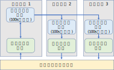

# 深度学习推荐系统

推荐系统通过对用户特征、历史行为等数据的分析，为用户推荐可能感兴趣的内容、商品或者广告。在信息爆炸的时代，高效且准确的推荐结果极大地提升了在线服务的质量。近年来，基于深度学习的推荐模型由于可以高效地利用在线服务中产生的海量数据，被谷歌、脸书、阿里巴巴等各大公司广泛应用于生产环境中。本节主要介绍深度学习推荐系统在工业界的主流系统架构、问题以及可能的解决方案。

## 背景

为了方便本节的讨论，我们首先简单介绍一些推荐系统的基本概念，包括三部分：推荐模型的结构，推荐系统的架构，和评估推荐系统的关键指标。

基于深度学习的推荐模型在过去几年受到了学术界和工业界的高度关注，得到了快速发展。目前主流的推荐模型（1，2，3，4）的基本结构可以总结如图 :numref:`ch10-recommendation-models`。

:width:`800px`
:label:`ch10-recommendation-models`

推荐模型以用户和内容的交互历史、用户属性、内容属性等特征作为输入，对输入特征进行充分相互作用，再将交互结果交由稠密深度神经网络来预测用户点击候选内容的可能性。【以xxx网络为例】。由于推荐模型的输入中包含大量无法直接进行矩阵运算的类别数据，例如用户和商品标识符，所以必须使用嵌入表将类别数据转换为数字向量形式。由于每种类别数据包含的每种情况都需要一个单独的嵌入项来表示，而稠密深度神经网络的参数可以共享，在大规模推荐模型中，嵌入表占据了绝大部分内存 :cite:`MLSYS2021_979d472a, DBLP:journals/corr/abs-2003-05622`。举例说明，假设一个推荐模型需要处理1亿条短视频内容，而每条短视频对应的嵌入项为一个64维的32位浮点数向量，那么仅该内容嵌入表就需要就需要占据大约24GB内存。如果考虑到用户标识符等其他嵌入表，那么单个模型可以轻易占据近100GB内存。而在工业界生产环境中，TB级的推荐模型 :cite:`DBLP:journals/corr/abs-2003-05622`也是非常常见的。

在实际的生产环境中，除了推荐模型本身，推荐系统通常包括：数据收集、数据处理、数据存储、模型训练、模型存储、模型评估、推理服务等多个子系统。如图 :numref:`ch10-abstract-recommendation-systems`所示，这些子系统之间分工协作、紧密配合，构成一个从用户反馈、到模型更新、再到新推荐结果生成的闭环。下一小节中将重点介绍模型训练、推理子系统的结构。

:width:`800px`
:label:`ch10-abstract-recommendation-systems`

深度学习模型给出的推荐结果的准确性是推荐系统需要关注的一个基本指标。然而不同于一般学术论文中使用的基准数据集，生产环境中推荐模型面对的是动态变化的数据分布。例如，每天的热点内容不同，每个用户的兴趣也会不断变化。为了保持模型的性能，推荐系统需要不断根据用户的反馈对已有模型进行更新。而这就需要系统能够将用户的行为转换为模型可以处理的数据。系统首先在提供服务的同时收集用户的行为，例如用户对内容的浏览、点击动作。收集到的数据还需要进一步加工处理，从而得到模型可以接受的格式化数据。

除了推荐准确性，对于在线服务的提供者而言，可用性是一个非常关键的指标。当用户需要一个推荐结果时，相比于给用户一个不完全准确的推荐，"无响应"的结果对于用户的体验伤害更大。因此，在某种程度上可以说系统可用性是比推荐结果的准确性更加关键的一个指标。然而这并不意味着准确性不重要，在一定的资源限制下，在线推荐系统的设计者必须谨慎地在准确性和可用性之间进行平衡。例如，使用更宽、更深、更复杂的神经网络模型可能会给出更加准确的推荐结果，但如果其推断延迟高于给定的阈值，那么这样的模型不能直接运用于生产环境中。

## 主流系统架构

正如上文提到的，嵌入表占据了推荐模型绝大部分存储而其更新具有显著的稀疏性，因此推荐系统通常采用上一章介绍的参数服务器架构来存储模型。具体来讲，所有参数被分布存储在一组参数服务器上，而训练服务器一方面从数据存储模块拉取训练数据，另一方面根据训练数据从参数服务器上拉取对应的嵌入项和所有稠密神经网络参数。训练服务器本地更新之后将本地梯度或新的参数发送回参数服务器以更新全局参数。全局参数更新可以选择全同步，半同步，或异步更新。类似的，推理服务器在接到一批用户的推荐请求后，从参数服务器拉去相应的嵌入项和稠密神经网络参数来响应用户的请求。为了提升训练（推理）的吞吐，可以在训练（推理）服务器上缓存一部分参数。

为了避免训练服务器和参数服务器之间的通信限制训练吞吐率，一些公司也在探索单机多GPU训练超大规模推荐系统。然而正如前文提到的，即使是单个推荐模型的参数量（1̃00GB）也超出了目前最新的GPU显存。有鉴于此，脸书公司的定制训练平台
-- ZionEX :cite:`DBLP:journals/corr/abs-2104-05158`
利用计算设备之间的高速链接将多台设备的存储共享起来可以单机训练TB级推荐模型。然而对于更大规模的模型或中小型企业、实验室，参数服务器架构依然是性价比最高的解决方案。

为了提升在发生故障的情况下的可用性，在线服务中的深度学习推荐模型通常都采用多副本分布式部署。同一个模型的多个副本通常会被部署在至少两个不同的地理区域内的多个数据中心中，如图 :numref:`ch10-recommendation-systems`，以应对大面积停电或者网络中断而导致整个地区的所有副本都不可用。除了容错方面的考虑，部署多个副本还有其他几点优势。首先，将模型部署在靠近用户的云服务器上可以提升响应速度。其次，部署多份副本也可以拓展模型推理服务的吞吐率。

:width:`800px`
:label:`ch10-recommendation-systems`

## 现有解决方案及其存在的问题

在线服务系统的两个主要诉求：

-   大模型的高效存储。为了提升训练和推理的性能，通常推荐模型全部存储在内存中，然而纯内存存储对于内存的需求极高。正如前文分析的，单个模型就要占据至少100GB的内存，而一个在线推荐系统中需要同时运行多个模型负责不同的服务。如果考虑到除了在线服务模型，算法研究人员还需要上线测试不同的模型结构或者训练策略，系统中通常会同时存在上百个超大模型。因此在线推荐系统亟需既能拓展存储容量，又不会影响训练和推理性能的存储解决方案。

-   大模型的快速更新。
    在线服务系统所面对的环境是复杂多变的，因此其中的机器学习模型必须不断更新以应对新的数据分布。以一个短视频推荐系统为例，其面对的变化主要来自三点。首先，每时每刻都有大量的新视频上传，这些新视频的特征分布和模型训练时所见到的数据不同；其次，对于不断加入的新用户，模型难以直接给出最优的推荐结果；最后，全部用户和内容之间的交互在不断改变，表现为热点视频在持续变化。因此，为了应对以上变化，在线服务中不可能奢望仅仅训练一次模型就能够一劳永逸地解决问题。目前业界主流的做法是利用新产生的数据不断地增量式更新所部属的模型。在学术界和工业界大量的研究和实践 :cite:`10.1145/2020408.2020444,10.1145/2648584.2648589,10.1145/3267809.3267817,9355295`中都发现模型更新可以有效缓解概念漂移带来的危害，而且更新的频率越高，模型的性能越好。

在线推荐系统对跨地域地部署的大模型进行快速更新的需求在现有的系统中很难得到满足。一种最直观的解决方案是周期性地将训练服务器上的模型参数发给所有副本。然而这种方式面临着非常大的资源瓶颈。我们以网络开销为例进行分析。假设负责训练的参数服务器存储有100GB的参数，每10分钟将所有参数（在训练集群内部，模型更新的速度极快，10分钟足够将所有参数更新多次）发给其余2个副本。这就需要至少2.6Gbps的网络带宽。然而我们的分析只是最基本的情况，没有考虑网络传输的额外开销以及可能出现的失败重传，也没有考虑需要水平扩展至更多副本、更大模型、更高的更新频率的情况。为了缓解网络瓶颈，人们不得不选择以更慢的速度更新更大的模型，或者限制模型大小以追求更快的更新速度。简单的广播模型参数除了会有很大的资源瓶颈，还无法保证多副本之间的一致性。然而如果采用先用的数据库系统来保证一致性，只能使得资源开销更加严重，进一步限制系统的规模和效率。

## 未来可以探索的方向

为了解决在线深度学习推荐系统的以上几点问题，研究人员也探索了几个潜在的方向。

-   云--边--端协同推荐系统。随着边缘设备的增加以及用户端设备性能逐渐增强，服务提供者可以通过将部分计算服务从云服务器下放至边缘服务器乃至用户的设备上来提高模型的反应速度。例如，有研究 :cite:`gong2020edgerec`探索了将模型的前几层下放至客户端上，并且利用用户的本地数据进行个性化训练以给出更加准确的推荐结果。当用户的兴趣发生改变时，客户端上的小模型可以实时地更新以响应用户的请求。除此之外，还可以借鉴联邦学习中的概念，例如有研究 :cite:`NEURIPS2020_a1d4c20b`探索了利用知识迁移的方法在云-端之间传递信息。在在线推荐系统中使用这种方法可以彻底解耦云上的大模型与客户端的小模型。

-   异构硬件多级存储。前文提到GPU显存无法装下完整的模型参数，一些现有的系统 :cite:`DBLP:journals/corr/abs-2003-05622`为了充分利用GPU的计算优势，采用多级缓存的思想，将部分参数分级存储于显存、主存和固态硬盘上。在他们提出的这个分级系统中，主要解决了缓存策略和异构硬件的适配问题。然而在设计类似的存储系统时，还应该考虑到机器学习模型内在的一些访存特征以进一步优化。Kraken :cite:`9355295`这篇工作讨论了利用机器学习模型的特征对嵌入项的哈希表的存储进行优化的方法。此外，新型硬件的发展为解决大规模推荐模型的高效存储提供了新的可能。比如非易失存储可以作为主存的扩展，进一步提升系统可以支持的模型尺寸。然而目前还没有见到专门为在线机器学习优化的非易失存储系统。另外也有工作 :cite:`MLSYS2021_ec895663`讨论了利用FPGA加速嵌入表的访存并且相比于CPU服务器取得了非常显著的效果。

-   内存高效的嵌入项存储与计算。除了系统上的设计，研究人员也在探索其他算法优化手段来压缩嵌入表的内存需求。直接使用低精度浮点数可以有效降低内存开销，但是还是会对模型的精度产生一定的影响。因此在在线推荐服务这种精度敏感的场景中并不适用。除此之外，:cite: `MLSYS2021_979d472a`利用低秩分解可以将一个大矩阵分解为两个小矩阵（向量）。这种方法可以在保留原矩阵大量信息的前提下显著减小内存开销。除了低秩分解外，还有其他 :cite:`10.1145/3394486.3403059`分解嵌入表的手段。还有研究 :cite:`ginart2021mixed`表明，没有必要为所有的项目都使用一样长的嵌入项，可以根据嵌入项的重要性动态决定其长度以节省内存开销。作为系统设计者，如何将层出不穷的算法优化手段高效地实现是需要考虑的问题。

## 小结

推荐系统作为深度学习在工业界最成功的落地成果之一，极大地提升了用户的在线服务体验，并且为各大公司创造了可观的利润，然而也带来了许多系统层面的挑战亟待解决。本节简单介绍了典型的工业界推荐系统架构及其面临的挑战，并给出了潜在的解决方案的方向。在实际生产环境中，具体的系统设计方案根据不同推荐场景的需求而变化，不存在一种万能的解决方案。
