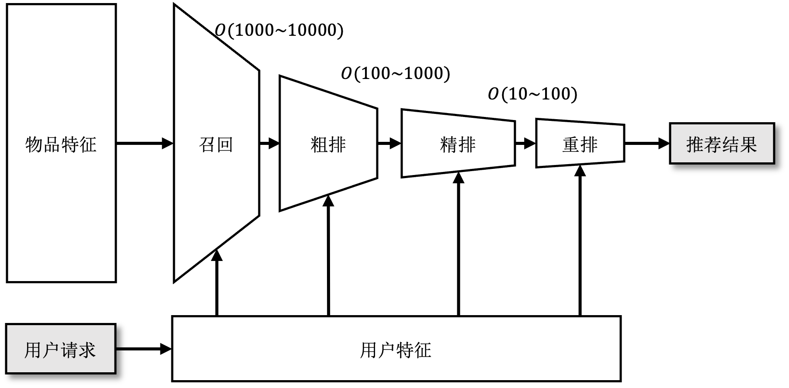
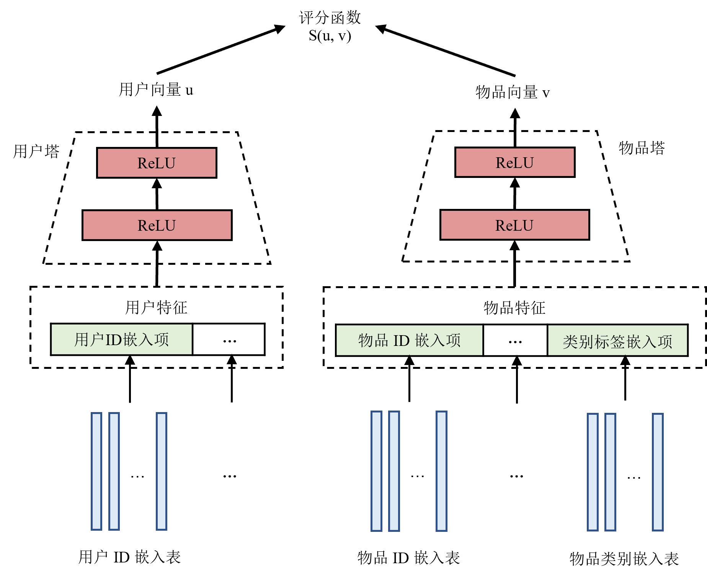
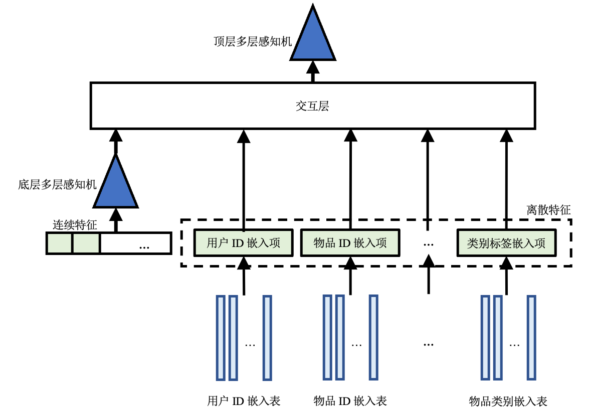
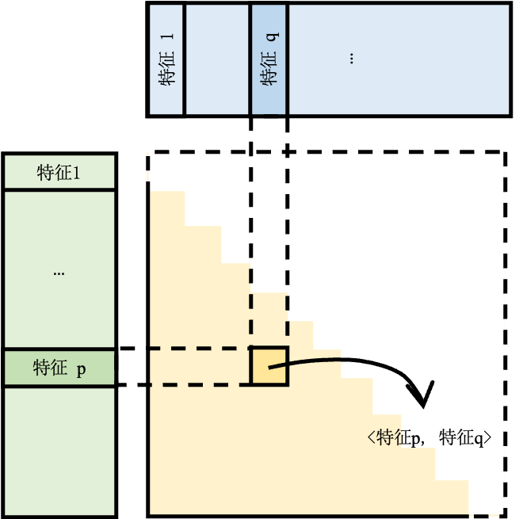

## 多阶段推荐系统
推荐流水线的功能是根据用户请求推荐为其可能感兴趣的物品。具体来说，当用户需要使用推荐服务时向推理服务发送一个推荐请求，其中包括用户ID和当前的上下文特征（例如，用户刚刚浏览过的物品、浏览时长等），推荐流水线将该用户的特征和备选物品特征作为输入，进行计算后得出这名用户对各个备选物品的评分，并选出评分最高的（数十个到数百个）物品作为推荐结果返回。

一个推荐系统中通常会有多达数十亿的备选物品，如果用一个模型来计算用户对于每个备选物品的评分，必然会导致模型在准确度和速度上做取舍。换句话说，要么选择简单的模型牺牲准确度换取速度——导致用户对推荐结果毫无兴趣；要么选择复杂的模型牺牲速度换取准确度——导致用户因等待时间过长而离开。有鉴于此，现代推荐系统通常以如图 :numref:`recommender-pipeline`所示的流水线的形式部署多个推荐模型。在流水线的最前端，召回（Retrieval）阶段（通常使用结构较为简单、运行速度较快的模型）从所有备选物品中过滤出用户可能感兴趣的数千至数万个物品。接下来排序（Ranking）阶段（通常使用结构更为复杂、运行速度也更慢的模型）对选出的物品进行打分并排序，然后再根据业务场景为用户返回最高分的数十或数百个物品作为推荐结果。当排序模型过于复杂而不能在规定时间内处理所有被召回的物品时，排序阶段可以被进一步细分为：粗排（Pre-ranking），精排（Ranking）和重排（Re-ranking）三个阶段。

### 推荐流水线概述

:width:`800px`
:label:`recommender-pipeline`

下面几个小节详细将会详细介绍召回和排序阶段的常用模型、训练方法以及关键指标。

### 召回
在召回阶段，模型以用户特征作为输入，从所有备选物品中粗略筛选出一部分用户可能感兴趣的物品作为输出。召回阶段的主要目的是将候选物品范围缩小，减轻下一阶段排序模型的运行负担。

#### 1. 双塔模型
接下来以如图 :numref:`two-tower-model`所示双塔模型 :cite:`yi2019sampling`为例介绍召回的流程。双塔模型具有两个MLP，分别对用户特征和物品特征进行编码，称之为用户塔[^1] 和物品塔。对于输入数据，连续特征可以直接作为MLP的输入，而离散特征需要通过嵌入表映射为一个稠密向量再输入到MLP中。用户塔和物品塔对特征进行处理得到用户向量和物品向量用于表示不同用户或物品。双塔模型使用一个评分函数衡量用户向量和物品向量之间的相似度。

:width:`800px`
:label:`two-tower-model`

#### 2. 训练

%关于如何训练这一模型，一个自然的想法是：每个用户都与所有的物品两两进行评分。然而如前文提及，训练数据集来自以往做出的推荐和用户反馈，同一名用户只可能对少数物品做出过反馈，因此数据集只包含用户与部分物品的互动。此外，召回阶段的备选物品通常很多，两两评分得到的分数矩阵会占用大量内存。所以在实际训练中，我们只选取用户点击了的（用户，物品）对，即正样本作为训练数据集，在训练过程中使用采样器对其他物品进行采样作为负样本。
训练时，模型的输入为用户对历史推荐结果的反馈数据，即（用户，物品，标签）对，其中标签表示用户是否点击了物品。一般点击记为1，而未点击记为0。双塔模型使用正样本（即标签为1的样本）作为训练数据。然后使用一种可以纠正采样偏差的批次内采样器在批次内进行采样得到负样本，其算法细节在不是本节介绍的重点，感兴趣的读者可以深入研究原论文。模型输出的结果是用户点击不同物品的概率。训练时选用合适的损失函数使得正样本的预测结果尽可能接近1，而负样本的预测结果尽可能接近0。

#### 3. 推理

推理之前，首先使用训练好的模型计算出所有物品的物品向量并保存。这是因为物品的特征是相对稳定的，这样做可以减少推理时的计算开销，从而加快推理速度。而用户特征和用户的使用情况相关，因此当用户请求到达时，双塔模型使用用户塔对当前的用户特征进行计算，得到用户向量。然后使用训练时的评分函数作为相似度的衡量，使用这一用户的用户向量与所有备选物品的物品向量进行相似度搜索。选出相似度最高的一部分物品输出作为召回结果。

#### 4. 评估指标

召回模型的常见评估指标是在召回$k$个物品时的召回率（Recall@k），召回$k$个物品时的召回率定义如下：
$$
 \text{Recall@k} = \frac{\text{TP}}{\min(\text{TP} + \text{FN}, k)}
$$

其中，TP、FN分别是真阳性（即召回的$k$个物品中真实标签为1的）和假阴性（即没有被召回的物品中真实标签为1的）。换句话说，召回率衡量的是所有正样本中有多少被模型成功找到了。这里需要注意的是，因为最多只能召回$k$个物品，因此如果正样本数多于$k$，那么最好的情况下也只能找出$k$个。因此分母选择正样本数和$k$中较小的那一个。

### 排序
在排序阶段，模型结合用户和物品特征对召回得到的物品逐一打分。分数大小反映了该用户对物品感兴趣的概率。根据排序结果，选取评分最高的一部分物品向用户推荐。

当推荐模型所需要处理的备选物品越来越多，或者需要加入更为复杂的推荐逻辑和规则时，排序可以进一步细分为三个阶段：粗排、精排和重排：

1. 粗排在召回与精排之间对物品进行进一步筛选。当有海量的备选物品或者使用了多路召回来增加召回结果的多样性时，召回阶段输出的物品数量依然会非常多。如果全部输入精排模型，会导致精排的耗时极高。因此在推荐流水线中加入粗排阶段可以进一步减少需要被精排的物品。
2. 精排是排序最重要的阶段。在精排阶段，模型应尽量准确地反映用户对不同物品的喜好程度。下文中的排序模型均指代精排模型。
3. 重排阶段会根据一定的商业逻辑（例如，增加新物品的曝光率或者过滤掉用户已经购买过的物品、看过的视频等）和规则（打乱推荐的物品、减少相似物品推荐）对精排的结果进行进一步处理以从整体上提升推荐服务的质量，而不是仅仅关注单个物品的点击率。

#### 1. DLRM

接下来以DLRM :cite:`naumov2019deep`为例，介绍排序模型如何处理特征数据。如图 :numref:`dlrm-model`所示，DLRM包括嵌入表、两层MLP和一层交互层[^2]。

:width:`800px`
:label:`dlrm-model`

和双塔模型类似，DLRM首先使用嵌入表将离散特征转化为对应的嵌入项（一条稠密向量），并将所有连续特征连接成一个向量输入底层MLP，处理得到与嵌入项维度相同的一个向量。底层MLP的输出和所有嵌入项一同送进交互层进行交互。

如图 :numref:`interaction`所示，交互层将所有特征（包括所有嵌入项和经过处理连续特征）进行点积（Dot production）操作，从而得到二阶交叉特征。由于交互层得到的交互特征是对称的，对角线是同一个特征与自己交互的结果，对角线以外的部分，每对不同特征的交互都出现了两次（例如，对于特征$p,q$，会得到$<p,q>, <q,p>$），所以只保留结果矩阵的下三角部分，并将这一部分拉平。拉平后的交叉结果和底层MLP的输出拼接起来，一起作为顶层MLP的输入，顶层MLP的进一步学习后，输出的评分代表用户点击该物品的概率

:width:`800px`
:label:`interaction`

#### 2. 训练方法

DLRM直接基于（用户，物品，标签）对进行训练。模型将用户和物品特征一起输入，进行交互处理预测出用户点击物品的概率。对于正样本应当令概率尽可能接近1，而负样本接近0。

#### 3. 训练评估指标

排序实际上可以被看作一个二分类问题，即将（用户，物品）分类为点击（标签为1）或不点击（标签为0），所以评估排序模型的方法与评估二分类模型类似。但是由于推荐系统数据集通常极度不平衡（正负样本比例悬殊），为了减少数据不平衡对指标的影响，排序模型的常用评估指标为AUC（Area Under Curve, 曲线下面积）和F1评分。
其中，AUC是ROC（Receiver Operating Characteristic，受试者工作特征）曲线下的面积，ROC曲线是在选取不同分类阈值时的真阳性率-假阳性率曲线。通过计算AUC和ROC曲线，可以选取合适的分类阈值。如果预测概率大于分类阈值，则认为预测结果为1（点击）；否则为0（不点击）。根据预测结果可以算出召回率（recall）和精确率（precision），然后根据公式 :eqref:`f1`计算F1评分。

$$
F1 = 2 \times \frac{recall \times precision}{recall + precision}
$$
:eqlabel:`f1`

#### 4. 推理流程

推理时，首先将召回的物品的特征和相应的该用户的特征拼接起来，然后输入DLRM。根据模型的预测分数，选择概率最高的一部分物品输出。

[^1]: 原论文中的用户塔还使用了用户观看过的视频的特征作为种子特征。

[^2]: DLRM允许对模型结构进行定制化，本节以DLRM的默认代码实现为例进行简单介绍。