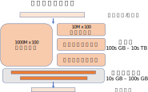
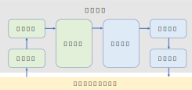

## 背景

为了方便本节的讨论，我们首先简单介绍一些推荐系统的基本概念，包括三部分：推荐模型的结构，推荐系统的架构，和评估推荐系统的关键指标。

基于深度学习的推荐模型在过去几年受到了学术界和工业界的高度关注，得到了快速发展。目前主流的推荐模型（1，2，3，4）的基本结构可以总结如图 :numref:`ch10-recommendation-models`。

:width:`800px`
:label:`ch10-recommendation-models`

推荐模型以用户和内容的交互历史、用户属性、内容属性等特征作为输入，对输入特征进行充分相互作用，再将交互结果交由稠密深度神经网络来预测用户点击候选内容的可能性。为了加深读者的对推荐模型的理解，此处我们以Wide & Deep模型 :cite:`10.1145/2988450.2988454`作为例子，深入分析推荐模型的输入特征以及输入特征之间如何交互。由于推荐模型的设计不在本章的讨论范围内，所以下面的介绍中重点介绍模型的基本结构以方便理解推荐系统的设计，而不讨论Wide & Deep模型的设计理念、数据生成、数据预处理的方法。感兴趣的读者可以自行阅读论文以进一步了解。

Wide & Deep模型是一个设计简洁然而性能优异的模型，由谷歌在开发并应用于谷歌应用商店中，该模型在谷歌的实际生产环境中可以大幅提升应用的下载率。

Wide & Deep模型的输入数据可以分为两类：连续特征（例如：用户年龄、用户已安装的应用数量、用户参与的会话数量等）和类别特征（例如：用户ID，用户性别属性、用户设备类型、应用ID等）。连续特征的值本身是具有实际意义的数字，可以直接参与后续模型的运算。而类别特征的值并不具有实际意义，所以需要使用嵌入表（Embedding table）将类别特征转化为数字向量，即嵌入项（Embedding item）。

Wide & Deep模型对输入数据进行两部分处理：Wide部分和Deep部分。Wide部分计算用户已安装应用和候选应用的外积（Cross- product）。Deep部分将所有连续特征和类别特征的嵌入项拼接起来输入一个多层感知机（Multilayer perceptron）。Wide部分和Deep部分按照一定规则拼接然后得到最终的输出。

正如上面的例子所示，推荐模型的输入中包含大量无法直接进行矩阵运算的类别数据，而由于每种类别数据包含的每种情况都需要一个单独的嵌入项来表示，而稠密深度神经网络的参数可以共享，在大规模推荐模型中，嵌入表占据了绝大部分内存 :cite:`MLSYS2021_979d472a,MLSYS2020_f7e6c855`。举例说明，假设一个推荐模型需要处理1亿条短视频内容，而每条短视频对应的嵌入项为一个64维的32位浮点数向量，那么仅该内容嵌入表就需要就需要占据大约24GB内存。如果考虑到用户标识符等其他嵌入表，那么单个模型可以轻易占据近100GB内存。而在工业界生产环境中，TB级的推荐模型 :cite:`MLSYS2020_f7e6c855`也是非常常见的。

在实际的生产环境中，除了推荐模型本身，推荐系统通常包括：数据收集、数据处理、数据存储、模型训练、模型存储、模型评估、推理服务等多个子系统。如图 :numref:`ch10-abstract-recommendation-systems`所示，这些子系统之间分工协作、紧密配合，构成一个从用户反馈、到模型更新、再到新推荐结果生成的闭环。下一小节中将重点介绍模型训练、推理子系统的结构。

:width:`800px`
:label:`ch10-abstract-recommendation-systems`

深度学习模型给出的推荐结果的准确性是推荐系统需要关注的一个基本指标。然而不同于一般学术论文中使用的基准数据集，生产环境中推荐模型面对的是动态变化的数据分布。例如，每天的热点内容不同，每个用户的兴趣也会不断变化。为了保持模型的性能，推荐系统需要不断根据用户的反馈对已有模型进行更新。而这就需要系统能够将用户的行为转换为模型可以处理的数据。系统首先在提供服务的同时收集用户的行为，例如用户对内容的浏览、点击动作。收集到的数据还需要进一步加工处理，从而得到模型可以接受的格式化数据。

除了推荐准确性，对于在线服务的提供者而言，可用性是一个非常关键的指标。当用户需要一个推荐结果时，相比于给用户一个不完全准确的推荐，"无响应"的结果对于用户的体验伤害更大。因此，在某种程度上可以说系统可用性是比推荐结果的准确性更加关键的一个指标。然而这并不意味着准确性不重要，在一定的资源限制下，在线推荐系统的设计者必须谨慎地在准确性和可用性之间进行平衡。例如，使用更宽、更深、更复杂的神经网络模型可能会给出更加准确的推荐结果，但如果其推断延迟高于给定的阈值，那么这样的模型不能直接运用于生产环境中。