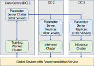

## 主流系统架构

在实际的生产环境中，除了推荐模型本身，一个企业级推荐系统通常包括从用户反馈数据收集，到模型训练，再到服务用户请求的完整流水线（pipeline）。甚至从系统角度来看，推荐模型固然是系统的核心，然而其本身的代码仅占推荐系统的很小一部分，而围绕推荐模型所构建的其他基础设施占据了系统的绝大部分 :cite:`NIPS2015_86df7dcf`。

本节以英伟达公司的Merlin开源框架 :cite:`Merlin`为例，简单介绍推荐系统的完整流水线以及各个组件在其中的作用，关于Merlin特性的完整介绍请读者参考官方文档。
Merlin是英伟达公司开发的一个开源推荐系统框架，帮助使用者构建高效的、基于GPU的推荐系统。Merlin提供三个主要开源组件：NVTabular :cite:`NVTabular`，HugeCTR :cite:`HugeCTR`和Triton :cite:`Triton`，分别对数据处理、模型训练核推理服务进行端到端加速。下面分别展开介绍流水线中的三个主要环节：

1. 数据处理：推荐系统首先从用户的推荐请求中记录用户的反馈数据（例如，用户是否对推荐结果做出了正向反应）到数据存储系统中。随后数据预处理系统对原始反馈数据进行格式化、清洗、重采样等操作生成训练数据。关于数据处理组件，本书在前面章节进行了详细介绍。在Merlin中，这一步骤由NVTabular负责。同时NVTabular还为多种模型训练框架提供了数据加载器（dataloader）。
2. 模型训练：推荐模型每次迭代选择一批训练数据，拉取对应的嵌入项、并送入稠密神经网络，计算损失，然后反向传播计算梯度，最终更新嵌入表和稠密神经网络。正如上文提到的，嵌入表占据了推荐模型绝大部分存储而其更新具有显著的稀疏性，因此推荐系统通常采用上一章介绍的参数服务器架构来存储模型。具体来讲，所有参数被分布存储在一组参数服务器上，而训练服务器根据训练数据从参数服务器上拉取对应的嵌入项和所有稠密神经网络参数。训练服务器本地更新之后将本地梯度或新的参数发送回参数服务器以更新全局参数。全局参数更新可以选择全同步，半同步，或异步更新。为了提升训练的吞吐，可以在训练服务器上缓存一部分参数。HugeCTR为此提供了Embedding Training Cache和GPU embedding cache。为了避免训练服务器和参数服务器之间的通信限制训练吞吐率，一些公司也在探索单机多GPU训练超大规模推荐系统。然而正如前文提到的，即使是单个推荐模型的参数量（~100GB）也超出了目前最新的GPU显存。有鉴于此，脸书（Facebook）公司的定制训练平台 -- ZionEX :cite:`zionex`利用计算设备之间的高速链接将多台设备的存储共享起来可以单机训练TB级推荐模型。然而对于更大规模的模型或中小型企业、实验室，参数服务器架构依然是性价比最高的解决方案。
3. 推理服务：类似地，推理服务器在接到一批用户的推荐请求后，从参数服务器拉去相应的嵌入项和稠密神经网络参数来响应用户的请求。推荐系统的推理服务对延迟十分敏感，例如脸书公司的DLRM :cite:`naumov2019deep`基准在MLPerf评测中的服务器延迟限定在30ms[^1]。因此如何在限定延迟（latency-bounded）的情况下尽可能提升吞吐（throughput）是推理服务面临的关键问题。在GPU推理场景下，常见的优化手段有：请求动态合批处理、核融合、低精度部署等 :cite:`10.1145/3437801.3441578,wang-etal-2021-lightseq`. Triton提供了请求调度的功能并且支持多种不同的机器学习框架作为后端。

在工业界，为了提升系统在发生故障的情况下的可用性，以上介绍的各个组件在实际中部署中都应该具备基本的容灾和故障恢复能力。以推理服务为例，在线服务中的深度学习推荐模型通常都采用多副本分布式部署。同一个模型的多个副本通常会被部署在至少两个不同的地理区域内的多个数据中心中，如 :numref:`ch10-recommendation-systems`，以应对大面积停电或者网络中断而导致整个地区的所有副本都不可用。除了容错方面的考虑，部署多个副本还有其他几点优势。首先，将模型部署在靠近用户的云服务器上可以提升响应速度。其次，部署多份副本也可以拓展模型推理服务的吞吐率。

:width:`800px`
:label:`ch10-recommendation-systems`

[^1]: https://mlcommons.org/en/inference-datacenter-11/