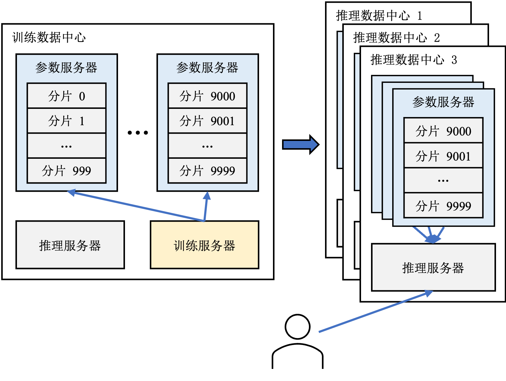

## 系统基本组成

推荐系统的核心模块是其中的推荐模型，其负责根据输入数据找出用户可能感兴趣的物品。为了支持推荐模型的持续、稳定、高质量运行，大型推荐系统还包括了围绕推荐模型搭建了的一系列其他模块。图 :numref:`ch10-recommendation-systems`展示了一个典型的推荐系统的基本组件。首先有一个消息队列接收从推荐服务的客户端上传的日志，其中包括了用户对于此前推荐结果的反馈，例如用户是否点击了推荐的物品。然后数据处理模块对日志中的原始数据进行处理。处理得到新的训练样本写入另一条消息队列中，由训练服务器读取并更新模型参数。主流的推荐模型主要由两部分构成：嵌入表和神经网络。在训练过程中，训练服务器从参数服务器拉取模型参数，计算梯度并将梯度上传回参数服务器，参数服务器聚合各个训练服务器的结果并更新参数。推理服务器负责处理用户请求，根据用户请求从参数服务器拉取对应的模型参数然后计算推荐结果。

:width:`800px`
:label:`ch10-recommendation-systems`

以下各个小节详细介绍推荐系统工作流中的各个组件的功能和特点。

### 消息队列
消息队列（Message Queue）是一种服务（Service）间异步通信的方式，常用于无服务（Serverless）或微服务（Microservices）架构中。

例如在推荐系统中，各个模块可以部署成一个个相对独立的微服务。客户端向服务器上报的日志（包含用户对推荐结果的反馈）由消息队列负责收集，然后数据处理服务从消息队列中读取原始日志，进行清洗、转化，得到的用户、物品特征存入特征存储中，而得到的训练样本再写入另一条消息队列中等待训练服务器使用。

消息队列带来的益处非常多，其中之一是允许消息的生产者（Producer），例如客户端的上报组件，和消息的消费者（Consumer），例如服务端的数据处理模块，可以以不同的速率生产消费数据。假设在推荐服务使用的高峰期，用户端产生了大量反馈，如果令数据处理模块直接接受数据，那么很可能因为处理速度跟不上产生速度而导致大量数据被丢弃。即使可以按最高峰的反馈量配置数据处理模块，那么也会导致大部分非高峰期时间资源是浪费的。而消息队列可以在高峰期将用户日志缓存起来，从而使得数据处理模块可以以一个较为恒定且经济的速度处理用户反馈。

作为分布式系统的重要基础组件，业界已经开发了许多成熟的消息队列系统，例如RabbitMQ，Kafka，Pulsar等。限于篇幅和主题，本节无法详细介绍消息队列的各个方面，感兴趣的读者可以参考这些开源系统的文档或者拓展阅读中给出的资料深入学习。

### 特征存储
特征存储是存储并组织特征的地方，被用于模型训练和推理服务中。

前文提到数据处理模块从消息队列中读取原始日志，例如日志中包含用户性别信息可能是“男”“女”，“未知”中的一种。这样的原始特征无法直接输入推荐模型中使用，因此数据处理模块对其进行简单的映射转化：“男” –> 0，“女”-> 1，“未知”-> 2。经过这样转化之后，性别特征就可以被数据处理模块或者推荐模型所使用。转化后的特征被存入特征存储中。一种典型的特征存储格式如图 :numref:`feature-store`所示，当训练或推理模块需要用到用户特征时，只需要知道用户ID就可以从特征存储中查询到所有需要的特征。

:width:`800px`
:label:`feature-store`

使用特征存储的一个显著优势是复用数据处理模块的结果并减少存储冗余，即避免每个模块都要单独对原始数据进行加工处理并维护一个数据存储系统来保存可能会用到的特征。然而其带来的一个更大的益处是可以保证整个系统中的各个组件拥有一致的特征视图。设想一个极端场景，假如训练模块自己维护的数据库中性别“男”对应的值是1，而“女”对应0，而推理模块恰好相反，这样会导致模型推理得到灾难性的结果。

特征存储是机器学习系统中的重要基础组件，工业界有许多成熟的产品，例如SageMaker，Databricks等，也有许多优秀的开源系统，例如Hopsworks，Feast等。关于特征存储更加详细的介绍可以参考拓展阅读中提供的资料。

### 稠密神经网络
稠密神经网络（Dense Neural Network，DNN）是推荐模型的核心，负责探索各个特征之间隐含的联系从而为用户推荐出可能感兴趣的物品。一般在推荐系统中，简单的多层感知机（Multilayer Perceptron，MLP）模型就已经显示出了强大的效果并被应用在谷歌~\citeu{10.1145/2988450.2988454}、Meta~\citeu{naumov2019deep}等各大公司的推荐模型中。虽然MLP的大矩阵相乘操作属于计算密集型任务，对于计算能力要求很高，但是推荐模型中的MLP尺寸一般不超过数MB，对存储要求不高。

虽然MLP已经取得了不错的效果，在推荐系统领域，近年来应用各种新型深度神经网络的尝试从未止步，更加精巧复杂的网络结构层出不穷，近年来也有工作尝试应用Transformer模型完成推荐任务~\citeu{10.1145/3460231.3474255}。在可以预见的未来，推荐模型中的稠密神经网络也必然会增长到数GB乃至TB。

### 嵌入表
嵌入表是几乎所有推荐模型的共有组件，负责将无法直接参与计算的离散特征数据，例如：用户和物品ID、用户性别、物品类别等，转化为高维空间中的一条向量。推荐模型中的嵌入表的结构和自然语言处理模型中的类似，不同的是自然语言处理模型中的深度神经网络贡献了主要的参数量，而在推荐模型中，如图 :numref:`recommendation-models`所示，嵌入表贡献主要的参数量。这是因为，推荐系统中有大量的离散特征，而每个离散特征的每一种可能的取值都需要有对应的嵌入项。例如，性别特征的取值可能是“女”，“男”，“未知”，则需要三个嵌入项。假设每条嵌入项是一个64维的单精度浮点数向量，如果一个推荐系统服务一亿用户，那么仅仅对应的用户嵌入表（其中的每条嵌入项对应一个用户）的大小就有$4*64*10^8～=23.8$GB。除了用户嵌入表，还有商品嵌入表（其中的每条嵌入项对应一个商品），以及用户和商品的各项特征的嵌入表。总的嵌入表大小可以轻易达到几百GB甚至几十TB。
而正如上文提到的，推荐系统中通常用的MLP模型尺寸较小。例如一个在Ali-CCP数据集~\citeu{10.1145/3209978.3210104}上训练的DLRM~\citeu{naumov2019deep}的嵌入表大小超过1.44GB，而稠密神经网络仅有大约100KB。

<!-- \begin{figure}[H]
\centering
\includegraphics{figs/ch_recommender/recommendation_model.png}
\caption{推荐模型的基本结构}
\label{fig:recommendation models}
\end{figure} -->

:width:`800px`
:label:`recommendation-models`

在推荐系统中，人们通常使用存算分离的参数服务器架构来服务推荐模型。尽管嵌入表占据了推荐模型的主要存储空间，但是其计算却是十分稀疏的。这是因为无论是在训练还是推理过程中，数据都是以小批次的形式依次计算。而在一个批次的计算过程中，只有涉及到的那些嵌入项才会被访问到。假设在一个服务一亿用户的推荐系统每次处理1000条用户的请求，那么一次只有大约十万分之一的嵌入项会被访问到。因此负责计算推荐结果的服务器（训练服务器或者推理服务器）根本没有必要存储所有的嵌入表。

### 训练服务器
因为深度学习推荐系统同时具有存储密集（嵌入表）和计算密集（深度神经网路）的特点，工业界通常使用参数服务器架构来支持超大规模推荐模型的训练和推理。参数服务器架构包含训练服务器、参数服务器和推理服务器。本书\ref{sec:parameter server}章详细介绍了参数服务器架构，因此本节只重点介绍参数服务器架构具体在推荐系统中的功能。

<!-- \begin{figure}[H]
\centering
\includegraphics{figs/ch_recommender/parameter_server_in_recommendation.png}
\caption{推荐系统中的参数服务器}
\label{fig:parameter server in recommendation}
\end{figure} -->

:width:`800px`
:label:`parameter-server-in-recommendation`

在推荐系统中，训练服务器从消息队列中读取一个批次的数据，然后从参数服务器上拉取对应的嵌入项和深度神经网络，得出推荐结果、计算损失、进行反向传播得到梯度。参数服务器从所有训练服务器处收集梯度，聚合得到新的参数。这就完成了一轮模型训练。

由于参数服务器要聚合所有训练服务器的梯度，为了避免网络延迟导致的掉队者严重影响训练效率，通常一个模型的所有训练服务器位于同一个数据中心中。我们将这个数据中心称之为训练数据中心。

### 参数服务器
在推荐系统中，参数服务器除了协调训练过程，还要负责支持模型推理。在模型推理过程中，推理服务器需要访问参数服务器上的模型参数以计算推荐结果。因此为了降低推理过程的延迟，通常会在推理服务器所在的数据中心（以下称之为推理数据中心）中的参数服务器上保存至少一份模型参数的副本，结构如图 :numref:`parameter-server-in-recommendation`所示。这种做法还有利于容灾——当一个数据中心因为某些原因被迫下线无法访问时，可以将用户请求重定向至其他的推理数据中心。

### 推理服务器
推荐系统中的推理服务器负责从客户端接受用户的推荐请求，然后根据请求从参数服务器拉取模型参数，从特征存储中拉取用户和物品特征，然后计算推荐结果。本节为了方便理解，假设用户请求由一个推理服务器处理，实际上在大规模推荐系统中，推理结果由（多个推理服务器上的）多个模型组成的推荐流水线给出。具体的细节将会在下一节多阶段推荐系统中介绍。

[^1]: https://mlcommons.org/en/inference-datacenter-11/