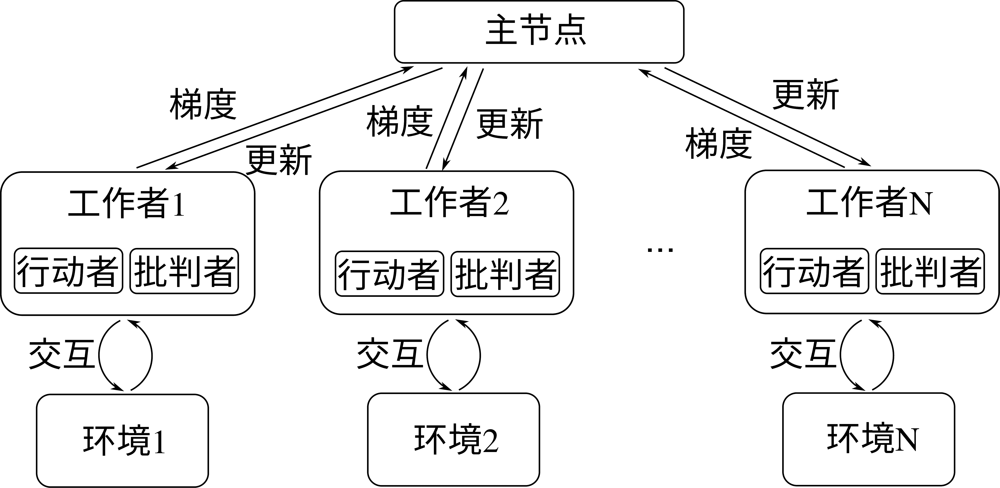
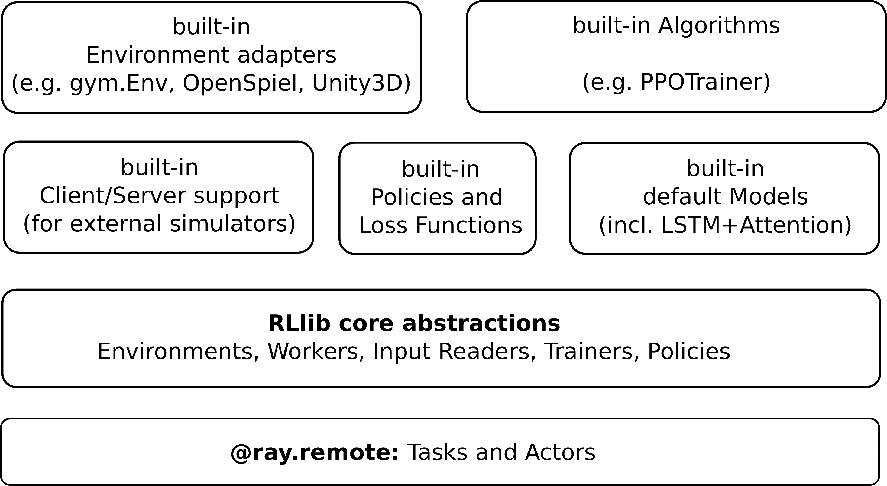
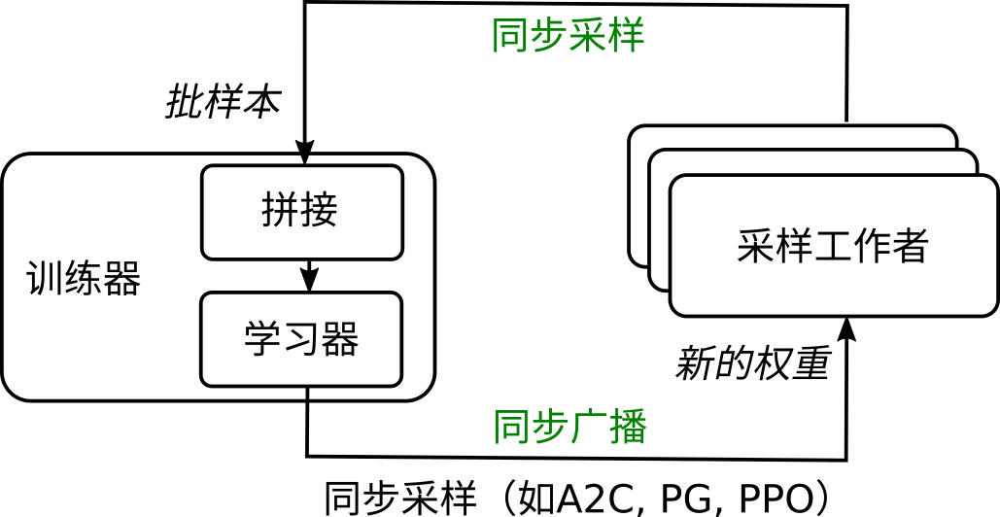

## 分布式强化学习系统

分布式强化学习系统是比上面介绍的单节点强化学习系统更强大的一种。它能支持多环境多模型并行处理，主要是能同时在多个实际计算机系统上对多个模型进行更新，将大大提高强化学习系统的学习速度和整体表现。我们这里介绍分布式强化学习常见的算法和系统。

异步优势行动-批判者（Asynchronous Advantage Actor-Critic，A3C）是由DeepMind研究人员 :cite:`mnih2016asynchronous`于2016年提出的可以在多个计算设备上并行更新网络的学习算法。相比于 :numref:`ch12/ch12-rlzoo`中的单节点强化学习系统，A3C通过创建一组工作者（Worker），并将每个工作者分配到不同的计算设备上且为他们各自创建可以交互的环境来实现并行采样和模型更新，同时用一个主（Master）节点维护这些行动者（Actor）和批判者（Critic）网络的更新。行动者是策略网络，批判者是价值网络， 分别对应强化学习中的策略和价值函数。通过这样的设计，整个算法的各个工作者可以实时将所采集到样本计算出的梯度回传到主节点，来更新主节点的模型参数，并在主节点模型更新后随时下发到各个工作者进行模型更新。每个工作者可以单独在一个GPU上进行运算，从而整个算法可以在一个GPU集群上并行更新模型。算法结构由 :numref:`ch12/ch12-a3c`所示。研究表明，分布式强化学习训练除加速模型学习之外，由于其更新梯度是由多个计算节点各自对环境采样计算得到的，还有利于稳定学习表现。

:width:`800px`

:label:`ch12/ch12-a3c`

重要性加权行动-学习者架构（Importance Weighted Actor-Learner Architecture，IMPALA) 是由Lasse Espeholt等人于2018年 :cite:`espeholt2018impala`提出的能够实现多机集群训练的强化学习框架。与A3C算法类似，IMPALA能够在多个GPU上并行进行梯度计算。具体地，IMPALA并行多个行动者（Actor）和学习者（Learner），每个行动者包含一个策略网络，并用它来和一个环境交互收集样本。所收集到的样本轨迹由行动者发送到各自的学习者，进行梯度计算。所有的学习者中有一个称为主学习者，它可以和其他所有学习者通信获取他们计算的梯度，从而在主学习者内部对模型进行更新，随后下发到各个学习者及行动者，做新一轮的采样和梯度计算。IMPALA被证明是比A3C更高效的分布式计算架构，它同时得益于一个特殊设计的学习者内的梯度计算函数，称为V-轨迹目标（V-trace Target），通过重要性加权来稳定训练。我们这里侧重对分布式强化学习结构的介绍，对此不再赘述。感兴趣的读者可以参考原论文。

:width:`800px`

:label:`ch12/ch12-impala`

以上是两个著名的分布式强化学习算法A3C和IMPALA，最近研究中还有许多其他成果，如SEED :cite:`espeholt2019seed`、Ape-X :cite:`horgan2018distributed`等都对分布式强化学习有更好的效果，我们不再做过多介绍。下面我们将讨论几个典型的分布式强化学习算法库。

:width:`800px`

:label:`ch12/ch12-rllib`

Ray :cite:`moritz2018ray`是由伯克利大学几名研究人员发起的一个分布式计算框架，基于Ray之上构建了一个专门针对强化学习的系统RLlib :cite:`liang2017ray`。RLlib是一个面向工业级应用的开源强化学习框架，同时包含了强化学习的算法库，它对非强化学习专家使用也很方便。

:width:`800px`

:label:`ch12/ch12-rllib_dist`

RLlib的系统架构如 :numref:`ch12/ch12-rllib`所示，系统底层是构建在Ray的分布式计算和通信的基础组建之上，面向强化学习的领域概念，在Python层抽象了Trainer, Environment, Policy等基础组件，并为各个抽象组件提供了一些常用的内置实现，同时用户可以根据自己的算法场景对组件进行扩展，通过这些内置以及自定义的算法组件，研究人员可以方便快速地实现具体的强化学习算法。RLlib支持多种范式的分布式强化学习训练，如 :numref:`ch12/ch12-rllib_dist`所示为基于同步采样的强化学习算法的分布式训练架构。其中每一个Rollout Worker为一个独立进程，负责和对应的环境进行交互以完成经验采集，多个Rollout Worker可以并行地完成环境交互；Trainer负责Rollout Worker之间的协调，策略优化，以及将更新后的策略同步到Rollout Worker中。

强化学习中的策略通常可以采用深度神经网络，而基于深度神经网络的分布式强化学习训练，可以采用RLlib结合PyTorch或者TensorFlow等深度学习框架协同完成，深度学习框架负责策略网络的训练和更新，RLlib负责强化学习的算法计算。此外RLlib支持对环境交互使用向量化（Vectorized）的并行方式，允许外接模拟器，以及可以进行离线（Offline）强化学习。

对于分布式系统中样本回放缓冲池的管理，我们会提到另一个工作Reverb :cite:`cassirer2021reverb`。回忆本章开头，我们介绍了强化学习中的状态、动作、奖励等概念，实际强化学习算法进行训练所使用的数据正是存放在经验缓冲池中的这些数据元组，而每种数据自身的格式可能又有不同，实际使用时也需要对不同的数据做不同类型的操作。常见的数据操作类型如拼接、截取、乘积、转置、部分乘积、取均值、取极值等，而每种操作都可能需要对特定数据的特定维度进行，这常常给现有的强化学习框架在实践中产生一定的困难。为了方便强化学习过程中灵活使用不同的数据形式，Reverb设计了数据块的概念（Chunks），所有使用的训练数据在缓冲池中都使用数据块的格式进行管理和调用，这一设计基于数据是多维张量的特点，增大了数据使用的灵活性和访问速度。Acme :cite:`hoffman2020acme`是近年来由DeepMind提出的一个分布式强化学习框架，同样是针对学术界的研究和工业界的应用，它基于Reverb对样本缓冲池的数据管理，结合分布式采样的结构，给出了一个更快的分布式强化学习解决方案。Reverb帮助解决了数据管理和传输的效率问题，使得Acme得以将分布式计算的效力充分发挥，研究人员用Acme在大量强化学习基准测试中取得了显著的速度提升。