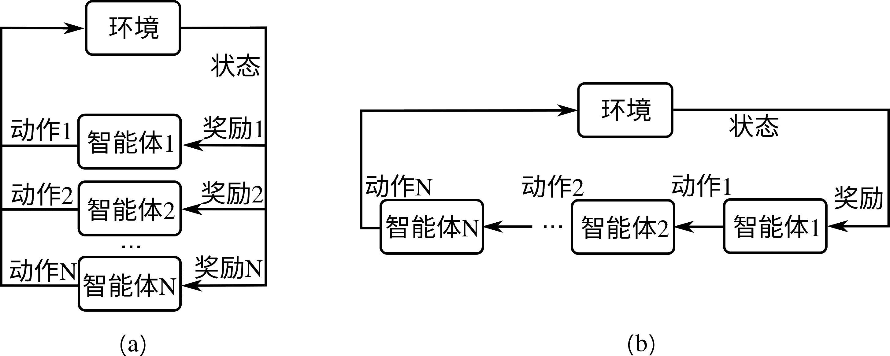

## 多智能体强化学习

以上所讲述的强化学习内容都为单智能体强化学习，而在近来的强化学习研究中，多智能体强化学习越来越受到研究人员关注。回想在本小节初介绍的单智能体强化学习框架 :numref:`ch12/ch12-rl-framework`，其中我们只有单个智能体产生的单个动作对环境产生影响，环境也返回单个奖励值给智能体。这里我们把单智能体强化学习扩展到多智能体强化学习，可以得到至少两种可能的多智能体强化学习框架，如 :numref:`ch12/ch12-marl`所示。 :numref:`ch12/ch12-marl`(a)为多智能体同时执行动作的情况，他们相互之间观察不到彼此的动作，他们的动作一同对环境产生影响，并各自接受自己动作所产生的奖励。 :numref:`ch12/ch12-marl`(b)为多智能体顺序执行动作的情况，后续智能体可能观察到前序智能体的动作，他们的动作一同对环境产生影响，并接受到各自的奖励值或共同的奖励值。除此之外，还有许多其他可能的多智能体框架，如更复杂的智能体间观察机制、智能体间通讯机制、多智能体合作与竞争等等。同时，这里假设多个智能体对环境的观察量都为环境的状态，这是最简单的一种，也是现实中最不可能出现的一种，实际情况下的多智能体往往对环境有各自不同的观察量。

:width:`800px`

:label:`ch12/ch12-marl`

这里我们可以根据前面对单智能体强化学习过程的马尔可夫决策过程描述，给出多智能体强化学习的马尔可夫决策过程，它可以用一个数组$(\mathcal{S}, N, \boldsymbol{\mathcal{A}}, \mathbf{R}, \mathcal{T}, \gamma)$来表示。$N$是智能体个数，$\mathcal{S}$和$\boldsymbol{\mathcal{A}}=(\mathcal{A}_1, \mathcal{A}_2, ..., \mathcal{A}_N)$分别是环境状态空间和多智能体动作空间，其中$A_i$是第$i$个智能体的动作空间，$\mathbf{R}=(R_1, R_2, ..., R_N)$是多智能体奖励函数，$\mathbf{R}(s,\mathbf{a})$: $\mathcal{S}\times \boldsymbol{\mathcal{A}}\rightarrow \mathbb{R}^N$为对于当前状态$s\in\mathcal{S}$和当前多智能体动作$\mathbf{a}\in\boldsymbol{\mathcal{A}}$的奖励向量值，其中$R_i$是对第$i$个智能体的奖励值。从当前状态和动作到下一个状态的状态转移概率定义为$\mathcal{T}(s^\prime|s,\mathbf{a})$: $\mathcal{S}\times\boldsymbol{\mathcal{A}}\times\mathcal{S}\rightarrow \mathbb{R}_+$。$\gamma\in(0,1)$是奖励折扣因子（假设多个智能体采用相同的奖励折扣因子）。不同于单智能体强化学习，多智能体强化学习的目标除了常见的最大化每个智能体各自的期望累计奖励值$\mathbb{E}[\sum_t \gamma^t r^i_t], i\in[N]$之外，还有许多其他可能的学习目标，如达到纳什均衡、最大化团队奖励等等。

由上述介绍和定义可以发现，多智能体强化学习是一个比单智能体强化学习更加复杂的问题。而实际上，多个智能体的存在，对于每个智能体的决策而言，绝对不是简单的把每个单智能体决策累加的难度，实际情况要比单智能体决策问题复杂很多。多智能体系统的研究实际上是门古老的学科，它与博弈论（Game Theory）密切相关，在深度强化学习盛行以前早已有大量研究和许多理论上未解的难题。其中一个典型的问题是纳什均衡在双人非零和博弈下没有多项式时间内可解的方法（实际上，这是一个PPAD（Polynomial Parity Argument, Directed version）类的问题。（见论文Settling the Complexity of Computing Two-Player Nash Equilibria. Xi Chen, et al.）由于篇幅限制，我们这里无法对多智能体问题做深入探讨，我们可以用一个简单例子来介绍为什么多智能体强化学习问题无法简单地用单智能体强化学习算法来解。

:剪刀石头布奖励值

|     | 剪刀    | 石头    | 布     |
| --- | ------- | ------- | ------- |
| 剪刀  | (0,0)   | (-1,+1) | (+1,-1) |
| 石头  | (+1,-1) | (0,0)   | (-1,+1) |
| 布   | (-1,+1) | (+1,-1) | (0,0)   |
:label:`tab_ch12_ch12_marl`

我们考虑一个大家都熟悉的游戏就“剪刀、石头、布”，考虑两个玩家玩这个游戏的输赢情况，“剪刀<石头<布<剪刀...”，这里的“<”即前一个纯策略被后一个纯策略完全压制，我们给予奖励值-1、+1到这两个玩家，当他们选择相同的纯策略时，奖励值均为0。于是我们得到一个奖励值表如 :numref:`tab_ch12_ch12_marl`所示，横轴为玩家1，纵轴为玩家2，表内的数组为玩家1和玩家2各自在相应动作下得到的奖励值。由于这个矩阵的反对称性，这个问题的纳什均衡策略对两个玩家相同，均为$(\frac{1}{3}, \frac{1}{3}, \frac{1}{3})$的策略分布，即有各$\frac{1}{3}$的概率出剪刀、石头或布。如果我们把得到这个纳什均衡策略作为多智能体学习的目标，那么我们可以简单分析得到这个均衡策略无法通过简单的单智能体算法得到。考虑我们随机初始化两个玩家为任意两个纯策略，比如玩家1出剪刀，玩家2出石头。这时假设玩家2策略固定，可以把玩家2看做固定环境的一部分，于是可以使用任意单智能体强化学习算法对玩家1进行训练，使其最大化自己的奖励值。于是，玩家1会收敛到布的纯策略。这时再把玩家1固定，训练玩家2，玩家2又收敛到剪刀的纯策略。于是循环往复，整个训练过程始终无法收敛，玩家1和2各自在3个策略中循环却无法得到正确的纳什均衡策略。

我们在上面这个例子中采用的学习方法其实是多智能体强化学习中最基础的一种，叫自学习（Selfplay）。我们可以看到自学习在特定的任务设置下可能无法收敛到我们想要的最终目标。正是由于多智能体学习过程中有类似循环结构的出现，我们需要更复杂的训练方法，和专门针对多智能体的学习方式来达到我们想要的目标。一般来讲，多智能体强化学习是比单智能体强化学习更复杂的一类，对于自学习的方法而言，单智能体强化学习的过程可以看做一个多智能体强化学习的子任务。从前面这一小游戏的角度来理解，当玩家1策略固定时，玩家1加游戏环境构成玩家2的实际学习环境，由于这个环境是固定的，玩家2可以通过单智能体强化学习来达到自身奖励值最大化；这时再固定玩家2的策略，玩家1又可以进行单智能体强化学习......这样，单智能体强化学习是多智能体任务的子任务。其他算法如虚构自学习（Fictitious Self-play），需要在每个单智能体强化学习的步骤中，对对手历史策略的平均策略求得最优应对策略，而对手的训练也是如此，进行循环，能够在上面剪刀-石头-布一类的游戏中保证收敛到纳什均衡策略。