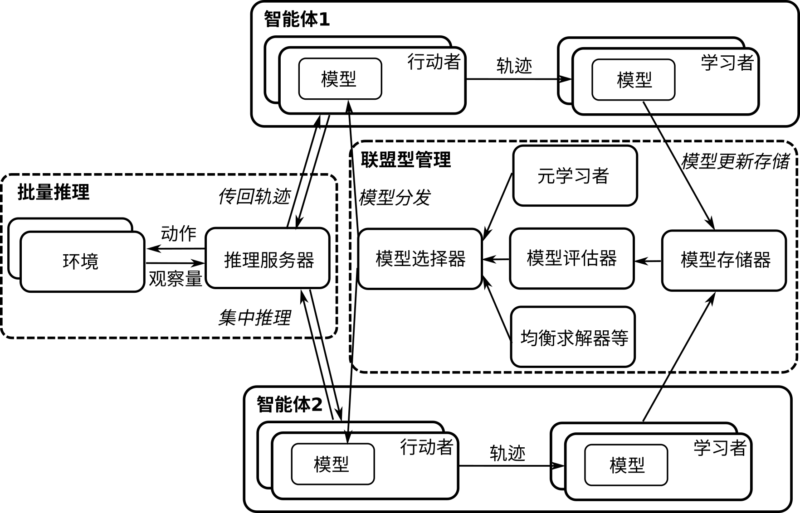

## 多智能体强化学习系统

上述的简单例子只是为了帮助读者理解强化学习在多智能体问题里的角色，而如今前沿的多智能体强化学习算法已经能够解决相当大规模的复杂多智能体问题，如星际争霸（StarCraft II）、Dota 2等游戏，已相继被DeepMind、OpenAI等公司所研究的智能体AlphaStar :cite:`vinyals2019grandmaster`和OpenAI Five :cite:`berner2019dota`攻克，达到超越人类顶级玩家的水平。国内公司如腾讯、启元世界等也提出了星际争霸游戏的多智能体强化学习解决方案TStarBot-X :cite:`han2020tstarbot`和SCC :cite:`wang2021scc`。对于这类高度复杂的游戏环境，整个训练过程对分布式计算系统的要求更高，而整个训练过程可能需要分为多个阶段。以 AlphaStar 为例，它训练的智能体采用了监督学习与强化学习结合的方式。在训练早期，往往先采用大量的人类专业玩家标定数据进行有监督的学习，从而使智能体快速获得较好的能力，随后，训练会切换到强化学习过程，使用前面介绍的虚构自学习的算法进行训练，即自我博弈。为了得到一个表现最好的智能体，算法需要充分探索整个策略空间，从而在训练中不止对一个策略进行训练，而是对一个策略集群（League）进行训练，并通过类似演化算法的方式对策略集群进行筛选，得到大量策略中表现最好的策略。如 :numref:`ch12/ch12-marl_train`所示，在训练过程中每个智能体往往需要
和其他智能体以及剥削者（Exploiter）进行博弈，剥削者是专门针对某一个智能体策略的最佳对手策略，与之对抗可以提高策略自身的防剥削能力。通过对大量智能体策略进行训练并筛选的这类方法称为集群式训练（Population-based Training/League Training），是一种通过分布式训练提高策略种群多样性进而提升模型表现的方式。可见，在实践中这类方法自然需要分布式系统支持，来实现多个智能体的训练和相互博弈，这很好地体现了多智能体强化学习对分布式计算的依赖性。

:width:`800px`

:label:`ch12/ch12-marl_train`

我们将对构建多智能体强化学习系统中的困难分为以下几点进行讨论：

* **智能体个数带来的复杂度**：从单智能体系统到多智能体系统最直接的变化，就是智能体个数从1变为大于1个。对于一个各个智能体独立的$N$智能体系统而言，这种变化带来的策略空间表示复杂度是指数增加的，即$\tilde{O}(e^N)$。举个简单的例子，对于一个离散空间的单智能体系统，假设其状态空间大小为$S$, 动作空间大小为$A$，游戏步长为$H$，那么这个离散策略空间的大小为$O(HSA)$；而直接将该游戏扩展为$N$玩家游戏后，在最一般的情况下，即所有玩家有对称的动作空间动作空间大小为$A$且不共享任何结构信息，所有玩家策略的联合分布空间大小为$O(HSA^N)$。这是因为每个独立玩家的策略空间构成联合策略空间是乘积关系$\mathcal{A}=\mathcal{A}_1\times\dots\mathcal{A}_N$。而这将直接导致算法搜索复杂度提升。

  在这种情况下，原先的单智能体系统，需要扩展为对多智能体策略进行优化的系统，这意味着单智能体分布式系统内的每个并行化的模块现在需要相应扩展到多智能体系统中的每个智能体上。而在复杂的情况下，还需要考虑智能体之间通信过程、智能体之间的异质性等，甚至不同智能体可能需要采用不完全对称模型进行表示，以及采用不同的算法进行优化等等。

* **游戏类型带来的复杂度**：从博弈论的角度，多智能系统所产生的游戏类型是复杂的。从最直接的分类角度，有竞争型、合作型、混合型。在竞争型游戏中，最典型的研究模型是二人零和博弈，如前一小节中提到的剪刀-石头-布的游戏。这类游戏中的纳什均衡策略一般为混合型策略，即无法通过单一纯策略达到均衡条件。纯策略纳什均衡存在于少数零和游戏中。合作型游戏即多个智能体需要通过合作来提升整体奖励。在这类问题研究中一般采用基于值分解的思路，将所有智能体得到的奖励值分配到单个智能体作为其奖励值。这一类的算法有VDN :cite:`sunehag2017value`, COMA :cite:`foerster2018counterfactual`, QMIX :cite:`rashid2018qmix`等。

  在混合型游戏中，部分智能体之间为合作关系，部分智能体或智能体的集合间为竞争关系。一般的非零和博弈且非纯合作型游戏为混合型游戏，举个简单的例子如囚徒困境（Prisoner's Dilemma）， 其奖励值表如 :numref:`tab_ch12_ch12_marl_prison`所示。囚徒困境的两个玩家各有两个动作，沉默和背叛。可以用警察审查两名罪犯来理解，奖励值的绝对值即他们将被判处的年数。纯所有玩家的奖励值之和非常数，故其为非零和博弈型游戏。因此这一游戏不能被认为是纯竞争型或纯合作型游戏，因为当他们中的一方选择沉默一方选择背叛时，二者没有有效合作，而一方拿到了 0 的奖励，另一方为-3。而两者都选择沉默时是一种合作策略，各自拿到-1 的奖励值。尽管这一策略看起来优于其他策略，但是这并不是这个游戏的纳什均衡策略，因为纳什均衡策略假设玩家间策略需要单独制定，无法形成联合策略分布。这实际上切断了玩家间的信息沟通和潜在合作的可能。因此，囚徒困境的纳什均衡策略是两个玩家都选择背叛对方。
  诸如此类的博弈论游戏类型，导致单智能体强化学习不能被直接用来优化多智能体系统中的各个智能体的策略。单智能体强化学习一般是找极值的过程，而多智能体系统求解纳什均衡策略往往是找极大-极小值即鞍点的过程，从优化的角度看这也是不同的。复杂的关系需要更普适的系统进行表达，这也对多智能体系统的构建提出了挑战。多智能体游戏类型也有许多其他的分类角度，如单轮进行的游戏、多轮进行的游戏、多智能体同时决策的、多智能体序贯决策等等，每一类不同的游戏都有相应不同的算法。而现有的多智能体系统往往针对单一类型游戏或者单一算法，缺少普适性多智能体强化学习系统，尤其是分布式的系统。

:囚徒困境奖励值

| 奖励值 | 沉默    | 背叛    |
| --- | ------- | ------- |
| **沉默** | (-1,-1)   | (-3,0) |
| **背叛** | (0,-3) | (-2,-2)   |
|:label:`tab_ch12_ch12_marl_prison`|||

* **算法的异构**：从前面介绍的几个简单的多智能体算法，如自学习、虚构自学习等可以看出，多智能体算法有时由许多轮单智能体强化学习过程组成。而对不同的游戏类型，算法的类型也不相同。比如，对合作型游戏，许多算法是基于功劳分配（Credit Assignment）的思想，如何将多个智能体获得的共同奖励合理分配给单个智能体是这类算法的核心。而这里面按照具体算法执行方式，也可以分为集成训练统一执行的（Centralized Training Centralized Execution）、集成训练分别执行的（Centralized Training Decentralized Execution）、分别训练并分别执行（Decentralized Training Decentralized Execution）的几类，来描述不同智能体训练过程和执行过程的统一性。对于竞争型游戏，往往采用各种计算纳什均衡的近似方法，如前面提到的虚构自学习、Double Oracle、Mirror Descent 等等，将获取单个最优策略的单智能体强化学习过程看做一个“动作”，而对这些“动作”组成的元问题上进行纳什均衡近似。现有的算法在类似问题上有很大的差异性，使得构建一个统一的多智能体强化学习系统比较困难。
* **学习方法组合**：在前面提到的AlphaStar :cite:`vinyals2019grandmaster`等工作中，多智能体系统中优化得到一个好的策略往往不只需要强化学习算法，还需要其他学习方法如模仿学习等的辅助。比如从一些顶级人类玩家的游戏记录中形成有标签的训练样本，来预训练智能体。由于这些大规模游戏的复杂性，这往往是一个在训练前期快速提升智能体表现的有效方式。而对于整个学习系统而言，这就需要对不同学习范式进行结合，如合理地在模仿学习和强化学习之间进行切换等。这也使得大规模多智能体系统不单一是构建强化学习系统的问题，而需要许多其他学习机制和协调机制的配合实现。

如 :numref:`ch12/ch12_marl_sys`所示，为一个分布式多智能体强化学习系统。图中的两个智能体可以类似扩展到多个智能体。每个智能体包含多个行动者（Actor）用于采样和学习者（Learner）用于更新模型，这些行动者和学习者可以并行处理来加速训练过程，具体方法可以参考单智能体分布式系统章节介绍的A3C和IMPALA架构。训练好的模型被统一存储和管理在模型存储器中，是否对各个智能体的模型统一存储取决于各个智能体是否对称——如果不对称，需要将模型分别存储。存储器中的模型可以被模型评估器用来打分，从而为下一步模型选择器做准备。模型选择器根据模型评估器或者元学习者（如PSRO算法 :cite:`lanctot2017unified`）以及均衡求解器等进行模型选择，并将选出的模型分发到各个智能体的行动者上。这一处理过程，我们称为联盟型管理（League-based Management）。对于与环境交互的部分，分布式系统可以通过一个推理服务器（Inference Server）对各个并行进程中的模型进行集中推理，将基于观察量（Observation）的动作（Action）发送给环境。环境部分也可以是并行的，对推理服务器传递来的动作进行并行处理后，返回观察量。推理服务器将采集到的交互轨迹发送给各个智能体进行模型训练。以上为一个分布式多智能体系统的例子，实际中根据不同的游戏类型和算法结构可能会有不同的设计。

:width:`800px`

:label:`ch12/ch12_marl_sys`