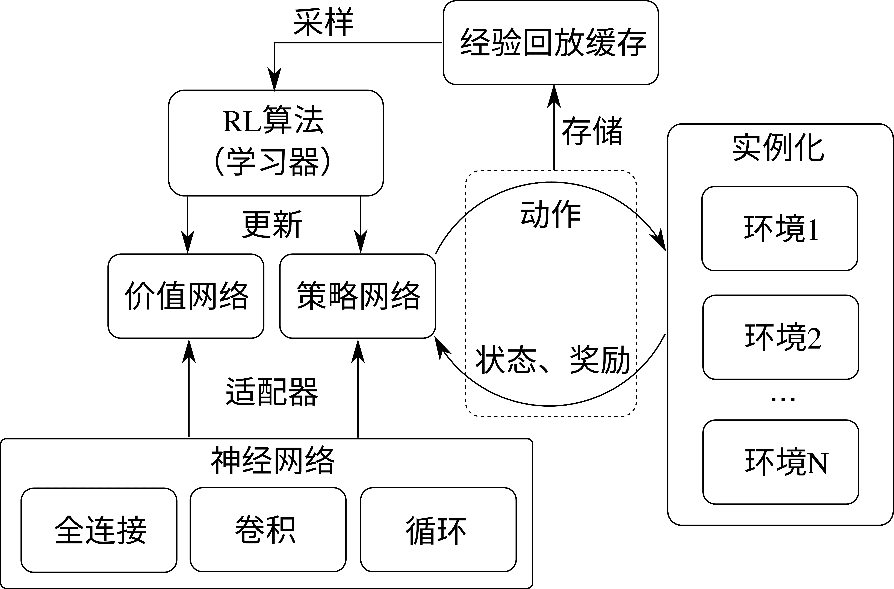

## 单节点强化学习系统

前面介绍了强化学习的基本知识和在系统层面的一般需求，这里我们介绍常见的单智能体强化学习系统中较为简单的一类，即单节点强化学习系统。这里，我们按照是否对模型训练和更新进行并行处理，将强化学习系统分为单节点和分布式强化学习系统。其中，单节点强化学习系统可以理解为只实例化一个类对象作为智能体，与环境交互进行采样和利用所采得的样本进行更新的过程分别视为这个类内的不同函数。除此之外的更为复杂的强化学习框架都可视为分布式强化学习系统。分布式强化学习系统的具体形式有很多，这也往往依赖于所实现的算法。从最简单的情况考虑，假设我们仍在同一个计算单元上实现算法，但是将强化学习的采样过程和更新过程实现为两个并行的进程，甚至各自实现为多个进程，以满足不同计算资源间的平衡。这时就需要进程间通信来协调采样和更新过程，这是一个最基础的分布式强化学习框架。更为复杂的情况是，整个算法的运行在多个计算设备上进行（如一个多机的计算集群），智能体的函数可能需要跨机跨进程间的通信来实现。对于多智能体系统，还需要同时对多个智能体的模型进行更新，则需要更为复杂的计算系统设计。我们将逐步介绍这些不同的系统内的实现机制。

我们先对单节点强化学习系统进行介绍。
在这里，我们以RLzoo :cite:`ding2020efficient`为例，讲解一个单节点强化学习系统构建所需要的基本模块。如 :numref:`ch12/ch12-rlzoo`所示，是RLzoo中采用的一个典型的单节点强化学习系统，它包括几个基本的组成部分：神经网络、适配器、策略网络和价值网络、环境实例、模型学习器、经验回放缓存（Experience Replay Buffer）等。

我们先对前三个，神经网络、适配器、策略网络和价值网络进行介绍。神经网络即一般深度学习中使用的神经网络，用于实现基于数据的函数拟合，特点是可以用梯度下降的方法更新。我们在图中简单列出常见的三类神经网络：全连接网络，卷积网络和循环网络。策略网络和价值网络是一般深度强化学习的常见组成部分，分别是对策略函数和价值函数的近似表示。策略网络即一个由参数化深度神经网络表示的动作策略，而价值网络为神经网络表示的状态价值（State-Value）或状态-动作价值（State-Action Value）函数。这里我们不妨称全连接网络，卷积网络和循环网络为一般神经网络，它们常作为基本构建模块而被用来搭建强化学习中的策略网络和价值网络。在RLzoo中，适配器则是为实现强化学习特定函数近似而选配一般神经网络的功能模块，每个适配器是一个根据网络输入输出格式决定的网络格式选择函数。如 :numref:`ch12/ch12-rlzoo`所示，RLzoo在实现中使用了三个不类型的适配器来使得强化学习算法构建过程有自适应能力。首先，根据不同的观察量类型，强化学习智能体所用的神经网络头部会有不同的结构，这一选择可以由一个基于观察量的适配器来实现；其次，根据所采用的强化学习算法类型，相应的策略网络尾部需要有不同的输出类型，包括确定性策略和随机性策略，RLzoo中使用一个策略适配器来进行选择；最后，根据不同的动作输出，如离散型、连续型、类别型等，需要使用一个动作适配器来选择。介绍完这些，我们已经有了可用的策略网络和价值网络，这构成了强化学习智能体核心学习模块。除此之外，还需要一个学习器（Learner）来更新这些学习模块，更新的规则就是强化学习算法给出的损失函数。而要想实现学习模块的更新，最重要的是输入的学习数据，即智能体跟环境交互过程中所采集的样本。对于**离线**（Off-Policy）强化学习，这些样本通常被存储于一个称为经验回放缓存的地方，学习器在需要更新模型时从该缓存中采得一些样本来进行更新。这里说到的离线强化学习是强化学习算法中的一类，强化学习算法可以分为**在线**（On-Policy）强化学习和离线强化学习两类，按照某个特定判据。这个判据是，用于更新的模型和用于采样的模型是否为同一个，如果是，则称在线强化学习算法，否则为离线强化学习算法。因而，离线强化学习通常允许与环境交互的策略采集的样本被存储于一个较大的缓存内，从而允许在许久之后再从这个缓存中抽取样本对模型进行更新。而对于在线强化学习，这个“缓存”有时其实也是存在的，只不过它所存储的是非常近期内采集的数据，从而被更新模型和用于采样的模型可以近似认为是同一个。从而，这里我们简单表示RLzoo的强化学习系统统一包括这个经验回放缓存模块。有了以上策略和价值网络、经验回放缓存、适配器、学习器，我们就得到了RLzoo中一个单节点的强化学习智能体，将这个智能体与环境实例交互，并采集数据进行模型更新，我们就得到了一个完整的单节点强化学习系统。这里的环境实例化我们允许多个环境并行采样。

:width:`800px`

:label:`ch12/ch12-rlzoo`
近来研究人员发现，强化学习算法领域的发展瓶颈，可能不仅在于算法本身，而在于智能体采集数据的模拟器的模拟速度。Isaac Gym :cite:`makoviychuk2021isaac`是Nvidia公司于2021年推出的基于GPU（Graphics Processing Unit）的模拟引擎，在单GPU上实现2-3倍于之前基于CPU（Central Processing Unit）的模拟器的运行速度。关于GPU上运行加速我们已经在章节5中有所介绍。之所以GPU模拟能够对强化学习任务实现显著的加速效果，除了GPU本身多核心的并行运算能力之外，还在于这省却了CPU与GPU之间的数据传输和通信时间。传统的强化学习环境，如OpenAI Gym（这是一个常用的强化学习基准测试环境）等，都是基于CPU进行的模拟计算，而深度学习方法的神经网络训练通常是在GPU（或TPU，Tensor Processing Unit）上进行的。从智能体与CPU上实例化的模拟环境交互过程所收集的数据样本，通常先暂时以CPU的数据格式存储，在使用的时候被转移到GPU上成为具有GPU数据类型的数据（如使用PyTorch时可通过tensor.to(device)的函数实现，只需将device设为“cuda”即可将一个类型为torch.Tensor的tensor转移到GPU上），然后来进行模型训练。同时，由于模型参数是以GPU上数据的类型存储的，调用模型进行前向传递的过程中也需要先将输入数据从CPU转移到GPU上，并且可能需要将模型输出的GPU数据再转移回CPU类型。这一系列冗余的数据转换操作都会显著增长模型学习的时间，并且也增加了算法实际使用过程中的工程量。Isaac Gym模拟器的设计从底层上解决了这一困难，由于模拟器和模型双双实现在GPU上，他们之间的数据通信不再需要通过CPU来实现，从而绕过了CPU与GPU数据双向传输这一问题，实现了对强化学习任务中模拟过程的特定加速。