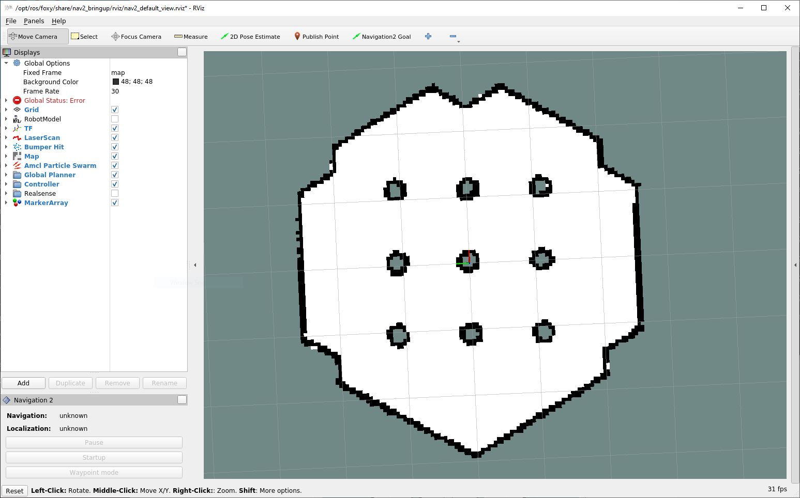
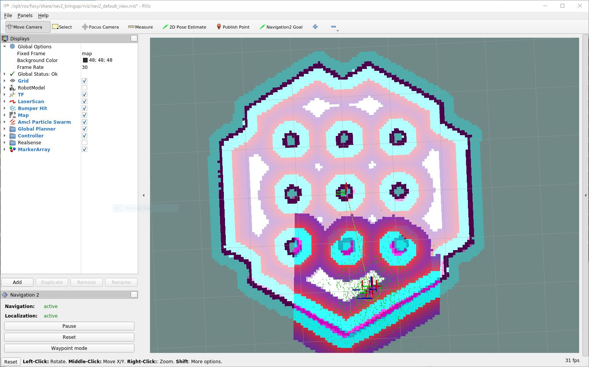

## 控制系统案例

在上一章节中，我们初步了解了机器人的控制系统，同时也知道了机器学习在机器人控制系统这个领域有着很多有趣和有前景的研究方向。
只不过由于控制系统的复杂性和这些研究的前瞻性，它们不太适合用来作为简单的案例。

与此同时，ROS作为一个成熟的机器人框架，它已经包含了很多成熟稳定的经典控制组件。
这些控制组件和其他的成熟的功能模块一起组成了更大规模的功能模组，来完成更复杂的任务。

在这些更大规模的功能模组中，**Nav2**和**MoveIt2**可能是最常用的两个。

从名字上就可以看出来，这两个功能模组各自都是它们ROS1版本的继承者。
Nav2是ROS Navigation Stack在ROS2中的继承者，专注于移动机器人的导航相关的功能，例如定位，路径规划等，并致力于用安全的方式将机器人从一点移动到另一点。
MoveIt2是ROS MoveIt在ROS2中的继承者，致力于打造一个容易使用的机器人操纵平台。带机械臂的机器人都基本离不开它。

这两个模组都成熟，可靠，和容易使用。使用ROS框架开发机器人是基本上都会直接使用它们或者在它们已有功能的基础上做适合自己的自定义修改，以避免重复造轮子。

因此，在本章节中，我们将以Nav2为案例，来带领大家初步了解怎样使用一个大型的ROS2功能模组。

本章节的内容很大程度参考了Nav2的[英文官方文档](https://navigation.ros.org/)，尤其是“Getting Started”这一章。对自己英文有信心的读者可以尝试阅读官方文档以了解更多细节。

本章没有额外的代码案例。

### 安装

首先，让我们通过Ubuntu的库管理器来安装Nav2相关的程序库。

```shell
sudo apt install ros-foxy-navigation2 ros-foxy-nav2-bringup
```

其中`ros-foxy-navigation2`是Nav2的核心程序库，而`ros-foxy-nav2-bringup`则是Nav2的一个启动案例。
这个案例十分灵活，很多时候我们可以将其稍加修改后放到自己的项目中使用。

接下来让我们安装`turtlebot3`相关的一系列程序库。
turtlebot系列是一个很成功的入门级移动机器人系列。
而这一系列程序库则提供了和turtlebot3机器人相关的组件，其中包含了在模拟环境中使用虚拟turtlebot3机器人的相关功能组件。

```shell
sudo apt install "ros-foxy-turtlebot3*"
```

### 运行

在安装好上面的那些程序库后，我们就可以尝试使用Nav2了。

首先，让我们新开一个终端窗口，并执行以下命令。这些命令分别导入了ROS2框架，并设定好了我们要使用哪个Turtlebot3模型和在哪儿搜索虚拟世界（Gazebo）需要的模型。

```shell
source /opt/ros/foxy/setup.bash
export TURTLEBOT3_MODEL=waffle
export GAZEBO_MODEL_PATH=$GAZEBO_MODEL_PATH:/opt/ros/foxy/share/turtlebot3_gazebo/models
```

现在，我们一切就绪，可以下面这行命令来运行一个Nav2的演示程序。

```shell
ros2 launch nav2_bringup tb3_simulation_launch.py
```

其中`ros2 launch`命令是用来执行一个launch文件，而后者则是将很多需要启动的ROS2组件集合到一起来按计划启动的一个说明文件。
一个机器人项目经常需要启动很多个不同的组件来配合完成任务。
而如果每个组件都要新开一个窗口执行命令的话，整个机器人的启动将会变得十分繁琐。
launch文件和`ros2 launch`命令就是来解决这个问题的。
我们可以把整个ROS2项目想象成一个交响乐团，其中每个组件分别代表一个乐器。
而launch文件就像是乐团的指挥，负责调配每个乐器应该在什么时候启动。
总而言之，这是ROS2中一个非常使用的特性。

关于`ros2 launch`命令和launch文件的更多细节，感兴趣的读者可以查阅[官方英文文档](https://docs.ros.org/en/foxy/Tutorials/Launch/Creating-Launch-Files.html)。

成功运行上述命令之后，我们应该会看到两个新开的GUI窗口，分别对应`RViz`和`Gazebo`程序。
其中`RViz`是ROS2框架的可视化接口，我们稍后将通过它来控制我们的虚拟机器人。
而`Gazebo`则是一个用过创建和运行虚拟世界的软件。
它独立于ROS2框架，但两者又互相紧密合作。

在`Gazebo`窗口中（如下图所示），我们应该能够看到一个三维的类六边形虚拟世界。
这个世界中还有一个虚拟的Turtlebot3机器人。
这个机器人发射出很多蓝色的射线。
这些射线代表了机器人的激光雷达的读数射线。
而激光雷达的读数则被Nav2用来在环境中定位机器人。


在`RViz`窗口中（如下图所示），我们应该能够看到虚拟世界的一个二维地图。
地图上的白色部分是机器人可以到达的部分，而黑色则是检测到的障碍物或墙。
如果你在左侧看到有红色的`Global Status: Error`错误的话，你的机器人并没有在RViz（即ROS2框架）中正确的定位。
请在工具栏选择`2D Pose Estimate`并在RViz地图上机器人应该在的位置（以Gazebo中机器人的位置为准）更新好机器人的姿态。



更新好机器人的姿态后，RViz应该和下图比较相似。



这样一来，我们的机器人就准备好在虚拟事件中移动了。

请在RViz的工具栏中选择`Navigation2 Goal`按钮，并在地图上选择你想要Turtlebot3机器人最终所到达的位置和姿态。
一旦选好了，你将会看到机器人开始向目标位置移动并最终到达目标。

RViz还提供了很多其它的Nav2功能的按钮，你可以通过Nav2和ROS2的官方英文文档来了解更多使用方法。

恭喜，你现在初步了解了怎样使用ROS2框架内的大型功能模组！

#### 章节附录：在WSL中使用Nav2

有些读者可能是通过Windows下的WSL（Windows Subsystem for Linux）来运行ROS2的。
如果是这种情况，这一章节中的图形界面程序，如RViz和Gazebo，可能会造成问题。
这是因为WSL默认并不能打开图形界面程序。

幸运的是，我们可以更改设置来达到在WSL中运行图形界面程序这一点。
[这篇笔记](https://github.com/rhaschke/lecture/wiki/WSL-install)介绍了其作者是如何在WSL中运行ROS2和图形界面的。其中第二点尤为值得注意。
而[这篇笔记](https://github.com/cascadium/wsl-windows-toolbar-launcher#firewall-rules)则更为细致的介绍了在一般情况下怎样在WSL中运行图形界面程序。

这两篇笔记应该可以给读者足够的信息来解决上述所说的和RViz还有Gazebo相关的问题。唯一的缺点就是这两篇笔记都是英文的，对读者的英语水平有一定要求。