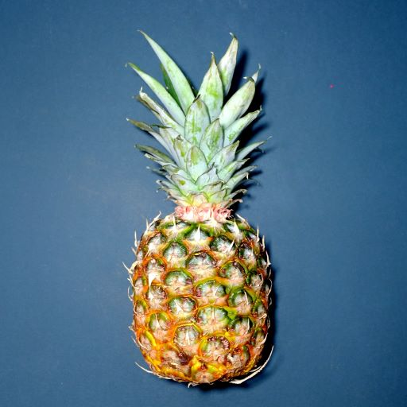
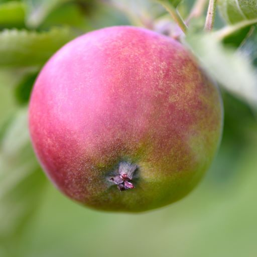

## 感知系统案例

在之前[机器人操作系统（ROS）的入门案例](./ros_code_ex.md)这一章节中，我们学习了怎样创建一个ROS2项目以及怎样使用ROS2框架下的节点，服务，动作等。然后，我们又在上一章节中初步了解了机器人的感知系统。
在这一章节中，我们将通过一个简单的案例来演示怎样结合ROS2和深度学习框架PyTorch来完成一个我们设想的感知系统中的一个基本功能。

### 案例背景

假设我们想要帮某果园设计一款全自动摘菠萝机器人。
这个机器人可能需要有一个智能移动底盘来负责在果园中移动，若干传感器（包括一个RGB摄像头）来检测菠萝，以及一个机械臂来负责摘取动作。
在这个机器人需要完成的一长列各种功能中，它的感知系统必然需要能检测摄像头传感器的画面中央是否有一个菠萝。
检测到了菠萝才会进入到摘取的环节。

这个检测在图像中央是否有菠萝存在的功能，就是我们机器人的感知系统中基础但必要的一个基本功能。
幸运的是，随着现代卷积神经网络的发展，我们可以利用已存在的深度学习框架，如PyTorch，来快速的完成这个功能。
而且一个简单的使用ImageNet进行预训练的AlexNet就以及足够了。

在之前的案例中，我们都是使用的ROS2框架下的程序库。在这个例子中，我们将开始了解如何在ROS2中使用框架外的Python库。

和之前的案例类似，本章节的案例所使用的代码可以在本书相关的[ROS2案例代码库](https://github.com/openmlsys/openmlsys-ros2)中的`src/object_detector`文件夹内找到。

### 项目搭建

让我们沿用之前已经搭建好的ROS2项目框架。
我们只需在其中增加一个ROS2的Python库来实现我们想要的功能即可。
因此，让我们回到`src`目录下并创建此Python库。

```shell
cd openmlsys-ros2/src
ros2 pkg create --build-type ament_python --node-name object_detector_node object_detector --dependencies rclpy std_msgs sensor_msgs cv_bridge opencv-python torch torchvision torchaudio
```

在创建好Python库后，别忘了将`package.xml`和`setup.py`中的`version`，`maintainer`，`maintainer_email`，`description`和`license`项都更新好。

紧接着，我们需要安装ROS2框架下的`image_publisher`库。
这个库能帮助我们将一张图片模拟成像摄像头视频一样的图片流。
在开发真是机器人时，我们可能可以在实机上检测我们的程序，但是对于这个案例，我们只能使用这个`image_publisher`库和若干选择好的图片来测试我们的程序。
实际上，就算是开发实际机器人的功能，也最好在实际测试之前使用图片来做这个功能的单元测试。

我们只需通过ubuntu的`apt`来安装这个`image_publisher`库，因为作为一个常用的ROS2框架下的程序库，它已经被打包好以便通过ubuntu的包管理器来安装。

```shell
sudo apt install ros-foxy-image-publisher
```

关于`image_publisher`这个库更多的信息和使用方法，可以查看[它的文档](http://wiki.ros.org/image_publisher)。这是个针对早期ROS1版本的文档，但是因为这个库之后没有任何变化，文档中所有的功能都和我们所使用的ROS2版本中的一样。

接下来，让我们在ROS2项目的Python虚拟环境中安装`opencv-python`，`torch`，`torchvision`和`torchaudio`。
例如使用`pipenv`的用户可能会执行`pipenv install opencv-python torch torchvision torchaudio`这条命令。

最后，让我们把下面这两张菠萝和苹果的图片保存在`openmlsys-ros2/data`下。
我们将使用这两张图片来检测我们的程序可以检测到菠萝并且不会把菠萝当成苹果。



:width:`256px`

:label:`ros2-pineapple`



:width:`256px`

:label:`ros2-apple`

### 添加代码

之前创建Python库的命令应该已经帮我们创建好了`src/object_detector/object_detector/object_detector_node.py`这个文件。现在让我们用以下内容来替换掉此文件中已有的内容。

```Python
import rclpy
from rclpy.node import Node

from std_msgs.msg import Bool
from sensor_msgs.msg import Image
import cv2
from cv_bridge import CvBridge

import torch
import torchvision.models as models
from torchvision import transforms


class ObjectDetectorNode(Node):

    PINEAPPLE_CLASS_ID = 953

    def __init__(self):
        super().__init__('object_detector_node')
        self.detection_publisher = self.create_publisher(Bool, 'object_detected', 10)
        self.camera_subscriber = self.create_subscription(
            Image, 'camera_topic', self.camera_callback, 10,
        )
        self.alex_net = models.alexnet(pretrained=True)
        self.alex_net.eval()
        self.preprocess = transforms.Compose([
            transforms.ToPILImage(),
            transforms.Resize(256),
            transforms.CenterCrop(224),
            transforms.ToTensor(),
            transforms.Normalize(mean=[0.485, 0.456, 0.406], std=[0.229, 0.224, 0.225]),
        ])
        self.cv_bridge = CvBridge()
        self.declare_parameter('detection_class_id', self.PINEAPPLE_CLASS_ID)
        self.get_logger().info(f'Detector node is ready.')
    
    def camera_callback(self, msg: Image):
        self.get_logger().info(f'Received an image, ready to detect!')
        detection_class_id = self.get_parameter('detection_class_id').get_parameter_value().integer_value
        img = self.cv_bridge.imgmsg_to_cv2(msg)
        input_batch = self.preprocess(img).unsqueeze(0)
        img_output = self.alex_net(input_batch)[0]
        detection = Bool()
        detection.data = torch.argmax(img_output).item() == detection_class_id
        self.detection_publisher.publish(detection)
        self.get_logger().info(f'Detected: "{detection.data}", target class id: {detection_class_id}')


def main(args=None):
    rclpy.init(args=args)
    object_detector_node = ObjectDetectorNode()
    rclpy.spin(object_detector_node)
    object_detector_node.destroy_node()
    rclpy.shutdown()


if __name__ == '__main__':
    main()
```

可能有些细心的读者已经发现了，这段代码和我们之前创建ROS2节点的代码非常像。
实际上这段代码就是创建了一个新的节点类来完成我们的功能。

这个节点类的实例将被赋予名字`object_detector_node`，同时它将订阅`camera_topic`这个主题并发布`Bool`类型的信息至`object_detected`主题。
其中，`camera_topic`主题的内容是机器人的摄像头传感器所接收到的视频流，而我们将用`image_publisher`库和之前的图片来模拟这个视频流。
而`object_detected`主题则将包含我们的检测结果以供机器人逻辑链的后续节点使用。
如果我们检测到菠萝，则我们将发布`True`信息，否则就发布`False`信息。

下面，让我们关注这个新节点类中的一些新细节。

首先，我们引入了`cv_bridge.CvBridge`这个类。
这个类是ROS2框架内的一个功能类，主要帮我们把图片在`opencv`/`numpy`格式和ROS2自己的`sensor_msgs.msg.Image`信息格式之间进行转换。
在我们新的节点类中我们可以看到它的具体用法（即`self.cv_bridge = CvBridge()`和`img = self.cv_bridge.imgmsg_to_cv2(msg)`）。

然后，在新的节点类`ObjectDetectorNode`中，我们使用了`PINEAPPLE_CLASS_ID`这个类成员变量来保存我们想要识别的物体在ImageNet中的类别ID（class id）。这里`953`是菠萝在ImageNet中的具体类别ID。

再之后，我们通过PyTorch实例化了一个预训练好的AlexNet，并将其设置到`eval`状态。
同时，我们声明了`detection_class_id`这个参数，以方便再运行时修改需要识别物体的类别ID（虽然这并不常用）。

最后，在`camera_topic`主题的回调函数`camera_callback`中，我们将收到的`Image`类型信息传换成`numpy`格式，然后调用AlexNet来进行物体识别，最后将识别结果以`Bool`的形式发布到`object_detected`主题上去，并进行日志记录。

至此，一个使用PyTorch和AlexNet来识别摄像头中是否有菠萝的节点类就完成了。

### 运行及检测

下面，让我们尝试运行我们新写好的节点类并用菠萝和苹果的图片来检测这个节点类是否运行正常。

首先，让我们编译这个新写的Python库。

```shell
cd openmlsys-ros2
colcon build --symlink-install
```

在成功编译之后，我们可以新开一个终端窗口并执行下面的命令来运行一个节点类实例。
记住，你可能需要先运行`source install/local_setup.zsh`来引入我们自己的ROS2项目。

```shell
ros2 run object_detector object_detector_node --ros-args -r camera_topic:=image_raw
```

如果你遇到`ModuleNotFoundError: No module named 'cv2'`这之类的问题，则代表ROS2命令没有成功识别你Python虚拟环境中的程序库。这时候你可以尝试进入你所用的虚拟环境后执行下面这个命令。

```shell
PYTHONPATH="$(dirname $(which python))/../lib/python3.8/site-packages:$PYTHONPATH" ros2 run object_detector object_detector_node --ros-args -r camera_topic:=image_raw
```

这个命令前面`PYTHONPATH="$(dirname $(which python))/../lib/python3.8/site-packages:$PYTHONPATH"`这一串的作用是将你目前Python环境的库添加到`PYTHONPATH`，这样ROS2命令的Python就可以找到你目前Python环境（即ROS2项目所对应的Python虚拟环境）中的Python库了。

当这个ROS2命令成功运行时，你应该能看到这行信息：`[INFO] [1655172977.491378700] [object_detector_node]: Detector node is ready.`。

另外，在这个ROS2命令中，我们使用了`--ros-args -r camera_topic:=image_raw`这一系列参数。
这些参数是用来告诉ROS2将我们新节点类所使用的`camera_topic`主题重映射（remap）到`image_raw`这个主题上。
这样一来，我们新节点类所有使用`camera_topic`主题的场合实际上都是在使用`image_raw`这个主题。
使用主题名字重映射的好处是在于解耦合。
对于每个新的ROS2程序库或者每个新的节点类，我们都可以自由的命名我们要使用的主题的名字，然后当它需要和其它组件组合起来发挥作用时，只需要使用重映射将两个不同组件所使用的不同主题名字连接起来，就可以达到数据在两个组件之间正常流通的效果。
这实际上是ROS2框架的一个很实用的特性。

如果你想更深入的了解重映射相关的细节，可以阅读[这篇官方介绍](https://design.ros2.org/articles/static_remapping.html)。

在我们成功运行新节点后，让我们在一个新终端窗口中运行下面这行命令来测试它是否能检测到菠萝。同样的，你可能需要先运行`source install/local_setup.zsh`来引入我们自己的ROS2项目。

```shell
PYTHONPATH="$(dirname $(which python))/../lib/python3.8/site-packages:$PYTHONPATH" ros2 run image_publisher image_publisher_node data/ros-pineapple.jpg --ros-args -p publish_rate:=1.0
```

上面这行命令将会使用`image_publisher`库和它的节点来以1Hz的频率将之前准备好的菠萝图片发布到`image_raw`这个主题上去。
当这个`image_publisher_node`节点成功运行后，我们应当能在`object_detector_node`节点运行的终端窗口中看到类似`[INFO] [1655174212.930385900] [object_detector_node]: Detected: "True", target class id: 953`这样的信息来证明我们的节点类能够检测到菠萝。

接着让我们在`image_publisher_node`节点的窗口中使用`Ctrl+C`结束掉节点，然后使用下面这行命令来发布准备好的苹果图片。

```shell
PYTHONPATH="$(dirname $(which python))/../lib/python3.8/site-packages:$PYTHONPATH" ros2 run image_publisher image_publisher_node data/ros-apple.jpg --ros-args -p publish_rate:=1.0
```

现在，在`object_detector_node`节点运行的终端窗口中我们应该看到的是类似`[INFO] [1655171989.912783400] [object_detector_node]: Detected: "False", target class id: 953`这样的信息来证明我们的节点类不会把苹果识别成菠萝。

### 小结

恭喜，你已经成功了解如何在ROS2项目中使用ROS2框架外的Python库了！
如果你使用Python虚拟环境，你可能需要额外的设置`PYTHONPATH`环境变量。
另外，主题名字重映射（Name Remapping）是一个很有用的ROS2特性。
你在以后的项目中很可能会经常用到它。