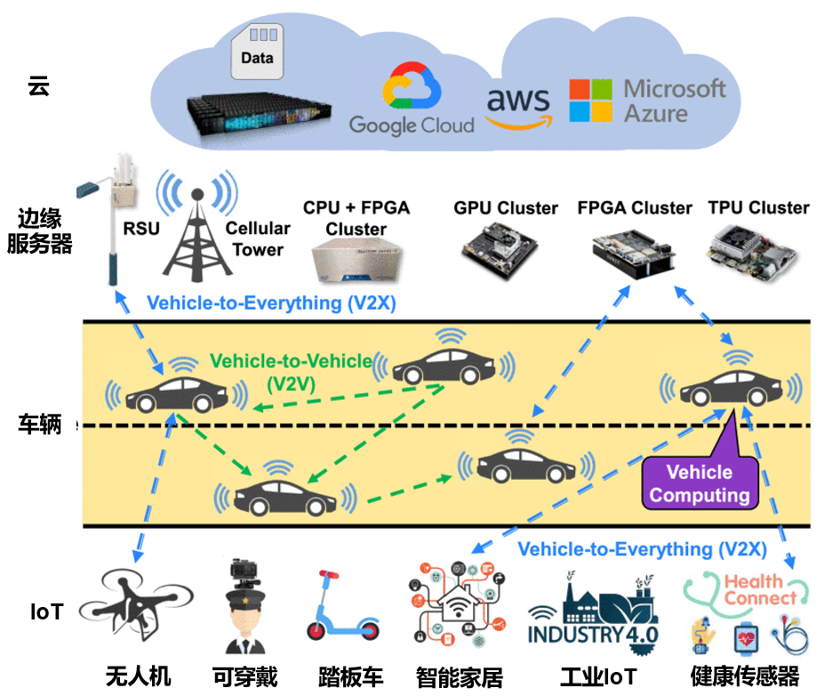

## 概述

机器人学是一个交叉学科，它涉及了计算机科学、机械工程、电气工程、生物医学工程、数学等多种学科，并有诸多应用，比如自动驾驶汽车、机械臂、无人机、医疗机器人等。机器人能够自主地完成一种或多种任务或者辅助人类完成指定任务。通常，人们把机器人系统划分为感知系统、决策（规划）和控制系统等组成部分。

近些年，随着机器学习的兴起，经典机器人技术出现和机器学习技术结合的趋势，称为机器人学习（Robot
Learning）。机器人学习包含了计算机视觉、自然语言处理、语音处理、强化学习和模仿学习等人工智能技术在机器人上的应用，让机器人通过学习，自主地执行各种决策控制任务。

机器人学习系统（Robot Learning
System）是一个较新的概念。作为系统和机器人学习的交叉方向，仿照机器学习系统的概念，我们把机器人学习系统定义为"支持机器人模型训练和部署的系统"。按照涉及的机器人数量，可以划分为单机器人学习系统和多机器人学习系统。多机器人学习系统协作和沟通中涉及的安全和隐私问题，也会是一个值得研究的方向。最近机器人学习系统在室内自主移动，道路自动驾驶，机械臂工业操作等行业场景得到充分应用和发展。一些机器人学习基础设施项目也在进行中，如具备从公开可用的互联网资源、计算机模拟和
真实机器人试验中学习能力的大规模的计算系统RobotBrain。在自动驾驶领域，受联网的自动驾驶汽车
(CAV) 对传统交通运输行业的影响，"车辆计算"(Vehicle Computing)
(如图[\[fig:vehicle\_computing\]](#fig:vehicle_computing){reference-type="ref"
reference="fig:vehicle_computing"})概念引起广泛关注，并激发了如何让计算能力有限使用周围的CAV计算平台来执行复杂的计算任务的研究。最近，有很多自动驾驶系统的模拟器，代表性的比如CARLA，支持安全RL、MARL、真实地图数据导入、泛化性测试等任务的MetaDrive，还有CarSim和
TruckSim，它们可以作为各种自动驾驶算法的训练场并对算法效果进行评估。另外针对自动驾驶的系统开发平台也不断涌现，如ERDOS,
D3 (Dynamic
Deadline-Driven)和强调模块化思想的Pylot，可以让模型训练与部署系统与这些平台对接。

[\[fig:vehicle\_computing\]]{#fig:vehicle_computing
label="fig:vehicle_computing"}

图 [\[fig:learning\_decision\_modulei\]](#fig:learning_decision_modulei){reference-type="ref"
reference="fig:learning_decision_modulei"}是一个典型的感知、规划、控制的模块化设计的自动驾驶系统框架图，接下来，我们也将按照这个顺序依次介绍通用框架、感知系统、规划系统和控制系统。

[\[fig:learning\_decision\_modulei\]]{#fig:learning_decision_modulei
label="fig:learning_decision_modulei"}
