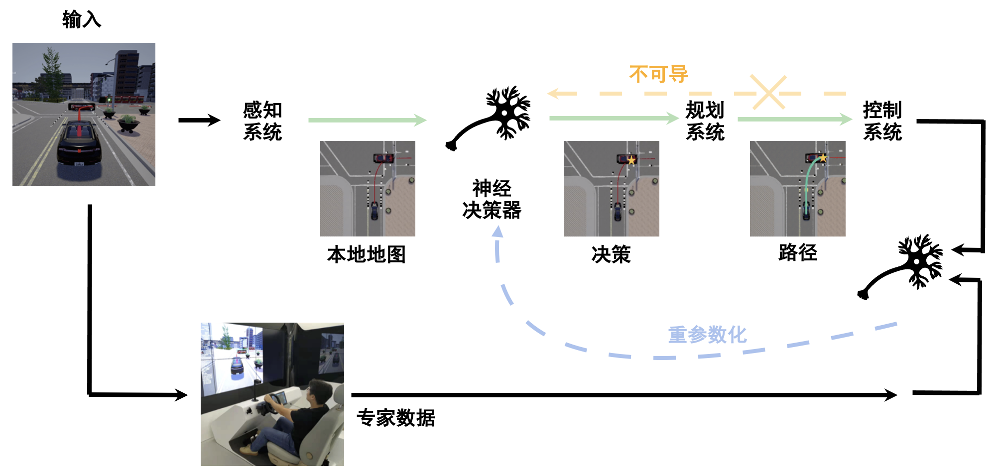

## 机器人系统概述

机器人学是一个交叉学科，它涉及了计算机科学、机械工程、电气工程、生物医学工程、数学等多种学科，并有诸多应用，比如自动驾驶汽车、机械臂、无人机、医疗机器人等。机器人能够自主地完成一种或多种任务或者辅助人类完成指定任务。通常，人们把机器人系统划分为感知系统、决策（规划）和控制系统等组成部分。

机器人系统按照涉及的机器人数量，可以划分为单机器人学习系统和多机器人学习系统。多机器人学习系统协作和沟通中涉及的安全和隐私问题，也会是一个值得研究的方向。最近机器人学习系统在室内自主移动 :cite:`9123682,huang2018navigationnet`，道路自动驾驶 :cite:`pmlr-v155-huang21a,pmlr-v155-sun21a,Sun2022SelfSupervisedTA`，机械臂工业操作等行业场景得到充分应用和发展。一些机器人学习基础设施项目也在进行中，如具备从公开可用的互联网资源、计算机模拟和 真实机器人试验中学习能力的大规模的计算系统RoboBrain。在自动驾驶领域，受联网的自动驾驶汽车 (CAV) 对传统交通运输行业的影响，“车辆计算”(Vehicle Computing) 概念引起广泛关注，并激发了如何让计算能力有限使用周围的CAV计算平台来执行复杂的计算任务的研究。最近，有很多自动驾驶系统的模拟器，代表性的比如CARLA，MetaDrive :cite:`li2021metadrive`，CarSim和TruckSim，它们可以作为各种自动驾驶算法的训练场并对算法效果进行评估。另外针对自动驾驶的系统开发平台也不断涌现，如ERDOS、D3 (Dynamic Deadline-Driven)和Pylot，可以让模型训练与部署系统与这些平台对接。

:width:`800px`

:label:`vehicle-computing`

:numref:`learning\_decision\_module`是一个典型的感知、规划、控制的模块化设计的自动驾驶系统框架图，绿线表示自主驾驶系统的模块化流程，而橙色虚线表示规划和控制模块是不可微的。但是决策策略可以通过重新参数化技术进行训练，如蓝色虚线所示。接下来将按照这个顺序依次介绍感知系统、规划系统和控制系统。

:width:`800px`

:label:`learning\_decision\_module`

### 感知系统

感知系统不仅包括视觉感知，还可以包含触觉、声音等。在未知环境中，机器人想实现自主移动和导航必须知道自己在哪（通过相机重定位 :cite:`ding2019camnet`），周围什么情况（通过3D物体检测 :cite:`yi2020segvoxelnet`或语义分割），预测相机在空间的轨迹 :cite:`9813561`，这些要依靠感知系统来实现 :cite:`xu2019depth`。
一提到感知系统，不得不提的就是即时定位与建图（Simultaneous Localization
and
Mapping，SLAM)系统。SLAM大致过程包括地标提取、数据关联、状态估计、状态更新以及地标更新等。视觉里程计Visual
Odometry是SLAM中的重要部分，它估计两个时刻机器人的相对运动（Ego-motion）。ORB-SLAM系列是视觉SLAM中有代表性的工作， :numref:`orbslam3` 展示了最新的ORB-SLAM3的主要系统组件。香港科技大学开源的基于单目视觉与惯导融合的SLAM技术VINS-Mono也很值得关注。多传感器融合、优化数据关联与回环检测、与前端异构处理器集成、提升鲁棒性和重定位精度都是SLAM技术接下来的发展方向。

最近，随着机器学习的兴起，基于学习的SLAM框架也被提了出来。TartanVO是第一个基于学习的视觉里程计（VO）模型，该模型可以推广到多个数据集和现实世界场景，并优于传统基于几何的方法。
UnDeepVO是一个无监督深度学习方案，能够通过使用深度神经网络估计单目相机的
6-DoF 位姿及其视图深度。DROID-SLAM是用于单目、立体和
RGB-D 相机的深度视觉 SLAM，它通过Bundle
Adjustment层对相机位姿和像素深度的反复迭代更新，具有很强的鲁棒性，故障大大减少，尽管对单目视频进行了训练，但它可以利用立体声或
RGB-D 视频在测试时提高性能。其中，Bundle Adjustment
(BA)与机器学习的结合被广泛研究。CMU提出通过主动神经
SLAM
的模块化系统帮助智能机器人在未知环境中的高效探索。

#### 物体检测与语义分割

感知系统不仅包括视觉感知，还可以包含触觉、声音等。在未知环境中，机器人想实现自主移动和导航必须知道自己在哪（通过相机重定位 :cite:`ding2019camnet`），周围什么情况（通过3D物体检测 :cite:`yi2020segvoxelnet`或语义分割），预测相机在空间的轨迹 :cite:`9813561`，这些要依靠感知系统来实现 :cite:`xu2019depth`。

图像语义分割作为一项常用而又经典的感知技术，经过多年不停的迭代，传统的2D技术已经渐渐的趋于成熟，提升空间较小。同时传统的2D语义分割有一定的局限性，很难从2D图像中直接获知物体的空间位置、以及其在整体空间中的布局，要知道整体空间的位置信息还是需要更多的三维信息。为了让机器人从单纯的2D图像出发，得到空间中物体三维的坐标、语义和边界信息，跨视角语义分割 :cite:`9123682`吸引了众多研究者的关注。

#### 即时定位与建图（SLAM）

将一个机器人放到未知的环境中，如何能让它明白自己的位置和周围环境？这要靠即时定位与建图（Simultaneous Localization and Mapping，SLAM）系统来实现。

:numref:`orbslam3` 展示了最新的ORB-SLAM3的主要系统组件。
SLAM大致过程包括地标提取、数据关联、状态估计、状态更新以及地标更新等。SLAM系统在机器人运动过程中通过重复观测到的地图特征（比如，墙角，柱子等）定位自身位置和姿态，再根据自身位置增量式的构建地图，从而达到同时定位和地图构建的目的。

DROID-SLAM是用于单目、立体和 RGB-D 相机的深度视觉 SLAM，它通过Bundle Adjustment层对相机位姿和像素深度的反复迭代更新，具有很强的鲁棒性，故障大大减少，尽管对单目视频进行了训练，但它可以利用立体声或 RGB-D 视频在测试时提高性能。
其中，Bundle Adjustment (BA)描述了像素坐标和重投影坐标之间误差的和，重投影坐标通常使用3D坐标点和相机参数计算得到。BA计算量较大较为耗时，爱丁堡大学提出通过分布式多GPU系统 :cite:`MegBA` 对BA计算进行加速。随着机器学习的发展，BA与机器学习的结合被广泛研究。

视觉里程计Visual Odometry是SLAM中的重要部分，它估计两个时刻机器人的相对运动。
最近，随着机器学习的兴起，基于学习的VO框架也被提了出来。
TartanVO是第一个基于学习的视觉里程计（VO）模型，该模型可以推广到多个数据集和现实世界场景，并优于传统基于几何的方法。 

:width:`800px`

:label:`orbslam3`

### 规划系统

机器人规划不仅包含运动路径规划，还包含任务规划 :cite:`9712373` :cite:`wang2023mimicplay`,:cite:`li2023behavior`。其中，运动规划是机器人技术的核心问题之一，在给定的两个位置之间为机器人找到一条符合约束条件的路径。这个约束可以是无碰撞、路径最短、机械功最小等，需要有概率完整性和最优性的保证，从导航到复杂环境中的机械臂操作都有运动规划的应用。然而，当经典运动规划在处理现实世界的机器人问题（在高维空间中）时，挑战仍然存在。研究人员仍在开发新算法来克服这些限制，包括优化计算和内存负载、更好地规划表示和处理维度灾难等。

同时，机器学习的一些进展为机器人专家研究运动规划问题开辟了新视角：以数据驱动的方式解决经典运动规划器的瓶颈。基于深度学习的规划器可以使用视觉或语义输入进行规划等。ML4KP是一个可用于运动动力学进行运动规划的C++库，可以轻松地将机器学习方法集成到规划过程中。

强化学习在规划系统上也有重要应用 :cite:`sun2021adversarial`，最近有一些工作基于MetaDrive模拟器 :cite:`li2021metadrive`进行多智能体强化学习、驾驶行为分析等 :cite:`peng2021learning` :cite:`peng2021safe` :cite:`li2021efficient`。为了更好地说明强化学习是如何应用在自动驾驶中，尤其是作为自动驾驶规划模块的应用， :numref:`rl\_ad`展示了一个基于深度强化学习的自动驾驶POMDP模型，包含环境、奖励、智能体等重要组件。

:width:`800px`

:label:`rl\_ad`

### 控制系统

虽然控制理论已牢牢植根于基于模型（Model-based）的设计思想，但丰富的数据和机器学习方法给控制理论带来了新的机遇。控制理论和机器学习的交叉方向涵盖了广泛的研究方向以及在各种现实世界系统中的应用。

#### 线性二次控制

理论方面，线性二次控制（Linear-Quadratic Control）是经典的控制方法。若动力系统可以用一组线性微分方程表示，而其约束为二次泛函，这类的问题称为线性二次问题。此类问题的解即为线性二次调节器（Linear–Quadratic Regulator），简称LQR。最近有关于图神经网络在分布式线性二次控制的研究，将线性二次问题转换为自监督学习问题，能够找到基于图神经网络的最佳分布式控制器，他们还推导出了所得闭环系统稳定的充分条件。

#### 模型预测控制

模型预测控制（MPC）是一种先进的过程控制方法，用于在满足一组约束条件的同时控制过程。MPC 的主要优势在于它允许优化当前时刻的同时考虑未来时刻。因此与线性二次调节器不同。MPC 还具有预测未来事件的能力，并可以相应地采取控制措施。最近有研究将最优控制和机器学习相结合并应用在陌生环境中的视觉导航任务：比如基于学习的感知模块产生一系列航路点通过无碰撞路径引导机器人到达目标，基于模型的规划器使用这些航路点来生成平滑且动态可行的轨迹，然后使用反馈控制在物理系统上执行。实验表明，与纯粹基于几何映射或基于端到端学习的方案相比，这种新的系统可以更可靠、更有效地到达目标位置。

#### 控制系统的稳定性分析

因为安全对机器人应用是至关重要的，有的强化学习方法通过学习动力学的不确定性来提高安全性，鼓励安全、稳健、以及可以正式认证所学控制策略的方法，如 :numref:`safe\_learning\_control`展示了安全学习控制（Safe Learning Control）系统的框架图。Lyapunov 函数是评估非线性动力系统稳定性的有效工具，最近有人提出Neural Lyapunov来将安全性纳入考虑。

:width:`800px`

:label:`safe\_learning\_control`

### 在机器人项目中安全的应用机器学习

机器人和机器学习都是有广阔前景和令人兴奋的前沿领域，而当它们结合在一起后，会变得更加迷人，并且有远大于1+1>2的效果。 因此，当我们在机器人项目中应用机器学习时，我们很容易过于兴奋，尝试着用机器学习去做很多之前只能幻想的成果。 然而，在机器人中应用机器学习和直接使用机器学习有着很多不同。 其中很重要的一点不同就是，一般的机器学习系统更多的是在虚拟世界中造成直接影响，而机器人中的机器学习系统很容易通过机器人对物理世界造成直接影响。 因此，**当我们在机器人项目中应用机器学习时，我们必须时刻关注系统的安全性**，保证无论是在产品开发时还是在产品上市后的使用期，开发者和用户的安全性都能得到可靠的保证。 而且不仅商业项目要考虑安全性，开发个人项目是也需要确保安全性。 没有人想因为安全性上的疏忽而对自己或朋友/同事造成无法挽回的遗憾。

以上这些并不是危言耸听，让我们设想以下这些情况：
假设你正在为你们公司开发一个物流仓库内使用的移动货运机器人，它被设计为和工人在同一工作环境内运行，以便在需要时及时帮工人搬运货物至目的地。 这个机器人有一个视觉的行人识别系统，以便识别前方是否有人。 当机器人在前进的过程中遇到障碍物的话，这个行人识别系统会参与决定机器人的行为。 如果有人的话，机器人会选择绕大弯来避开行进道路上的行人障碍物；而如果没人的话，机器人可以绕小弯来避障。 可是，如果某次这个行人识别系统检测失误，系统没有检测到前方的障碍物是一个正在梯子上整理货物的工人，所以选择小弯避障。 而当机器人靠近时，工人才突然发现有个机器人正在靠近他，并因此受到惊吓跌落至机器人行进的正前方。如果我们考虑到物流仓库的货运机器人自重加载重一般至少是几百公斤，我们就知道万一真的因此发生碰撞，后果是不堪设想。 如果真的发生这种情况，这个机器人产品的商业前景会毁于一旦，公司和负责人也会被追究相应责任（甚至法律意义上的责任）。更重要的是，对受害者所造成的伤害和自己心里的内疚会对双方的一生都造成严重的影响。

不仅是商业项目，假设你正在开发一个小型娱乐机械臂来尝试帮你完成桌面上的一些小任务，例如移动茶杯或打开关闭开关。 你的这个机械臂也依赖于一个物体识别系统来识别任务目标。 某次在移动茶杯时，机械臂没有识别到规划路线中有一个接线板，因此茶杯不小心摔倒并且水泼到接线板里引起短路。 幸运的话可能只需要换一个接线板，而不幸的时候甚至可能会引起火灾或电击。 我相信，没有人会想遇到这类突发事件。

因此，无论是在怎样的机器人项目中应用机器学习，我们都必须时刻关注和确保系统的安全性。

#### 确保安全性的办法：风险评估和独立的安全系统

##### 风险评估

为了能够确保机器人和机器学习系统的安全性，我们首先要知道可能有哪些危险。 我们可以通过风险评估（Risk Assessment）来做到这一点。
怎样完成一份风险评估网上已经有很多文章了，我们在这里就不过多的介绍。 我们想要强调的是，对于发现的风险，我们需要尽可能的给出一个避免风险的方案（Risk Mitigation）。 更重要的时，我们需要确保这些方案的具体执行，而不仅仅是流于表面的给出方案就完事。 一份没有执行的方案等于没有方案。

##### 独立的安全系统

在了解了可能有哪些风险之后，我们可以通过设计一个独立的安全系统来规避掉风险中和机器人系统相关的那一部分。
具体来讲，这个安全系统应该独立于机器学习系统，并且处于机器人架构的底层和拥有足够或最高等级的优先级。 实际上，这个安全系统不应该只针对机器学习系统，而是应该针对整个机器人的方方面面。 或者换句话来说，当开发机器人项目时，必须要有一个足够安全且独立的安全系统。 而针对于机器学习系统的安全性只是这个独立安全系统“足够安全”的部分体现罢了。
还是以之前的那个物流仓库移动货运机器人为例。 如果机器人的轮子是有独立安全回路并且断电自动刹车的轮子，而机器人又有一个严格符合安全标准且也有安全回路的激光雷达来检测障碍物，同时这个激光雷达的安全回路直接连接至轮子的安全回路。 这样一来，不管机器人是否检测到前方有人或突然有一个人闯入机器人行进路线，激光雷达都会检测到有异物，直接通过独立的安全回路将轮子断电并刹车，以确保不会发生碰撞。 这样一个配置完全独立于任何控制逻辑，从而不受任何上层系统的影响。 **而对于开发者来说，当我们有了一个可靠独立的安全系统，我们也可以放心的去使用最新的突破性技术，而不用担心新技术是否会造成不可预期的后果。**

#### 机器学习系统的伦理问题

除了上述讨论到的最根本的安全性问题，机器学习系统的伦理问题也会对机器人的使用造成影响。

例如训练数据集中人种类型不平衡这一类经典的伦理问题。 让我们还是以之前的那个物流仓库移动货运机器人为例。 如果我们的训练数据集只有亚洲人的图片，那么当我们想要开拓海外市场时，我们的海外用户很有可能会发现我们的机器人并不能很好的识别他们的工人。 虽然独立的安全系统可以避免事故的发生，但是急停在工人面前肯定不是一个很好的用户体验。 我们机器人的海外销量也会受到影响。

机器学习系统的伦理问题是目前比较火热的一个讨论领域。作为行业相关人员，我们需要了解这个方向上的最新进展。一方面是在系统设计的初期就把这些问题考虑进去，另一方面也是希望我们的成果能够给更多人带来幸福，而不是带去困扰。

