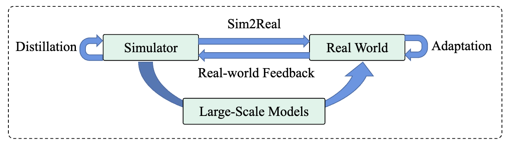
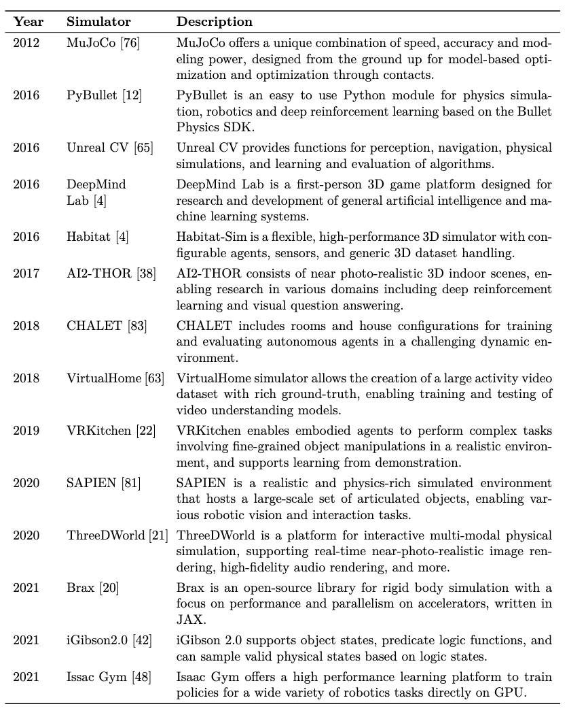
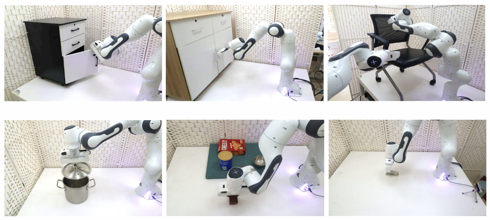
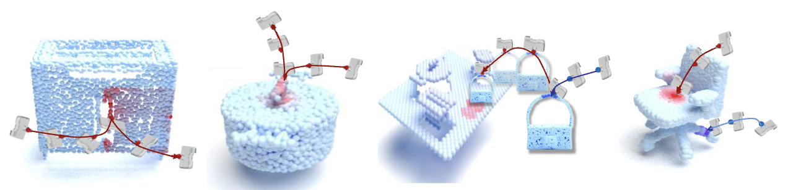

## 机器人交互环境

在机器人学习领域，获取在真实世界设置中操纵物体的能力可能是一个耗时且资源密集的过程。这不仅需要大量努力，还需要大量硬件投资。为了应对这些挑战并加速学习过程，研究人员转向使用仿真环境的数据驱动方法。通过模拟各种场景，这些环境使机器人能够在不需要与真实世界直接交互的情况下学习并做出明智的决策。在本章中，我们将探讨使用仿真环境进行机器人决策的概念，重点介绍一些模拟器示例及其关键特性，同时与现实世界和底层硬件考虑进行比较。

### 在仿真环境中学习：

仿真器已成为以受控和高效方式训练机器人的不可或缺的工具。与仅依赖于真实世界经验不同，仿真环境提供了一种经济有效的方式，生成大量训练数据。这种方法不仅节省时间，还减少了在潜在危险或昂贵环境中操作物理机器人的风险。此外，仿真器提供了创建多样化场景和操纵各种环境参数的灵活性，允许研究人员全面探索不同的学习策略，并优化机器人决策算法。

如表所示，领域中有多个仿真器示例。

### 仿真器与现实世界的比较：

虽然仿真环境提供了许多优势，但认识到这些虚拟世界与现实世界之间的差异至关重要。一个关键的区别是物理和动力学建模可能存在的差异。仿真器通常近似物理交互，可能与实际物理系统的复杂性和细节不同。研究人员必须意识到这些限制，并仔细验证他们在现实世界场景中学习到的策略，以确保鲁棒性和泛化性。

另一个考虑因素是感测输入。在仿真中，传感器可以提供完美、无噪声的数据，而现实世界中的传感器容易受到噪声、校准问题和视野限制的影响。在学习过程中考虑这些差异，并应用适当的技术（如传感器噪声注入或域适应）对于成功将学习到的策略从仿真转移到现实至关重要。

### 硬件考虑：

虽然仿真环境减少了对昂贵硬件设置的需求，但某些与硬件相关的方面不应被忽视。为了准确模拟机器人行为，需要使用与所研究的物理机器人密切相似的硬件模型和运动学表示。此外，为了确保高效和实时的仿真，尤其在处理复杂场景或大规模仿真时，可能需要高性能计算资源。

### 结论：

仿真环境已成为训练机器人和实现高效决策的宝贵工具。通过利用这些虚拟世界，研究人员可以加快学习过程，同时减少与真实世界实验相关的成本和风险。然而，重要的是要承认仿真的局限性以及将所学策略转移到物理系统的挑战。通过仔细的验证、传感器校准和硬件建模，可以弥合仿真与现实之间的差距，为现实环境中稳健和可靠的机器人决策能力铺平道路。

## 机器人技能学习
### 感知

在令人着迷的机器人领域中，感知在使机器人能够与周围世界互动并理解它们起着至关重要的作用。就像人类依赖于他们的感官来收集信息一样，机器人使用各种感测方式来感知并理解其环境。本章深入探讨机器人感知领域，重点是多种感测方式的整合及其在增强机器人对周围环境理解方面的重要性。我们将探索可供机器人使用的多种感测方式及其在感知方面的独特能力。

**视觉感知：**
视觉感知是机器人的主要感测方式之一，模仿人类视觉。相机和图像传感器捕获视觉数据，使机器人能够感知物体、场景和空间信息。本节讨论计算机视觉技术（如图像处理、物体识别和深度估计）在使机器人解释视觉数据并提取有意义信息方面的作用。

**触觉感知：**
触觉感知关注机器人感知和解释与物体和表面的物理接触的能力。嵌入在机器人手指或手中的触觉传感器提供有关纹理、形状、硬度和温度的信息。本节探讨触觉传感器的整合及其在物体操纵、抓握和精细运动控制中的应用，使机器人能够以更类似于人类的方式与物理世界互动。

**听觉感知：**
声音和听觉线索是机器人获取信息的宝贵来源。通过整合麦克风或专门的听觉传感器，机器人可以感知和分析音频信号，例如语音、环境声音和定位线索。本节讨论听觉感知在诸如语音识别、声源定位和人机交互等任务中的作用，强调音频信息对于全面机器人感知的重要性。

**范围感知：**
范围感测方式，如激光雷达（光检测和测距）和深度相机，为机器人提供了有关周围环境的深度信息。通过发射和测量飞行时间或结构光模式，机器人可以创建环境的详细三维表示。本节探讨范围感测方式在物体检测、同时定位和映射（SLAM）以及在动态环境中的导航能力。

**环境感知：**
机器人还可以使用各种传感器感知环境，这些传感器捕获超出人类感官范围的信息。本节涵盖了如红外传感器、气体传感器和环境监测设备等感测方式。这些传感器使机器人能够检测温度、气体浓度、湿度和其他环境因素，使它们适用于环境监测、灾难响应和工业环境中的应用。

**感测方式的融合和整合：**
为了实现对环境的更全面了解，机器人通常会整合多种感测方式。本节探讨融合来自不同传感器的数据时所

面临的挑战和技术，如传感器校准、数据对齐和传感器融合算法。它还讨论了传感器融合在提高感知准确性、鲁棒性和适应性方面的益处。

**结论：**
机器人感知是一个迷人的领域，涵盖了多种感测方式，每种都为机器人理解周围环境做出了贡献。通过整合视觉、触觉、听觉、范围和环境感测，机器人可以创建世界的丰富表示。本章概述了不同感测方式，强调了它们在使机器人能够在复杂环境中导航、互动和做出明智决策方面的重要性。通过利用多样化的感测方式，机器人在感知、学习和适应方面继续取得进步，使我们更接近一个智能机器与人类和谐共存的世界。

### 决策
在机器人领域，决策对于使机器人能够智能地与环境互动至关重要。本章探讨了多种机器人决策方法，包括启发式策略、强化学习、可供性学习，以及从大型模型中提取知识。通过理解这些技术，我们可以洞察机器人如何做出明智且适应性强的决策。

**启发式策略：**
启发式策略指的是基于预定义规则或启发式的决策策略。这些规则通常由人类专家制定，捕捉特定领域的知识以指导机器人的行为。启发式策略为机器人在某些情境下提供了快速可靠的决策方式，但它们可能缺乏适应性，在复杂和动态的环境中难以应用。尽管如此，它们可作为机器人决策的一个有用的起点，以便在更复杂的技术被采用之前使用。

**强化学习：**
强化学习（RL）是一种强大的方法，使机器人能够通过与环境的交互来学习决策策略。在 RL 中，机器人通过采取行动并观察其结果来学习如何最大化数值奖励信号。通过探索不同的行动并接收以奖励或惩罚形式的反馈，机器人逐渐发现决策的最优策略。

强化学习包括以下关键要素：
- 代理（Agent）：机器人或决策实体。
- 环境（Environment）：代理互动的外部世界或仿真。
- 状态（State）：当前情况或上下文的表示。
- 行动（Action）：代理可供选择的行动。
- 奖励（Reward）：反馈信号，表明在给定状态下行动的可取性。

**可供性学习：**

\begin{figure}
    \centering
    \includegraphics[width=\textwidth]{figs/ch13/affordance.pdf}
    \caption{机器人操纵任务中的可供性可视化结果。}
    \label{fig:affordance-results}
\end{figure}

可供性学习侧重于理解环境为机器人提供的行动可能性。它涉及感知和提取关于可供性的相关信息，这些是对象或场景可以提供的潜在行动或互动。通过识别和理解可供性，机器人可以做出更明智的行动决策。

可供性学习包括以下步骤：
- 感知（Perception）：通过各种传感器（例如，相机、深度传感器）感知环境，捕获相关数据。
- 特征提取（Feature Extraction）：从感测数据中提取有意义的特征，以表示对象或场景。
- 可供性识别（Affordance Recognition）：识别和分类对象或场景提供的潜在行动或互动。
- 决策制定（Decision-Making）：利用识别出的可供性来指导机器人的决策过程。

**从大型模型中提取知识：**
随着深度学习和大规模语言模型的发展，从这些模型中提取知识对于机器人决策

变得越来越有价值。这些模型接受了大量数据的训练，并捕获了复杂的模式和关系。通过利用这些知识，机器人可以从这些模型中获取的集体智慧中受益。

通常，从大型模型中提取知识包括以下步骤：
- 模型可解释性（Model Interpretability）：理解模型如何处理输入数据并生成预测或决策。
- 特征提取（Feature Extraction）：从模型中提取相关特征或表示，捕获决策所需的基本信息。
- 迁移学习（Transfer Learning）：从预训练模型中转移知识，以改善特定机器人任务中的决策。
- 决策融合（Decision Fusion）：将从大型模型中提取的知识与其他决策技术相结合，以做出更明智和稳健的决策。

机器人决策是使机器人能够智能地与环境互动的关键方面。启发式策略提供了初始指导，强化学习允许机器人通过与环境的交互来学习最佳决策策略。可供性学习帮助机器人识别和理解其周围的潜在行动。最后，从大型模型中提取知识利用这些模型中捕获的信息丰富来增强决策能力。通过整合这些技术，机器人可以在各种情景中做出更具适应性、情境意识和智能的决策，这将显著推动机器人学习领域的发展。

## 在真实环境中的部署

在机器人领域中，机器人做出智能决策的能力对其与真实世界有效互动至关重要。多年来，人们在开发算法和技术上取得了显著进展，使机器人能够直接在真实环境中学习和做出决策。在本章中，我们将探讨与机器人决策相关的一些关键主题，包括在真实环境中直接学习、Sim2Real 方法、真实世界反馈、从真实世界示范中学习，以及教师-学生蒸馏的概念。

### 在真实环境中直接学习
机器人决策的一个基本方法涉及直接在真实环境中学习。传统方法通常依赖于仿真或简化的场景，但在真实世界条件下学习为机器人提供了对所遇到的复杂性和不确定性的更准确理解。这种方法利用了诸如强化学习之类的技术，其中机器人通过试错学习，根据从环境中获得的反馈优化其决策策略。

### Sim2Real 和真实世界反馈
虽然在真实环境中学习是可取的，但由于安全考虑、成本和真实世界场景的有限访问等限制，这可能具有挑战性。Sim2Real 方法通过最初在仿真环境中训练机器人来应对这些挑战，这些环境更便宜、更安全，并提供更广泛的数据。然而，为了确保在真实世界中有效地做出决策，训练有素的策略需要转移到物理领域并进行适应。真实世界反馈机制，如域适应技术和带微调的强化学习，在此过程中起到了架接仿真与现实差距的重要作用。

### 从真实世界示范中学习
从真实世界示范中学习是机器人决策的另一种强大范式。通过观察和模仿人类或专家的示范，机器人可以获得有关适当决策策略的宝贵知识。这种方法通常涉及诸如模仿学习或逆强化学习之类的技术，其中机器人从熟练个体的行动和决策中学习。通过从有限数量的示范中泛化，机器人可以学会在类似情境中做出智能决策。

### 教师-学生蒸馏
教师-学生蒸馏是一种利用更有能力的教师模型的知识来增强经验较少的学生模型决策能力的方法。在机器人学习的背景下，这种方法涉及训练一个高性能的策略（教师），并使用其专业知识指导和改进一个较不理想的策略（学生）的学习过程。在直接进行强化学习具有挑战性或耗时的情况下，这种技术特别有用。教师模型可以提供宝贵的反馈和约束，以促进复杂真实世界环境中高效的决策。

### 结论
在真实环境中的机器人决策是一个多方面的领域，涵盖了多种方法和技术。直接在真实环境中学习、利用 Sim2Real 方法、纳入真实世界反馈、从示范中学习以及采用教师-学生蒸馏，都是提升机器人能力的重要方面。作为研究人员和从业者，我们继续探索这些主题，以增强机器人的学习和决策能力，使它们能够在多样化的真实世界环境中有效且智能地运作。
