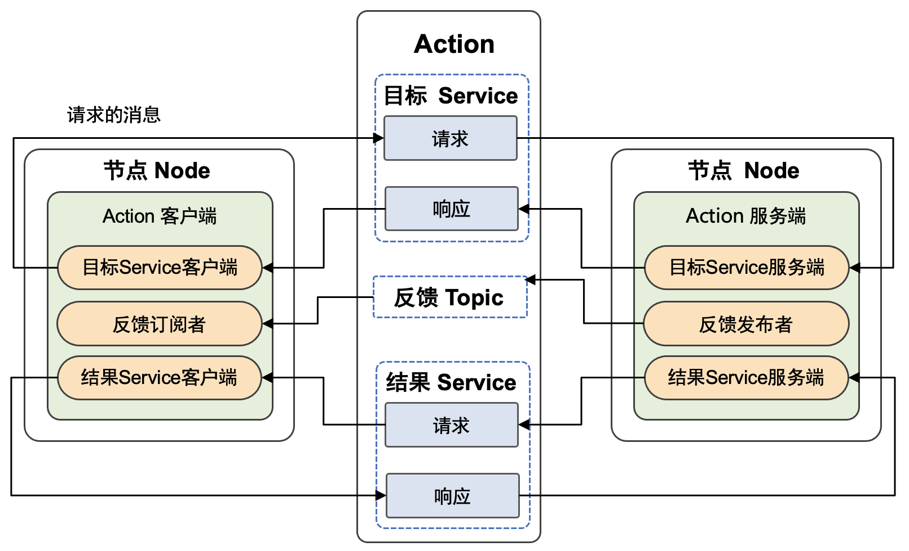
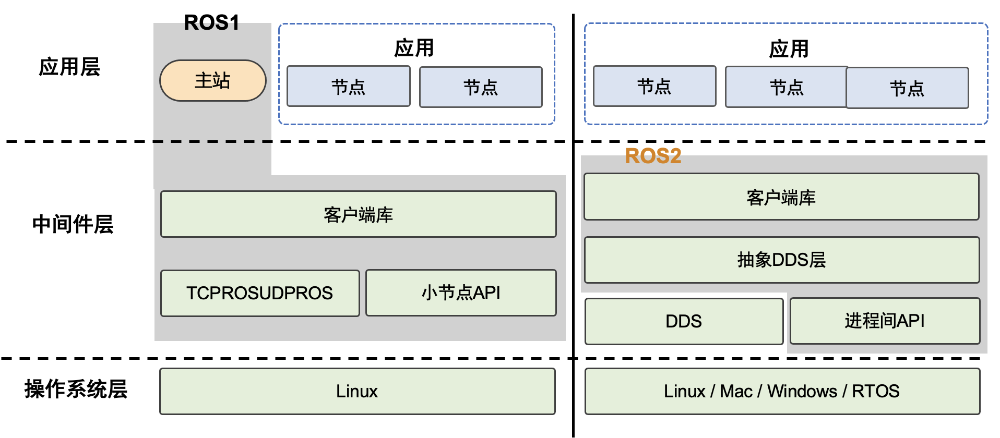

## 通用机器人操作系统

机器人操作系统(ROS) 起源于斯坦福大学人工智能实验室的一个机器人项目。它是一个自由、开源的框架，提供接口、工具来构建先进的机器人。由于机器人领域的快速发展和复杂化，代码复用和模块化的需求日益强烈，ROS适用于机器人这种多节点多任务的复杂场景。目前也有一些机器人、无人机甚至无人车都开始采用ROS作为开发平台。在机器人学习方面，ROS/ROS2可以与深度学习结合，有开发人员为ROS/ROS2开发了的深度学习节点，并支持NVIDIA
Jetson和TensorRT。

作为一个适用于机器人编程的框架，ROS把原本松散的零部件耦合在了一起，为他们提供了通信架构。虽然叫做"操作系统"，ROS更像是一个中间件，给各种基于ROS的应用程序建立起了沟通的桥梁，通过这个中间件，机器人的感知、决策、控制算法可以组织和运行。ROS采用了分布式的设计思想，支持C++、Pyhton等多种编程语言，方便移植。对ROS来讲，最小的进程单元是节点，由节点管理器来管理。参数配置存储在参数服务器中。ROS的通信方式包含：主题（Topic）、服务（Service）、参数服务器（Parameter
Server）、动作库（ActionLib）这四种。

ROS提供了很多内置工具，比如三维可视化器rviz，用于可视化机器人、它们工作的环境和传感器数据。它是一个高度可配置的工具，具有许多不同类型的可视化和插件。catkin是ROS
构建系统（类似于Linux下的CMake），Catkin
Workspace是创建、修改、编译catkin软件包的目录。roslaunch可用于在本地和远程启动多个ROS
节点以及在ROS参数服务器上设置参数的工具。此外还有机器人仿真工具Gazebo和移动操作软件和规划框架MoveIt!。ROS为机器人开发者提供了不同编程语言的接口，比如C++语言ROS接口roscpp，python语言的ROS接口rospy。ROS中提供了许多机器人的统一机器人描述格式URDF（Unified
Robot Description
Format）文件，URDF使用XML格式描述机器人文件。ROS也有一些需要提高的地方，比如它的通信实时性能有限，与工业级要求的系统稳定性还有一定差距。

ROS2项目在ROSCon 2014上被宣布，第一个ROS2发行版
Ardent Apalone
是于2017年发布。ROS2增加了对多机器人系统的支持，提高了多机器人之间通信的网络性能，而且支持微控制器和跨系统平台，不仅可以运行在现有的X86和ARM系统上，还将支持MCU等嵌入式微控制器，不止能运行在Linux系统之上，还增加了对Windows、MacOS、RTOS等系统的支持。更重要的是，ROS
2还加入了实时控制的支持，可以提高控制的时效性和整体机器人的性能。ROS
2的通信系统基于DDS（Data Distribution
Service），即数据分发服务,如图 [\[fig:ROS2\_arch\]](#fig:ROS2_arch){reference-type="ref"
reference="fig:ROS2_arch"}所示。

ROS2依赖于使用shell环境组合工作区。"工作区"（Workspace）是一个ROS术语，表示使用ROS2进行开发的系统位置。核心ROS2
工作区称为Underlay。随后的工作区称为Overlays。使用ROS2
进行开发时，通常会同时有多个工作区处于活动状态。接下来我们详细介绍一下ROS2的核心概念（这一部分我们参考了文献 [^1]）。

ROS2 Nodes
----------

ROS
Graph是一个由ROS2元素组成的网络，在同一时间一起处理数据。它包括所有的可执行文件和它们之间的联系。ROS2
中的每个节点都应负责一个单一的模块用途（例如，一个节点用于控制车轮马达，一个节点用于控制激光测距仪等）。每个节点都可以通过主题、服务、动作或参数向其他节点发送和接收数据。一个完整的机器人系统由许多协同工作的节点组成。在
ROS 2 中，单个可执行文件（C++ 程序、Python
程序等）可以包含一个或多个节点，如图 [\[fig:ros2\_graph\]](#fig:ros2_graph){reference-type="ref"
reference="fig:ros2_graph"}。

[\[fig:ros2\_graph\]]{#fig:ros2_graph label="fig:ros2_graph"}

节点之间的互相发现是通过ROS2底层的中间件实现的。 过程总结如下

-   当一个节点启动后， 它会向其他拥有相同ROS域名(ROS domain，
    可以通过设置ROS\_DOMAIN\_ID环境变量来设
    置)的节点进行广播，说明它已经上线。
    其他节点在收到广播后返回自己的相关信息，这样节点间的连接就可以建
    立了，之后就可以通信了。

-   节点会定时广播它的信息，这样即使它已经错过了最初的发现过程，它也可以和新上线的节点进行连接。

-   节点在下线前它也会广播其他节点自己要下线了。

ROS2 Topics
-----------

ROS2将复杂系统分解为许多模块化节点。主题（Topics）是 ROS
Graph的重要元素，它充当节点交换消息的总线。一个节点可以向任意数量的主题发布数据，同时订阅任意数量的主题，如图 [\[fig:ros2\_topics\]](#fig:ros2_topics){reference-type="ref"
reference="fig:ros2_topics"}所示。主题是数据在节点之间以及因此在系统的不同部分之间移动的主要方式之一。

rqt是ROS的一个软件框架，以插件的形式实现了各种 GUI 工具。可以在 rqt
中将所有现有的GUI工具作为可停靠窗口运行！这些工具仍然可以以传统的独立方法运行，但rqt可以更轻松地同时管理屏幕上的所有各种窗口。

[\[fig:ros2\_topics\]]{#fig:ros2_topics label="fig:ros2_topics"}

ROS 2 Services
--------------

服务（Services）是 ROS
图中节点的另一种通信方式。服务基于调用和响应模型，而不是主题的发布者-订阅者模型。虽然主题允许节点订阅数据流并获得持续更新，但服务仅在客户端专门调用它们时才提供数据。节点可以使用ROS2中的服务进行通信。与主题那种单向通信模式，节点发布可由一个或多个订阅者使用的信息的方式不同
服务是客户端向节点发出请求的请求/响应模式提供服务，服务处理请求并生成响应。

[\[fig:ros2\_services\]]{#fig:ros2_services label="fig:ros2_services"}

ROS 2 Parameters
----------------

参数（Parameters）是节点的配置值。您可以将参数视为节点设置。节点可以将参数存储为整数、浮点数、布尔值、字符串和列表。在ROS2
中，每个节点都维护自己的参数。

ROS 2 Actions
-------------

动作（Actions）是ROS2中的一种通信类型，适用于长时间运行的任务。它们由三个部分组成：目标、反馈和结果。动作建立在主题和服务之上。它们的功能类似于服务，除了可以取消动作。它们还提供稳定的反馈，而不是返回单一响应的服务。动作使用客户端-服务器模型，类似于发布者-订阅者模型（在主题教程中描述）。"动作客户端"节点将目标发送到"动作服务器"节点，该节点确认目标并返回反馈流和结果。动作类似于允许您执行长时间运行的任务、提供定期反馈并且可以取消的服务。机器人系统可能会使用动作进行导航。动作目标可以告诉机器人前往某个位置。当机器人导航到该位置时，它可以沿途发送更新（即反馈），然后在到达目的地后发送最终结果消息。

[\[fig:ros2\_actions\]]{#fig:ros2_actions label="fig:ros2_actions"}

[\[fig:ROS2\_arch\]]{#fig:ROS2_arch label="fig:ROS2_arch"}

[^1]: https://docs.ros.org/en/foxy/Tutorials/Understanding-ROS2-Nodes.html