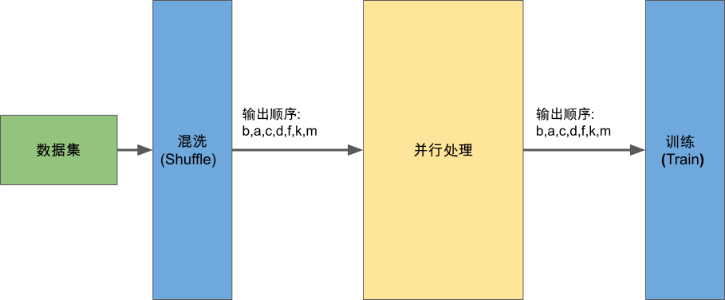

## 保序性设计

和常规数据并行计算任务不同的是，机器学习场景下的数据并行处理为了确保实验的可复现性需要维护保序的性质。在具体实现中，我们需要保证并行数据预处理后的数据输出顺序与输入顺序保持相同(即下图中的SeqB和SeqA相同)。这确保了每一次的数据模块的结果输出顺序由数据混洗模块输出顺序唯一确定，有助于用户在不同的实验之间进行比较和调试。不同的机器学习系统采用了不同的方案来确保保序性，我们以MindSpore的实现为例子进行介绍以加深读者对这部分内容的理解。

:width:`800px`
:label:`data_order_definition`

MindSpore通过约束算子线程组间的通信行为来确保对当前算子的下游算子的输入顺序与自己的输入顺序相同，基于这种递归的约束，确保了整个并行数据处理最后一个算子的输出顺序与第一个算子的输入顺序相同。具体实现中，MindSpore以Connector为算子线程组间的通信组件，对Connector的核心操作为上游算子的Push操作以及下游算子的Pop操作，我们重点关注MindSpore对这两个行为的约束。

Connector的使用有如下两个要求：

-   Connector两端的数据生产线程组和数据消费线程组中的线程分别从0开始编号。

-   确保数据生产者的输入数据顺序是在各个生产者线程间为按顺序轮询分布(Round-Robin distribution), 即当生产者线程组大小为M时，生产者线程0拥有第(0 + M \* k)个数据，生产者线程1拥有第(1 + M \* k)，生产者线程2拥有第(2 + M \* k)个数据等(其中k=0，1，2，3\...)。

Connector中维护与生产者线程数目相同的队列并确保向Connector中放入数据时，每个生产者线程生产的数据只放到对应编号的队列中，这样可以确保Connector中的数据在不同的队列间的分布与在不同生产者线程组之间的分布相同(代码片段中的Push函数)。接着当Connector的消费者线程组从Connector中获取数据时，我们需要确保最终数据在不同的消费者线程间依然为按顺序轮询分布，即当消费者线程组大小为N时，消费者线程0拥有第(0 + N \* k)个数据，消费者线程1拥有第(1 + N \* k)个数据，消费者线程2拥有第(2 + N \* k)个数据等(其中k=0，1，2，3\...)。为此当有消费者线程从Connector中请求数据时，Connector在确保当前请求消费者线程编号i与待消费数据标号j符合$i=j\%N$的关系下(其中N为消费者线程数目)按照轮循的方式从各个队列中获取数据，如果二者标号不符合上述关系，则该请求阻塞等待。通过这种通信的约束方式，MindSpore实现了保序功能。

:width:`800px`
:label:`mindspore_data_order_implementation`
