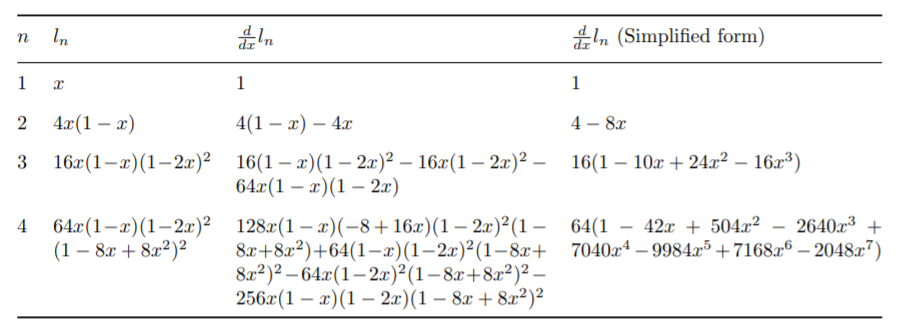
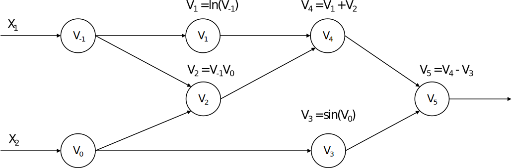
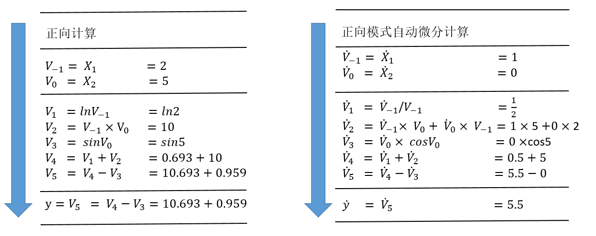
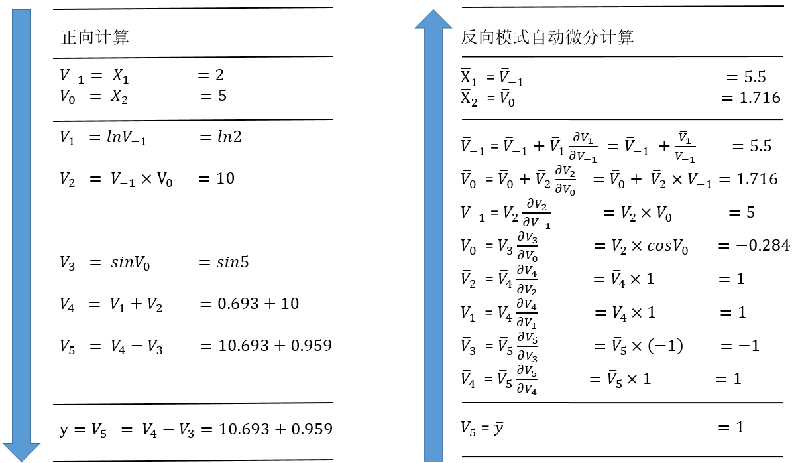

自动微分
--------

上一节，我们介绍了机器学习框架的中间表示，设计这些中间表示的最核心的目的之一便是服务于自动微分变换。那么什么是自动微分？我们在这一节来详细介绍。

### 自动微分的基本概念

自动微分（Automatic
Differentiation，AD）是一种对计算机程序进行高效且准确求导的技术，在上个世纪六七十年代就已经被广泛应用于流体力学、天文学、数学金融等领域 :cite:`10.5555/1455489`。时至今日，自动微分的实现及其理论仍然是一个活跃的研究领域。随着近些年深度学习在越来越多的机器学习任务上取得领先成果，自动微分被广泛的应用于机器学习领域。许多机器学习模型使用的优化算法都需要获取模型的导数，因此自动微分技术成为了一些热门的机器学习框架（例如TensorFlow和PyTorch）的核心特性。

常见的计算机程序求导的方法可以归纳为以下四种 :cite:`2015Automatic`：手工微分（Manual
Differentiation）、数值微分（Numerical
Differentiation）、符号微分（Symbolic
Differentiation）和自动微分（Automatic Differentiation）。

（1）手工微分：需手工求解函数导数的表达式，并在程序运行时根据输入的数值直接计算结果。手工微分需根据函数的变化重新推导表达式，工作量大且容易出错。

（2）数值微分 :cite:`2015Numerical`：数值微分通过差分近似方法完成，其本质是根据导数的定义推导而来。

$$f^{'}(x)=\lim_{h \to 0}\frac{f(x+h)-f(x)}{h}$$

当$h$充分小时，可以用差分$\frac{f(x+h)-f(x)}{h}$来近似导数结果。而近似的一部分误差，称为截断误差（Truncation
error）。理论上，数值微分中的截断误差与步长$h$有关，$h$越小则截断误差越小，近似程度越高。但实际情况下数值微分的精确度并不会随着$h$的减小而一直减小。这是因为计算机系统对于浮点数运算的精度有限导致另外一种误差的存在，这种误差称为舍入误差（Round-off
Error）。舍入误差会随着$h$变小而逐渐增大。当h较大时，截断误差占主导。而当h较小时，舍入误差占主导。
在截断误差和舍入误差的共同作用下，数值微分的精度将会在某一个$h$值处达到最小值，并不会无限的减小。因此，虽然数值微分容易实现，但是存在精度误差问题。

（3）符号微分 :cite:`2003Computer`：利用计算机程序自动地通过如下的数学规则对函数表达式进行递归变换来完成求导。
$$\frac{d}{dx}(f(x)+g(x))\rightsquigarrow\frac{d}{dx}f(x)+\frac{d}{dx}g(x)$$

$$\frac{d}{dx}(f(x)g(x))\rightsquigarrow(\frac{d}{dx}f(x))g(x)+f(x)(\frac{d}{dx}g(x))$$
符号微分常被应用于现代代数系统工具中，例如Mathematica、Maxima和Maple，以及机器学习框架，如Theano。符号微分虽然消除了手工微分硬编码的缺陷。但因为对表达式进行严格的递归变换和展开，不复用产生的变换结果，很容易产生表达式膨胀（expression
swell  :cite:`10.5555/60181.60188` ）问题。如 :numref:`symbolic_differentiation` 所示，用符号微分计算递归表达式$l_{n+1}=4l_n(1-l_n)$，$l_1=x$的导数表达式，其结果随着迭代次数增加快速膨胀。


:width:`800px`
:label:`symbolic_differentiation`

并且符号微分需要表达式被定义成闭合式的（closed-form），不能带有或者严格限制控制流的语句表达，使用符号微分会很大程度上地限制了机器学习框架网络的设计与表达。

（4）自动微分 :cite:`2000An`：自动微分的思想是将计算机程序中的运算操作分解为一个有限的基本操作集合，且集合中基本操作的求导规则均为已知，在完成每一个基本操作的求导后，使用链式法则将结果组合得到整体程序的求导结果。自动微分是一种介于数值微分和符号微分之间的求导方法，结合了数值微分和符号微分的思想。相比于数值微分，自动微分可以精确地计算函数的导数；相比符号微分，自动微分将程序分解为基本表达式的组合，仅对基本表达式应用符号微分规则，并复用每一个基本表达式的求导结果，从而避免了符号微分中的表达式膨胀问题。而且自动微分可以处理分支、循环和递归等控制流语句。目前的深度学习框架基本都采用自动微分机制进行求导运算，下面我们将重点介绍自动微分机制以及自动微分的实现。

### 前向与反向自动微分

自动微分根据链式法则的不同组合顺序，可以分为前向模式（Forward
Mode）和反向模式（Reverse
Mode）。对于一个复合函数$y=a(b(c(x)))$,其梯度值$\frac{dy}{dx}$的计算公式为：
$$\frac{dy}{dx}=\frac{dy}{da}\frac{da}{db}\frac{db}{dc}\frac{dc}{dx}$$
前向模式的自动微分是从输入方向开始计算梯度值的，其计算公式为：
$$\frac{dy}{dx}=(\frac{dy}{da}(\frac{da}{db}(\frac{db}{dc}\frac{dc}{dx})))$$
反向模式的自动微分是从输出方向开始计算梯度值的，其计算公式为：
$$\frac{dy}{dx}=(((\frac{dy}{da}\frac{da}{db})\frac{db}{dc})\frac{dc}{dx})$$
我们以下面的函数为例介绍两种模式的计算方式，我们希望计算函数在$(x_1, x_2)=(2,5)$处的导数$\frac{\partial y}{\partial x_1}$：
$$y=f(x_1,x_2)=ln(x_1)+{x_1}{x_2}-sin(x_2)$$

该函数对应的计算图如 :numref:`example_compute_graph`：


:width:`800px`
:label:`example_compute_graph`

（1）前向模式


:width:`800px`
:label:`forward_AD`

前向模式的计算过程如 :numref:`forward_AD`所示，左侧是源程序分解后得到的基本操作集合，右侧展示了运用链式法则和已知的求导规则，从上至下计算每一个中间变量${\dot{v}_i}=\frac{\partial v_i}{\partial x_1}$，从而计算出最后的变量${\dot{v}_5}=\frac{\partial y}{\partial x_1}$。

当我们想要对一个函数求导时，我们想要得到的是该函数的任意一个输出对任意一个输入的偏微分的集合。对于一个带有$n$个独立输入$x_i$和$m$个独立输出$y_i$的函数$f:{\mathbf{R}^n}\to \mathbf{R}^m$，该函数的求导结果可以构成如下的雅克比矩阵（Jacobian
Matrix）： $$\mathbf{J}_{f}=
\begin{bmatrix}
    \frac{\partial y_1}{\partial x_1} & \cdots & \frac{\partial y_1}{\partial x_n} \\
    \vdots & \ddots & \vdots \\
    \frac{\partial y_m}{\partial x_1} & \cdots & \frac{\partial y_m}{\partial x_n}
\end{bmatrix}$$

前向模式中每次计算函数$f$的所有输出对某一个输入的偏微分，也就是雅克比矩阵的某一列，如下面的向量所示。因此，通过n次前向模式的自动微分就可以得到整个雅克比矩阵。
$$\begin{bmatrix}
    \frac{\partial y_1}{\partial x_i} \\
    \vdots \\
    \frac{\partial y_m}{\partial x_i}
\end{bmatrix}$$

前向模式通过计算雅克比向量积（Jacobian-vector
products）的方式来计算这一列的结果。我们初始化$\dot{\mathbf{x}}=\mathbf{r}$。基本操作的求导规则是已经定义好的，代表着基本操作的雅可比矩阵是已知量。在此基础上，我们应用链式法则从$f$的输入到输出传播求导结果，从而得到输入网络的雅克比矩阵中的一列。
$$\mathbf{J}_{f}\mathbf{r}=
\begin{bmatrix}
    \frac{\partial y_1}{\partial x_1} & \cdots & \frac{\partial y_1}{\partial x_n} \\
    \vdots & \ddots & \vdots \\
    \frac{\partial y_m}{\partial x_1} & \cdots & \frac{\partial y_m}{\partial x_n}
\end{bmatrix}
\begin{bmatrix}
    r_1 \\
    \vdots \\
    r_n
\end{bmatrix}$$

（2）反向模式


:width:`800px`
:label:`backward_AD`

反向模式的计算过程如上 :numref:`backward_AD`所示，左侧是源程序分解后得到的基本操作集合，右侧展示了运用链式法则和已知的求导规则，从$\bar{v}_5=\bar{y}=\frac{\partial y}{\partial y}=1$开始，
由下至上地计算每一个中间变量${\bar{v}_i}=\frac{\partial y_j}{\partial v_i}$，从而计算出最后的变量${\bar{x}_1}=\frac{\partial y}{\partial x_1}$和${\bar{x}_2}=\frac{\partial y}{\partial x_2}$。

反向模式每次计算的是函数$f$的某一个输出对任一输入的偏微分，也就是雅克比矩阵的某一行，如下面的向量所示。因此通过运行m次反向模式自动微分，我们就可以得到整个雅克比矩阵。
$$\begin{bmatrix}
    \frac{\partial y_j}{\partial x_1} & \cdots & \frac{\partial y_j}{\partial x_n}
\end{bmatrix}$$

类似地，我们可以通过计算向量雅克比积（Vector-jacobian
products）的方式来计算雅克比矩阵的一行。我们初始化$\bar{\mathbf{y}}=\mathbf{r}$，在已知基本操作的求导规则的前提下，应用链式法则从$f$的输出到输入传播求导结果，从而最后得到雅克比矩阵中的一行。
$$\mathbf{r}^{T}\mathbf{J}_{f}=
\begin{bmatrix}
    r_1 & \cdots & r_m
\end{bmatrix}
\begin{bmatrix}
    \frac{\partial y_1}{\partial x_1} & \cdots & \frac{\partial y_1}{\partial x_n} \\
    \vdots & \ddots & \vdots \\
    \frac{\partial y_m}{\partial x_1} & \cdots & \frac{\partial y_m}{\partial x_n}
\end{bmatrix}$$

在求解函数$f$的雅克比矩阵时，前向模式的迭代次数与雅克比矩阵的列数相关，而反向模式的迭代次数则与雅克比矩阵的行数相关。因此，在函数输出个数远远大于输入个数时$(f:{\mathbf{R}^n}\to \mathbf{R}^m, n << m)$，前向模式效率更高；反之，在函数输入个数远远大于输出个数时$(f:{\mathbf{R}^n}\to \mathbf{R}^m, n >> m)$，反向模式效率更高。在极端情况下的函数$f:{\mathbf{R}^n}\to \mathbf{R}$，只需要应用一次反向模式就已经能够把所有输出对输入的导数$(\frac{\partial y}{\partial x_1},\cdots,\frac{\partial y}{\partial x_n})$都计算出来，而前向模式则需要执行n次。这种计算一个标量值的输出关于大量参数输入的梯度的场景恰好是机器学习实践中最常见的一种计算场景，这使得反向模式的自动微分成为反向传播算法使用的核心技术之一。

但是反向模式也存在一定的缺陷。在源程序分解为一系列基本操作后，前向模式由于求导顺序与基本操作的执行顺序一致，输入值可以在执行基本操作的过程中同步获得。而在反向模式中，由于求导顺序与源程序的执行顺序是相反的，计算过程需要分为两个阶段，第一个阶段先执行源程序，且将源程序的中间结果保存起来，在第二阶段才把中间结果取出来去计算导数。因此反向模式会有额外的内存消耗。业界也一直在研究反向模式的内存占用优化方法，例如检查点策略（checkpointing
strategies）和数据流分析（data-flow
analysis） :cite:`2006The,2017Divide` 。

### 自动微分的实现

上一节我们介绍了自动微分的基本概念，可以总结为将程序分解为一系列微分规则已知的基本操作，然后运用链式法则将它们的微分结果组合起来得到程序的微分结果。而在机器学习的应用中，因为输入的数量远远大于输出的数量，所以反向模式的自动微分更受青睐。虽然自动微分的基本思想是明确的，但是具体的实现方法也分为几类 :cite:`2015Automatic` ，大体可以划分为基本表达式法（Elemental
Libraries）、操作符重载法（Operator
Overloading，OO）和代码变换法（Source Code Transformation，ST）。

（1）基本表达式法：封装大多数的基本表达式及对应的微分表达式，通过库函数的方式提供给用户，用户在写代码时，需要手工分解程序为一系列的基本表达式，然后使用这些库函数去替换这些基本表达式。以程序$a=(x+y)/z$为例，用户需要手工地把这个程序分解为：
```python
t = x + y
a = t / z
```
然后使用自动微分的库函数去替换分解出来的基本表达式：
```python
// 参数为变量x, y, t和对应的导数变量dx, dy, dt
call ADAdd(x, dx, y, dy, t, dt)
// 参数为变量t, z, a和对应的导数变量dt, dz, da
call ADDiv(t, dt, z, dz, a, da)
```
库函数ADAdd和ADDiv运用链式法则，分别定义了Add和Div的微分表达式。
```python
def ADAdd(x, dx, y, dy, z, dz):
    z = x + y
    dz = dy + dx

def ADDiv(x, dx, y, dy, z, dz):
    z = x / y
    dz = dx / y + (x / (y * y)) * dy
```
基本表达式法的优缺点显而易见，优点是实现简单直接，可为任意语言快速实现微分的库函数；而缺点是增加了用户的工作量，用户必须先手工分解程序为一些基本表达式，才能使用这些库函数进行编程，无法方便地使用语言原生的表达式。

（2）操作符重载法（Operator Overloading,
OO）：依赖于现代编程语言的多态特性，使用操作符重载对编程语言中的基本操作语义进行重定义，封装其微分规则。每个基本操作类型及其输入关系，在程序运行时会被记录在一个所谓的"tape"的数据结构里面，最后，这些"tape"会形成一个跟踪轨迹(trace)，我们就可以使用链式法则沿着轨迹正向或者反向地将基本操作组成起来进行微分。以自动微分库AutoDiff为例，对编程语言的基本运算操作符进行了重载：
```C++
namespace AutoDiff
{
    public abstract class Term
    {
    // 重载操作符 `+`，`*` 和 `/`，调用这些操作符时，会通过其中的
    // TermBuilder 将操作的类型、输入输出信息等记录至 tape 中
    public static Term operator+(Term left, Term right)
    {
        return TermBuilder.Sum(left, right);
    }
    public static Term operator*(Term left, Term right)
    {
        return TermBuilder.Product(left, right);
    }
    public static Term operator/(Term numerator, Term denominator)
    {
        return TermBuilder.Product(numerator, TermBuilder.Power(denominator, -1));
    }
    }

    // Tape 数据结构中的基本元素，主要包含：
    // 1) 操作的运算结果
    // 2) 操作的运算结果对应的导数结果
    // 3) 操作的输入
    // 除此外还通过函数 Eval 和 Diff 定义了该运算操作的计算规则和微分规则
    internal abstract class TapeElement
    {
    public double Value;
    public double Adjoint;
    public InputEdges Inputs;

    public abstract void Eval();
    public abstract void Diff();
    }
}
```
OO对程序的运行跟踪经过了函数调用和控制流，因此实现起来也是简单直接。而缺点是需要在程序运行时进行跟踪，特别在反向模式上还需要沿着轨迹反向地执行微分，所以会造成性能上的损耗，尤其对于本来运行就很快的基本操作。并且因为其运行时跟踪程序的特性，该方法不允许在运行前做编译时刻的图优化，控制流也需要根据运行时的信息来展开。Pytorch的自动微分框架使用了该方法。

（3）代码变换法（Source
Transformation，ST）：提供对编程语言的扩展，分析程序的源码或抽象语法树（AST），将程序自动地分解为一系列可微分的基本操作，而这些基本操作的微分规则已预定义好，最后使用链式法则对基本操作的微分表达式进行组合生成新的程序表达来完成微分。TensorFlow，MindSpore等机器学习框架都采用了该方式。

不同于OO在编程语言内部操作，ST需要语法分析器（parser）和操作中间表示的工具。除此以外，ST需要定义对函数调用和控制流语句（如循环和条件等）的转换规则。其优势在于对每一个程序，自动微分的转换只做一次，因此不会造成运行时的额外性能损耗。而且，因为整个微分程序在编译时就能获得，编译器可以对微分程序进行进一步的编译优化。但ST实现起来更加复杂，需要扩展语言的预处理器、编译器或解释器，且需要支持更多的数据类型和操作，需要更强的类型检查系统。另外，虽然ST不需要在运行时做自动微分的转换，但是对于反向模式，在反向部分执行时，仍然需要确保前向执行的一部分中间变量可以被获取到，有两种方式可以解决该问题  :cite:`van2018Automatic` ：

（1）基于Tape的方式。该方式使用一个全局的"tape"去确保中间变量可以被获取到。原始函数被扩展为在前向部分执行时把中间变量写入到tape中的函数，在程序执行反向部分时会从tape中读取这些中间变量。除了存储中间变量外，OO中的tape还会存储执行的操作类型。然而因为tape是一个在运行时构造的数据结构，所以需要添加一些定制化的编译器优化方法。且为了支持高阶微分，对于tape的读写都需要是可微分的。而大多数基于tape的工具都没有实现对tape的读写操作的微分，因此它们都不支持多次嵌套执行反向模式的自动微分（reverse-over-reverse）。机器学习框架Tangent采用了该方式。

（2）基于闭包（closure）的方式。基于闭包的方式可以解决基于tape方式的缺陷。在函数式编程里，闭包可以捕获到语句的执行环境并识别到中间变量的非局部使用。因为这些它们是闭包里的自由变量，所以不需要再去定制化编译器优化方法。

MindSpore是使用基于闭包的代码变换法来实现的自动微分的。这需要一个定制的中间表示。MindIR的具体设计，在上一节中已经介绍过，这里不再赘述。

MindSpore的自动微分，使用基于闭包的代码变换法实现，转换程序根据正向部分的计算，构造了一个闭包的调用链。这些闭包包含了计算导数的代码以及从正向部分拿到的中间变量。程序中的每个函数调用，都会得到转换并且额外返回一个叫做"bprop"的函数，$bprop$根据给定的关于输出的导数，计算出关于输入的导数。由于每个基本操作的$bprop$是已知的，我们可以容易地反向构造出用户定义的整个函数的$bprop$。为了支持reverse-over-reverse调用去计算高阶导数，我们需要确保可以在已转换好的程序中再进行转换，这需要有处理函数自由变量（函数外定义的变量）的能力。为了达到这个目的，每个$bprop$除了关于原始函数输入的偏导数以外，还会返回一系列关于自由变量的偏导数，闭包里面的$bprop$负责把每个偏导数解开，将其分别累加贡献到各自的自由变量上。且闭包也是一种函数，可以作为其他闭包的输入。因此，MindSpore自动微分的算法设计可以总结为：

（1）应用链式求导法则，对每个函数（算子或子图）定义一个反向传播函数$bprop: dout->(df, dinputs)$，这里$df$表示函数对自由变量的导数，$dinputs$表示函数对输入的导数。

（2）应用全微分法则，将($df$, $dinputs$)累加到对应的变量上。

涉及控制流语句时，因为MindIR实现了分支、循环和闭包等操作的函数式表达，我们对这些操作应用上述法则进行组合，即可完成微分。定义运算符K求解导数，MindSpore的自动微分算法可以简单表达如下：
```C++
// func和inputs分别表示函数及其输入，dout为关于输出的梯度
v = (func, inputs)
F(v): {
    (result, bprop) = K(func)(inputs)
    df, dinputs = bprop(dout)
    v.df += df
    v.dinputs += dinputs
}
```
MindSpore解析器模块首先根据Python的AST生成MindIR，再经过特化模块使得中间表示中的算子可识别，然后调用自动微分模块。自动微分模块的入口函数如下所示：
```C++
function Grad {
    Init();
    MapObject();  // 实现Parameter/Primitive/FuncGraph/FreeVariable对象的映射
    MapMorphism();  // 实现CNode的映射
    Finish();
    Return GetKGraph();  // 获取梯度函数计算图
}
```
Grad函数先通过MapObject实现图上自由变量、Parameter和ValueNode（Primitive或FuncGraph）等节点到$fprop$的映射。$fprop$是$(forward\_result, bprop)$形式的梯度函数对象。$forward\_result$是前向计算图的输出节点，$bprop$是以$fprop$的闭包对象形式生成的梯度函数，它只有$dout$一个入参，其余的输入则是引用的$fprop$的输入和输出。其中对于ValueNode\<Primitive\>类型的$bprop$，通过解析Python层预先注册的$get\_bprop$函数的得到，如下所示。对于ValueNode\<FuncGraph\>类型的节点，则递归求出它的梯度函数对象。
```python
@bprop_getters.register(P.ReLU)
def get_bprop_relu(self):
    """Grad definition for `ReLU` operation."""
    input_grad = G.ReluGrad()

    def bprop(x, out, dout):
        dx = input_grad(dout, out)
        return (dx,)

    return bprop
```
随后，MapMorphism函数从原函数的输出节点开始实现对CNode的映射，并建立起节点间的反向传播连接，实现梯度累加，最后返回原函数的梯度函数计算图。
