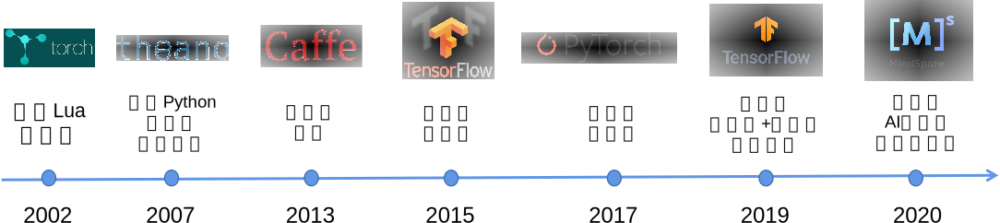

## 机器学习系统编程模型的演进

:width:`800px`
:label:`img_framedh`

随着机器学习系统的诞生，如何设计易用且高性能的API接口就一直成为了系统设计者首要解决的问题。在早期的机器学习框架中（如 :numref:`img_framedh`所示），人们选择用Lua（Torch）和Python（Theano）等高层次编程语言来编写机器学习程序。这些早期的机器学习框架提供了机器学习必须的模型定义，自动微分等功能，其适用于编写小型和科研为导向的机器学习应用。

深度神经网络在2011年来快速崛起，很快在各个AI应用领域（计算机视觉、语音识别、自然语言处理等）取得了突破性的成绩。训练深度神经网络需要消耗大量的算力，而以Lua和Python为主导开发的Torch和Theano无法发挥这些算力的最大性能。与此同时，计算加速卡（如英伟达GPU）的通用API接口（例如CUDA C）日趋成熟，且构建于CPU多核技术之上的多线程库（POSIX Threads）也被广大开发者所接受。因此，许多的机器学习用户希望基于C和C++来开发高性能的深度学习应用。这一类需求被Caffe等一系列以C和C++作为核心API的框架所满足。

然而，机器学习模型往往需要针对部署场景、数据类型、识别任务等需求进行深度定制，而这类定制任务需要被广大的AI应用领域开发者所实现。这类开发者的背景多样，往往不能熟练使用C和C++。因此Caffe这一类与C和C++深度绑定的编程框架，成为了制约框架快速推广的巨大瓶颈。

在2015年底，谷歌率先推出了TensorFlow。相比于传统的Torch，TensorFlow提出前后端分离相对独立的设计，利用高层次编程语言Python作为面向用户的主要前端语言，而利用C和C++实现高性能后端。大量基于Python的前端API确保了TensorFlow可以被大量的数据科学家和机器学习科学家接受，同时帮助TensorFlow能够快速融入Python为主导的大数据生态（大量的大数据开发库如Numpy、Pandas、SciPy、Matplotlib和PySpark）。同时，Python具有出色的和C/C++语言的互操作性，这种互操作性已经在多个Python库中得到验证。因此，TensorFlow兼有Python的灵活性和生态，同时也通过C/C++后端得以实现高性能。这种设计在日后崛起的PyTorch、MindSpore和PaddlePaddle等机器学习框架得到传承。

随着各国大型企业开源机器学习框架的出现，为了更高效地开发机器学习应用，基于开源机器学习框架为后端的高层次库Keras和TensorLayerX应运而生，它们提供Python API 可以快速导入已有的模型，这些高层次API进一步屏蔽了机器学习框架的实现细节，因此Keras和TensorLayerX可以运行在不同的机器学习框架之上。

随着深度神经网络的进一步发展，对于机器学习框架编程接口的挑战也日益增长。因此在2020年前后，新型的机器学习框架如MindSpore和JAX进一步出现。其中，MindSpore在继承了TensorFlow、PyTorch的Python和C/C++的混合接口的基础上，进一步拓展了机器学习编程模型从而可以高效支持多种AI后端芯片（如华为Ascend、英伟达GPU和ARM芯片），实现了机器学习应用在海量异构设备上的快速部署。

同时，超大型数据集和超大型深度神经网络崛起让分布式执行成为了机器学习编程框架的核心设计需求。为了实现分布式执行，TensorFlow和PyTorch的使用者需要花费大量代码来将数据集和神经网络分配到分布式节点上，而大量的AI开发人员并不具有分布式编程的能力。因此MindSpore进一步完善了机器学习框架的分布式编程模型的能力，从而让单节点的MindSpore程序可以无缝地运行在海量节点上。

在本小节中，我们将以MindSpore作为例子讲解一个现代机器学习框架的Python前端API和C/C++后端API的设计原则。这些设计原则和PyTorch，TensorFlow相似。
